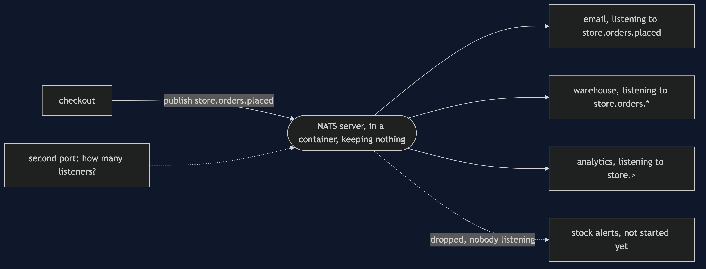
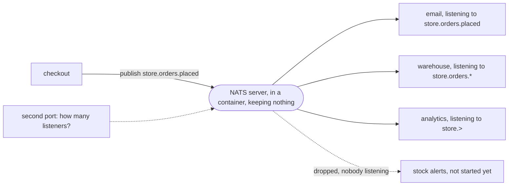

# Event Bus with NATS Pattern — Architecture Diagram

One publisher, one server that stores nothing, and listeners that do not know each other.

Mermaid source

Said out loud: checkout publishes an order-placed event to the NATS server and returns. The server hands it to every service listening for that name at that instant: email, which asked for placed orders only; the warehouse, which asked for any order event; analytics, which asked for everything under `store`. A service that has not started listening yet gets nothing, and the event is dropped with no record of it. On the side, a second port on the same server is the only place anybody can find out how many listeners there are.
