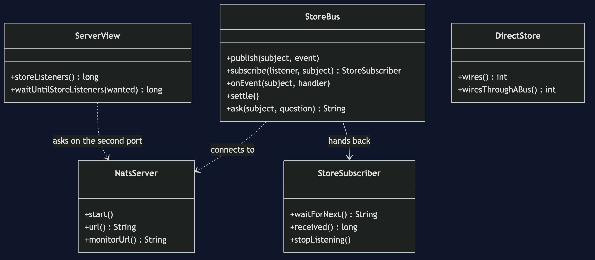
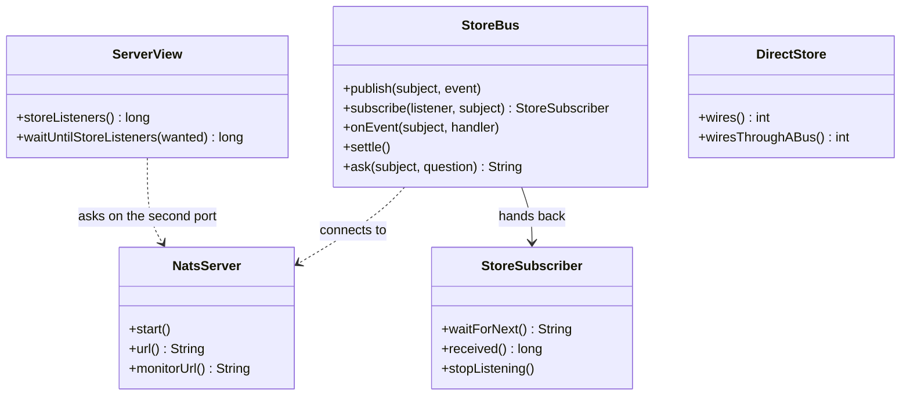

# Event Bus with NATS Pattern — Class Diagram

A server in a container, services that publish, and listeners that hear only what is announced while they are in the room.

Mermaid source

Said out loud: `StoreBus` is one service's link to the bus. It can publish an event under a name, and it can subscribe, which hands back a `StoreSubscriber` that waits for events with a deadline. `ServerView` is the only thing that can say how many listeners exist, and it has to ask the server. `DirectStore` is the version with no bus at all, and it exists only to count the wiring.
