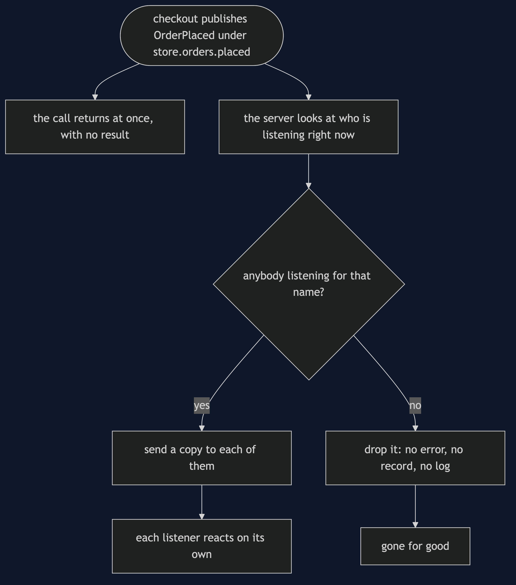

# Event Bus with NATS Pattern — Data Flow Diagram

What happens to one published event.

Said out loud: checkout publishes the event, and its own call returns immediately with no result of any kind. Meanwhile the server looks at who is listening for that name at that instant. If somebody is, each of them gets a copy and reacts on its own. If nobody is, the server drops it. There is no error, no record and no log, so it is gone for good. Checkout's call returned successfully either way, which is the whole trap.
