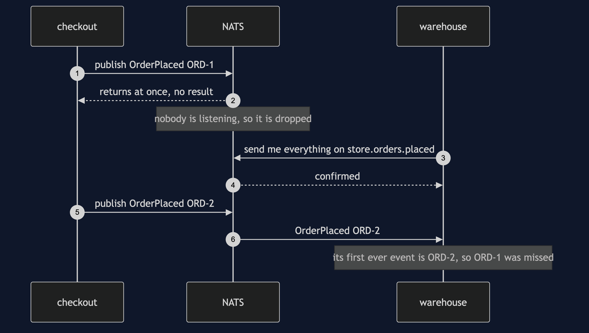

# Event Bus with NATS Pattern — Sequence Diagram

Written for a listener with the screen off.

Say it in words. Nobody is listening yet. Checkout publishes an order-placed event for ORD-1 to NATS. The call returns at once and tells checkout nothing. NATS looks for listeners, finds none, and drops the event; there is no record of it anywhere. Now the warehouse connects and asks NATS to send it everything published under the name store dot orders dot placed. It waits for NATS to confirm that. Checkout then publishes ORD-2. NATS sends ORD-2 to the warehouse. The very first event the warehouse has ever received is ORD-2, which is how we know ORD-1 was never coming: this bus delivers one name in order, so if the first order were still on its way it would have arrived before the second.

The other sequences — the fan-out to three listeners, a subscriber that throws, and asking instead of telling — are in [`uml-diagram.md`](uml-diagram.md).

The load-bearing sentence: **publishing always succeeds, and succeeding means nothing.**
