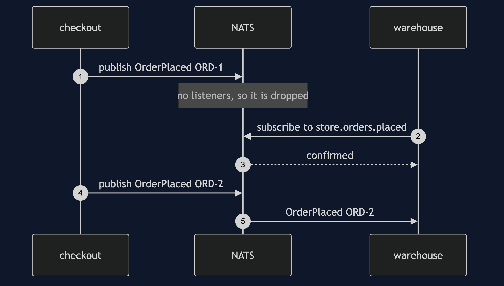
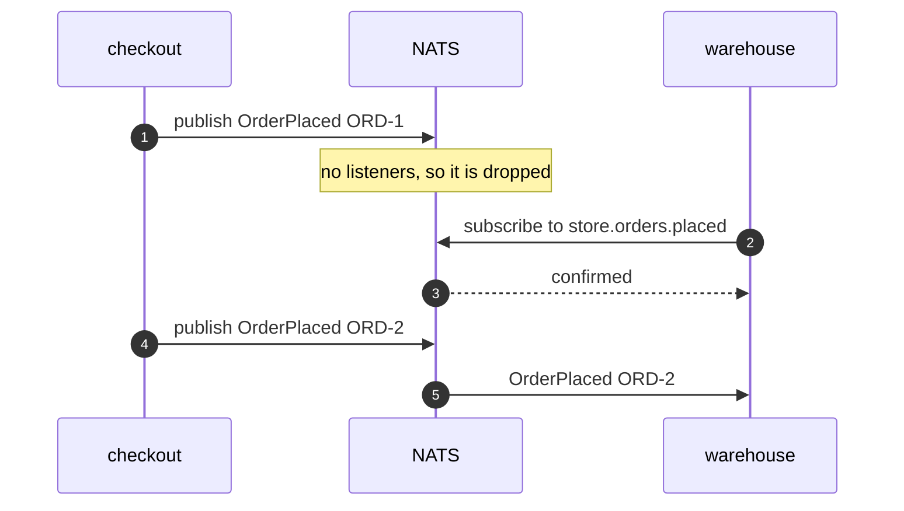
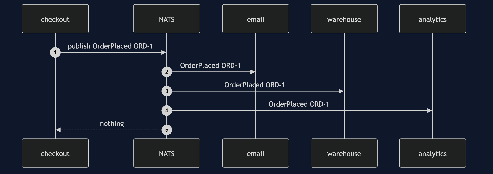
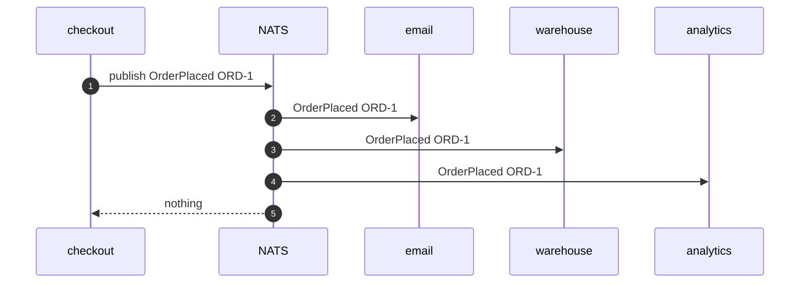
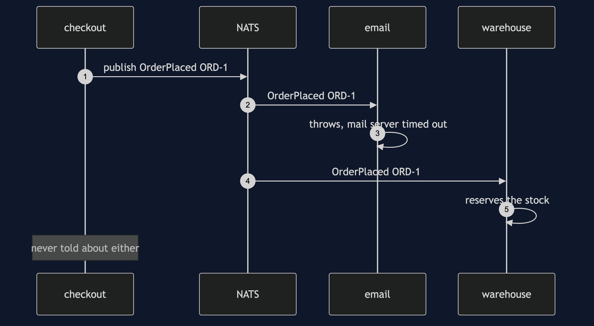
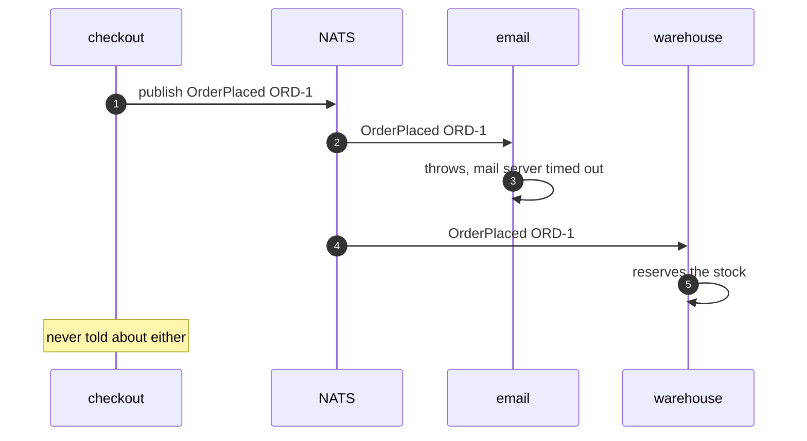
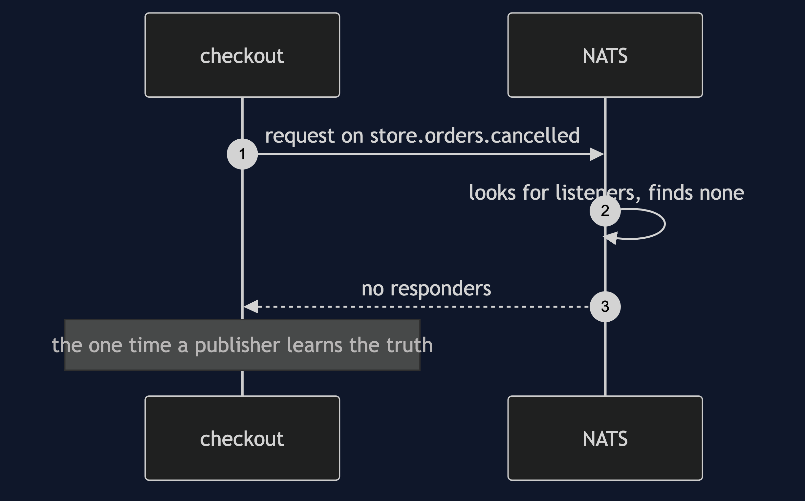
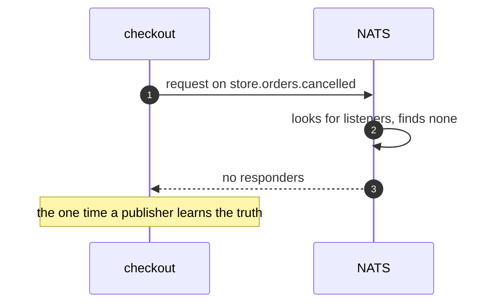

# Event Bus with NATS Pattern — UML Sequence Diagrams

Four sequences: the miss, the fan-out, a subscriber that throws, and asking instead of telling.

## 1. The Event Nobody Hears

Nobody is listening. Checkout publishes ORD-1 and the server drops it. The warehouse then starts listening and waits for the server to confirm. Checkout publishes ORD-2, and that is the first event the warehouse ever sees.

Mermaid source

## 2. One Announcement, Three Listeners

Checkout publishes once. The server sends a copy to each service listening for that name. Checkout is never told how many there were.

Mermaid source

## 3. A Subscriber That Throws

The email service's handler fails. The warehouse, on its own connection, still reacts. Checkout had already moved on before either of them ran.

Mermaid source

## 4. Asking Instead Of Telling

A request is a question with a reply address on it. When nobody is listening for that name, the server says so at once rather than leaving the caller waiting.

Mermaid source

