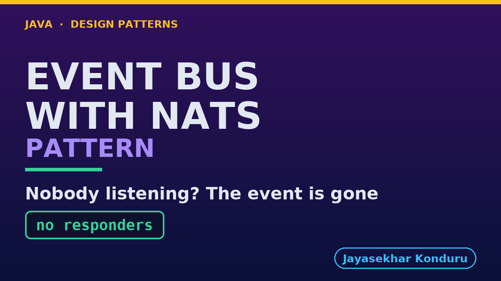

# YouTube — Event Bus With Nats Pattern

Everything needed to publish `video/event-bus-with-nats-pattern-explained.mp4`. Copy the fields straight out of this file.

Chapter timings are generated from the video's `.srt`. Re-run `python3 docs/make_youtube_docs.py event-bus-with-nats` after any change to the narration, or they will be wrong.

## Title

```
Event Bus with NATS
```

19 characters — under the 60 YouTube shows before truncating in search results.

## Description

The first two lines are what a viewer sees above the fold, so they carry the hook rather than the boilerplate.

```
Event Bus pattern in Java: an event bus is one shared line where senders announce events and each listener hears the ones it cares about, without sender and listener knowing each other. Explained with NATS, a real messaging server on the network that keeps nothing. Checkout announces that an order was placed, and the email service, the warehouse and analytics each listen for what they care about, like a warehouse loudspeaker: whoever is in the room hears it, and someone who walks in a second later hears nothing. We subscribe by name, survive a failing subscriber, hear an event nobody hears, and use ask instead of tell when an answer matters. We finish with the bill and the opposite trade. On this bus, publishing always succeeds, and succeeding means nothing.

CHAPTERS
00:00 Introduction
00:57 The Partner Project
01:19 Before The First Line
01:57 Everyone Knows Everyone
02:23 Everyone Knows The Bus
02:52 Subscribing By Name
03:30 One Failing Subscriber
03:55 An Event Nobody Hears
04:46 Ask, Do Not Tell
05:10 The Bill
05:45 The Opposite Trade
06:22 The Verdict
06:56 How To Recognise It
07:19 What Was Used
07:40 What Is Real Here
08:01 Thanks for Watching

SOURCE CODE, WRITTEN NOTES AND AN INTERACTIVE ANIMATION
https://github.com/jk-boot-up/java-design-patterns/tree/main/gradle-java/messaging-integration-patterns/event-bus-with-nats-pattern

WHAT YOU NEED FIRST
Java 21 and a working knowledge of classes and interfaces. No prior design-pattern knowledge is assumed. The full prerequisites are in docs/prerequisites.md in the repository.
```

## Chapters

YouTube renders these as chapters only if there are at least three and the first is at `00:00`.

```
00:00 Introduction
00:57 The Partner Project
01:19 Before The First Line
01:57 Everyone Knows Everyone
02:23 Everyone Knows The Bus
02:52 Subscribing By Name
03:30 One Failing Subscriber
03:55 An Event Nobody Hears
04:46 Ask, Do Not Tell
05:10 The Bill
05:45 The Opposite Trade
06:22 The Verdict
06:56 How To Recognise It
07:19 What Was Used
07:40 What Is Real Here
08:01 Thanks for Watching
```

## Tags

```
event bus, nats, publish subscribe, docker, design patterns, java design patterns, gang of four, java 21, software design, clean code, object oriented design, java tutorial, ecommerce, programming tutorial
```

205 characters, under YouTube's 500 limit.

## Thumbnail



**Upload `docs/thumbnail.png`** — 1280×720, the size YouTube recommends, generated by `docs/make_thumbnails.py`. It is deliberately not the same image as the video's opening frame: a thumbnail is judged at about 360 pixels wide in a search result, so this one carries only the pattern name, one line of promise and one short piece of code, each set large enough to survive the shrink.

`video/poster.png` is the 1920×1080 opening frame, produced by the video build. It stays in the repository as the title card; it is not what gets uploaded.

YouTube will not pick the thumbnail up on its own — upload it under **Details → Thumbnail → Upload file**. A custom thumbnail requires a verified channel.

## Upload checklist

- [ ] Upload `video/event-bus-with-nats-pattern-explained.mp4` (1080p, H.264, 30 fps, AAC 48 kHz — already YouTube's recommended settings, no re-encode needed)
- [ ] Set the video language to **English** first, or the subtitle option may not appear
- [ ] Add subtitles: *Video elements → Add subtitles → Upload file → With timing* → `video/event-bus-with-nats-pattern-explained.srt`
- [ ] Upload `docs/thumbnail.png` as the thumbnail — do not let YouTube auto-pick a frame
- [ ] Paste the title, description and tags from above
- [ ] Add to the **Java Design Patterns** playlist, in learning order
- [ ] Wait for 1080p processing before sharing the link — code slides are unreadable at 360p

## Cards and end screen

End screen links to whichever pattern video goes up next — set it at upload time rather than assuming an order.

Add a card partway through pointing at the playlist, so a viewer who arrives at this pattern from search can find the rest of the series.

## Runtime

Approximately 08:39, narrated at 145 words per minute.
