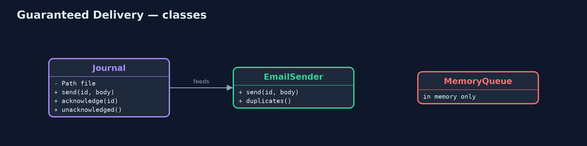
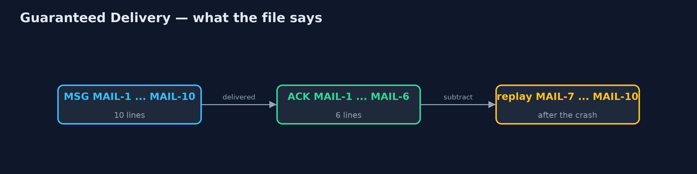
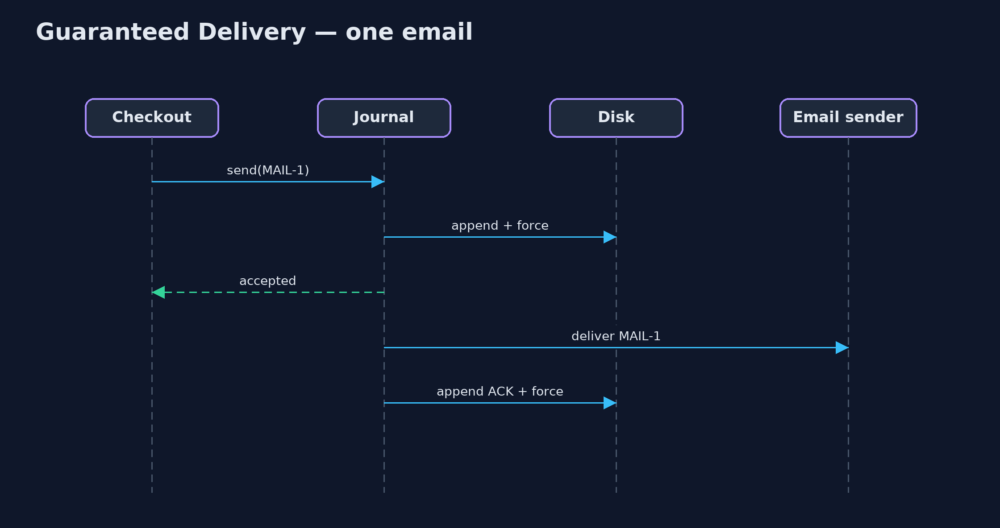

# Guaranteed Delivery Pattern

```
src/main/java/com/jk/explore/guaranteed/
├── EmailSender.java             Sends order confirmation emails, and remembers every one it sent (so duplicates can be counted)
├── GuaranteedDeliveryDemo.java  The five acts: messages only in memory, a journal on disk, acknowledgements, a crash between sending and acknowledging, and the bill
├── Journal.java                 The pattern: every message is written to a file on disk, and forced to the disk, before the sender is told it was accepted
└── MemoryQueue.java             Without the pattern: queued messages live only in memory, so a crash or a restart loses them all
```

**Store every message safely on disk before accepting it, acknowledge it only after it is delivered, and after a crash deliver everything that was never acknowledged.**

Guaranteed Delivery is one of the Enterprise Integration Patterns. A message
that is only held in memory disappears when the program stops, whether from a
crash or an ordinary restart. With guaranteed delivery, the messaging system
writes each message to disk, and makes sure it has reached the disk, before it
tells the sender "accepted". When the message has been delivered, an
acknowledgement is written too. After a crash, anything on disk without an
acknowledgement is delivered again.

Nothing accepted is ever lost. The price is a disk write in the path of every
message, and the possibility of delivering the same message twice.

## The idea in everyday terms

Think of recorded delivery at the post office. Before you get your receipt,
the parcel is entered in a ledger. When it is delivered, the recipient signs,
and that is recorded too. If a van breaks down, the ledger says exactly which
parcels to send out again. And very occasionally, when a signature record goes
missing, someone receives the same parcel twice.

## The scenario

The online store sends an order confirmation email for every order, through a
queue in front of a slow email provider. The queue was held in memory. When
the server restarted for an update with ten emails waiting, all ten were lost,
and ten customers never heard that their order had been received.

## Run

```bash
./gradlew run
```

The demo tells the story in 5 acts, each printing exact numbers that the tests check:

| Act | What it shows |
| --- | --- |
| 1. Only in memory | 10 emails queued in memory; the server restarts and the queue has 0; 10 customers never hear. |
| 2. Written to disk first | Each email is forced to a journal file before it is accepted: 10 lines; after a restart, 10 waiting. |
| 3. Acknowledgements | 6 emails sent and acknowledged, then a crash; after restart MAIL-7 to MAIL-10 are waiting; all 10 sent exactly once. |
| 4. At least once | MAIL-11 is sent, then the crash comes before its acknowledgement; after restart it is sent again: 1 duplicate. |
| 5. The bill | 10 emails cost 10 forced disk writes to accept and 10 more to acknowledge; the journal grows; receivers must cope with duplicates. |

## Test

```bash
./gradlew test
```

7 tests in `DemoRunsTest`, `JournalTest`. Every number the demo prints is asserted, and nothing depends on the clock, so every run gives the same result.

## Technologies and versions

| Technology | Version | Used for |
| --- | --- | --- |
| Java | 21 | the code (toolchain set in `build.gradle`) |
| Gradle | 9.2.1 (wrapper) | build and run, nothing to install |
| JUnit | 5.10.2 | the tests |
| videokit | repository tool | the narrated video and animation: Piper `en_US-amy-medium`, speed 0.8, longer pauses (the approved `amy-slow` voice) |

## Learning Material

| Document | What it is for |
| --- | --- |
| [Problem statement](docs/problem-statement.md) | the situation and what the project must show |
| [Prerequisites](docs/prerequisites.md) | what you need to know first |
| [Guaranteed Delivery, explained](docs/guaranteed-delivery-pattern-explained.md) | the acts in prose |
| [Session guide](docs/session.md) | a one-hour lesson with exercises |
| [Animated walkthrough](docs/animation.html) | the acts step by step, narrated |
| [Spec](docs/spec.md) | what this project must be true of |

### The pattern in one picture

The journal sits between accepting and delivering.


### Where each piece sits

One file, three operations.



### How the data moves

Messages without an ACK are replayed.



### Who calls whom, in order

Stored, then accepted; sent, then acknowledged.



### Video

`video/guaranteed-delivery-pattern-explained.mp4` (with `.m4a` audio and `.srt` subtitles) is built by `video/build_video.sh`. Rendered media is not committed.

## What it costs

- **At least once, not exactly once.** A crash between sending and acknowledging sends the email again: one duplicate in the demo.
- **A disk write per message.** Every accept waits for a forced write, and every delivery writes an acknowledgement.
- **The journal grows.** Acknowledged lines must be trimmed, or the file grows for ever.

## When this is too much

For messages that can be lost harmlessly, such as live price ticks that are
replaced every second, writing each one to disk is waste. Use guaranteed
delivery for messages that matter: orders, payments, confirmations.

## Where you have already met this

- Persistent messages in JMS, RabbitMQ durable queues, and Kafka's replicated logs.
- Transactional outboxes that store messages in the database first.
- Recorded and signed-for post.

## Where this sits

This project is in [messaging-integration-patterns](..), next to
[Dead Letter Channel](../dead-letter-channel-pattern), which handles messages
that keep failing, and near
[Idempotent Consumer](../../micro-services-design-patterns/idempotent-consumer-pattern),
the usual answer to duplicates.
