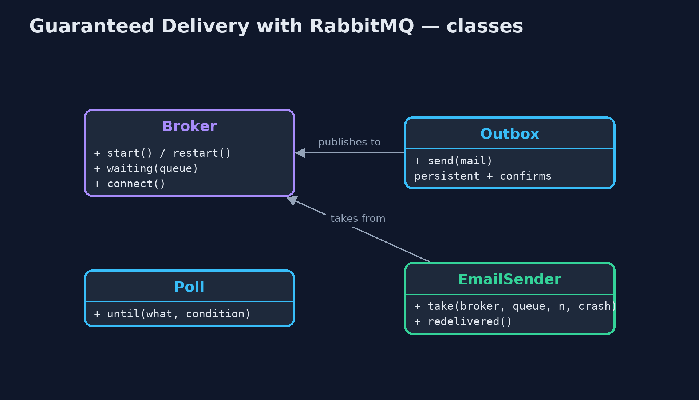
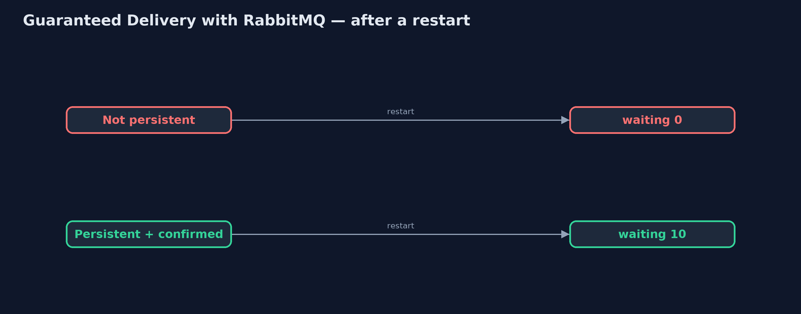
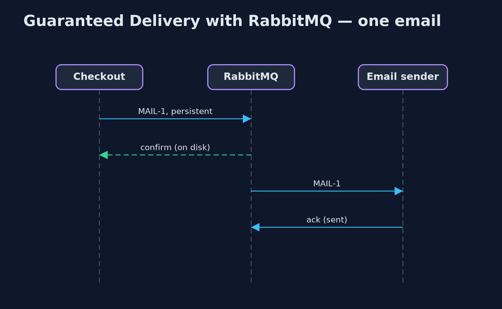

# Guaranteed Delivery with RabbitMQ Pattern

```
src/main/java/com/jk/explore/guaranteedrabbit/
├── Broker.java                        A real RabbitMQ broker, running in a container that this demo starts and stops itself
├── EmailSender.java                   The receiver: takes emails off the queue, sends them, and only then acknowledges each one
├── Outbox.java                        Checkout's side: puts confirmation emails on a queue
├── Poll.java                          Waits for a real condition, checking often, and gives up after a limit
└── RabbitGuaranteedDeliveryDemo.java  The five acts, against a real RabbitMQ broker started and stopped by this program
```

**Guarantee delivery with a real RabbitMQ broker: persistent messages on a durable queue, publisher confirms so the sender knows each message is stored, and acknowledgements so a message leaves the queue only after it has been handled.**

This is the real-infrastructure version of the Guaranteed Delivery pattern.
The plain Java version, a separate project in this category, writes its own
journal file to disk. Here a real RabbitMQ broker, started in a container by
the demo itself, does the storing, and the demo restarts the broker to show
what survives.

Three settings together make the guarantee. The queue is durable, so the
queue survives a restart. Each message is sent as persistent, so the message
itself is written to disk. And the sender turns on publisher confirms, so it
waits until the broker says the message is safely stored. On the receiving
side, each message is acknowledged only after the email has been sent.

## The idea in everyday terms

Think of sending an important letter by recorded delivery. The post office
logs it when you hand it over and gives you a receipt, which is the confirm.
The letter is signed for at the other end, which is the acknowledgement. If
the van breaks down, the letter is still in the sorting office. And if the
recipient signs, then drops the letter unread, a second copy may arrive: the
service guarantees at least one delivery, not exactly one.

## The scenario

The online store sends a confirmation email for every order. The emails wait
on a queue while the email provider is slow. When the broker restarted for an
update, ten queued emails vanished, and ten customers never heard that their
order had been received.

## Run

This project needs a running container runtime, such as Docker Desktop: the
demo starts a real RabbitMQ 4.3.6 broker in a container and removes it again.
Without one, it prints a sentence saying what to start, rather than failing.

```bash
./gradlew run
```

The demo tells the story in 5 acts, each printing exact numbers that the tests check:

| Act | What it shows |
| --- | --- |
| 1. Durable queue, transient messages | 10 emails on a durable queue but sent as not persistent: after a broker restart the queue is there, with 0 waiting. |
| 2. Persistent and confirmed | Persistent messages with publisher confirms: each is confirmed after it is stored; after a restart, 10 are waiting. |
| 3. Acknowledged after sending | The sender acknowledges each email after sending it: 6 sent, 4 still waiting; a new sender takes the rest, 10 of 10, each once. |
| 4. A crash before the acknowledgement | The sender dies after sending MAIL-11 but before acknowledging it: RabbitMQ redelivers it, marked redelivered, and the customer gets it twice. |
| 5. The bill | Every email waits for a disk write and a confirm; and the broker is one more system to run, back up and watch. |

## Test

```bash
./gradlew test
```

2 tests in `DemoRunsTest`. Every number the demo prints is asserted against a real broker. Waits are bounded polls on real conditions, never fixed sleeps. Without a container runtime, the broker test is skipped rather than failed.

## What the simulation got right, and what it left out

The plain Java version got the idea exactly right: write every message down
before accepting it, remove it only when acknowledged, and accept that a
crash between sending and acknowledging means a duplicate. What it left out
is how a real broker divides that work, and the traps in its settings. A
durable queue alone is not enough: messages sent as not persistent vanished
on restart although the queue survived. The sender only knows a message is
safe once the broker confirms it. RabbitMQ 4 refuses shared queues that are
not durable at all. And the broker marks a message it delivers again as
redelivered, which a receiver can use to check before sending twice.

## Technologies and versions

| Technology | Version | Used for |
| --- | --- | --- |
| Java | 21 | the code (toolchain set in `build.gradle`) |
| Gradle | 9.2.1 (wrapper) | build and run, nothing to install |
| JUnit | 5.10.2 | the tests |
| RabbitMQ | 4.3.6 (container image) | the broker: durable queue, persistence, confirms, acknowledgements |
| RabbitMQ Java client | 5.36.0 | publishing, confirms, getting and acknowledging |
| Testcontainers | 2.0.5 | starts and stops the broker container from the demo |
| Docker | 24 or later | runs the container |
| SLF4J simple | 2.0.17 | library logging, switched off |
| videokit | repository tool | the narrated video and animation: Piper `en_US-amy-medium`, speed 0.8, longer pauses (the approved `amy-slow` voice) |

## Learning Material

| Document | What it is for |
| --- | --- |
| [Dependencies](docs/dependencies.md) | what the framework and infrastructure are, and why they are here |
| [Problem statement](docs/problem-statement.md) | the situation and what the project must show |
| [Prerequisites](docs/prerequisites.md) | what you need to know first |
| [Guaranteed Delivery with RabbitMQ, explained](docs/guaranteed-delivery-with-rabbitmq-pattern-explained.md) | the acts in prose |
| [Session guide](docs/session.md) | a one-hour lesson with exercises |
| [Animated walkthrough](docs/animation.html) | the acts step by step, narrated |
| [Spec](docs/spec.md) | what this project must be true of |

### The pattern in one picture

Confirmed on the way in, acknowledged on the way out.


### Where each piece sits

The guarantee lives in how things are declared.



### How the data moves

The message setting decides what survives.



### Who calls whom, in order

Stored before confirmed; removed after acked.



### Video

`video/guaranteed-delivery-with-rabbitmq-pattern-explained.mp4` (with `.m4a` audio and `.srt` subtitles) is built by `video/build_video.sh`. Rendered media is not committed.

## What it costs

- **Slower sends.** Every email waits for a disk write and a confirm before checkout moves on.
- **Duplicates remain.** A receiver that dies after sending but before acknowledging causes a second email.
- **Another system.** The broker must be run, backed up and watched; one node is still one disk, so production uses replicated queues.

## When this is too much

For messages that can be recreated or safely lost, such as live price
updates, persistence and confirms only add cost. Guaranteed delivery is for
messages whose loss someone would notice: orders, payments, confirmations.

## Where you have already met this

- RabbitMQ durable queues, persistent messages, confirms and manual acks.
- Kafka's `acks=all` with replicated partitions.
- Amazon SQS, which keeps a message until it is deleted by the receiver.

## Where this sits

This project is in [messaging-integration-patterns](..). It is the
real-infrastructure version of the plain Java Guaranteed Delivery project in
the same category, which is left unchanged.
