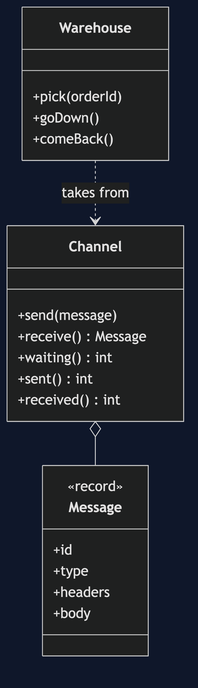

# Message Channel Pattern

```
src/main/java/com/jk/explore/messagechannel/
├── MessageChannelDemo.java          the six acts
├── Channel.java                     a named, typed, bounded queue between two systems
├── Message.java                     an envelope: headers and a body
├── Warehouse.java                   the system on the other end; can be taken down
└── WrongType.java  ChannelFull.java
```

**A message channel is a queue between two systems, so neither has to wait for the other.**

This is the first project in [messaging-integration-patterns](..), whose subject is how separate systems exchange messages safely. Everything else in the category, routing, splitting, dead letters and buses, is built on the channel.

## Run

```bash
./gradlew run
```

Six acts. Every number quoted below comes from this program's own output.

```
ONE. Checkout calls the warehouse.
  the warehouse system is down for maintenance. orders placed: 3. checkouts that failed: 3.
  the shop cannot sell while another system is away, though selling does not need it to answer yet.
TWO. A channel between them.
  checkout sends 3 messages and carries on. waiting in the channel: 3.
  the warehouse takes them, each once: [ORD-1, ORD-2, ORD-3].
THREE. The receiver is away.
  the warehouse is down. checkout sends 3, and none fail. waiting: 3.
  the warehouse comes back and works through them, in order: [ORD-1, ORD-2, ORD-3].
FOUR. An envelope.
  headers, readable without opening the body: {correlation=ORD-1, priority=express}. type: PickOrder.
  body: 2 x MUG-BLUE.
  a router or a receiver can decide what to do from the envelope alone.
FIVE. One channel, one kind of message.
  channel pick-orders carries PickOrder but was given RefundRequest.
  a receiver of pick orders never has to ask what it was given.
SIX. The bill.
  the warehouse stays down and a channel of 5 fills: 5 accepted, 3 refused. a channel must have a limit, and somebody must decide what to do at it.
  and the sender no longer learns whether the warehouse picked the order. it learns only that the message was accepted.
  sent 5, received 0: the difference is work nobody has done yet.
```

## Test

```bash
./gradlew test
```

2 test classes, 7 test methods, offline, with nothing installed and no framework.

## Technologies and versions

| What | Version | Why it is here |
| --- | --- | --- |
| Java | 21 | The repository standard, via the Gradle toolchain block |
| Gradle | 9.2.1 | The wrapper in this directory; no separate install needed |
| JUnit 5 | 5.10.2 | Test runner |

No framework. A hand-built project stays plain Java so the mechanism is the whole lesson.

## Learning Material

| Document | What it covers |
| --- | --- |
| [`docs/problem-statement.md`](docs/problem-statement.md) | Two systems that are not always up together |
| [`docs/message-channel-pattern-explained.md`](docs/message-channel-pattern-explained.md) | The pattern, and six acts |
| [`docs/class-diagram.md`](docs/class-diagram.md) | The types |
| [`docs/architecture-diagram.md`](docs/architecture-diagram.md) | A sender, a channel and a receiver |
| [`docs/data-flow-diagram.md`](docs/data-flow-diagram.md) | What happens to a message |
| [`docs/sequence-diagram.md`](docs/sequence-diagram.md) | Written for a listener with the screen off |
| [`docs/uml-diagram.md`](docs/uml-diagram.md) | Four sequences |
| [`docs/animation.html`](docs/animation.html) | The six acts in a browser |
| [`docs/prerequisites.md`](docs/prerequisites.md) | What you need to know |
| [`docs/session.md`](docs/session.md) | A one-hour taught session |
| [`docs/spec.md`](docs/spec.md) | The generated specification |
| [`docs/youtube.md`](docs/youtube.md) | Title, description and chapters |

### The pattern in one picture



### Where each piece sits


### How one request moves


### Who calls whom, in order


### All four sequences


### Video

Built from [`video/scenes.py`](video/scenes.py) by
[`video/build_video.sh`](video/build_video.sh). The rendered file is not
committed; see the repository README for why.

## Where you have already met this

Every message queue product, and Java's own `BlockingQueue`, which is the same idea inside one process.

## When this is too much

If both systems are always up and the caller needs the answer now, a direct call is simpler. A channel is for decoupling in time.

## Where this sits

This project is in [`messaging-integration-patterns`](..), and is meant to be read with its neighbours there.
