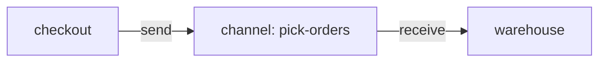

# Message Channel Pattern — Architecture Diagram

The sender and the receiver only know the channel.

Mermaid source

```mermaid
flowchart LR
    C["checkout"] -->|send| Q["channel: pick-orders"]
    Q -->|receive| W["warehouse"]
```

