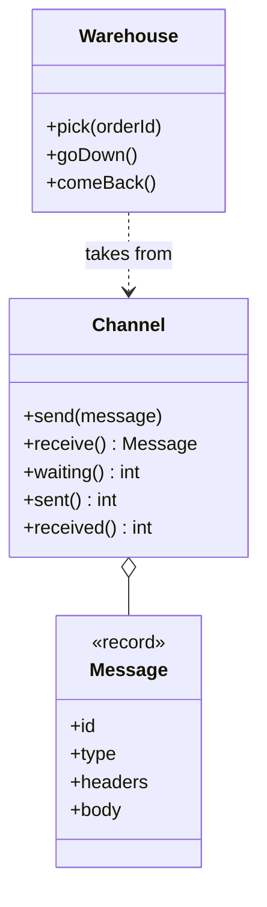

# Message Channel Pattern — Class Diagram

A channel carries typed messages between a sender and a receiver.

Mermaid source

```mermaid
classDiagram
    class Channel {
        +send(message)
        +receive() Message
        +waiting() int
        +sent() int
        +received() int
    }
    class Message {
        <<record>>
        +id
        +type
        +headers
        +body
    }
    class Warehouse {
        +pick(orderId)
        +goDown()
        +comeBack()
    }
    Channel o-- Message
    Warehouse ..> Channel : takes from
```

