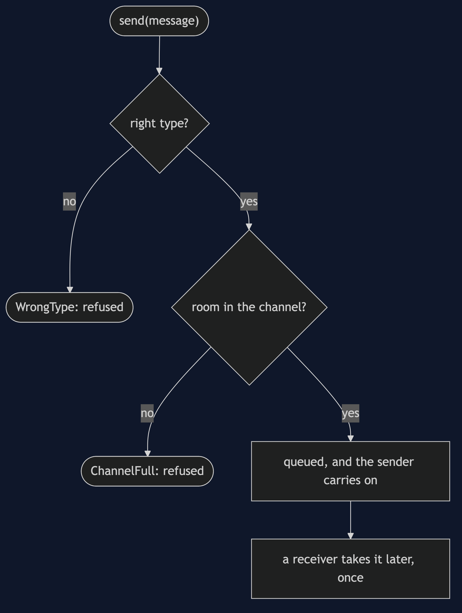
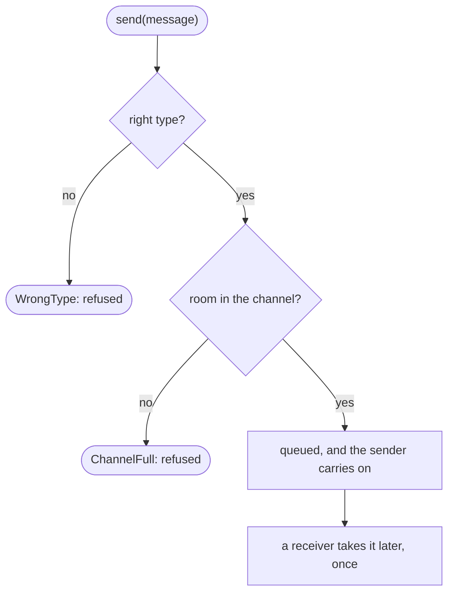

# Message Channel Pattern — Data Flow Diagram

What happens to a message sent to the channel.

Mermaid source

```mermaid
flowchart TD
    Send(["send(message)"])
    T{"right type?"}
    Wrong(["WrongType: refused"])
    F{"room in the channel?"}
    Full(["ChannelFull: refused"])
    Q["queued, and the sender carries on"]
    R["a receiver takes it later, once"]
    Send --> T
    T -- no --> Wrong
    T -- yes --> F
    F -- no --> Full
    F -- yes --> Q --> R
```

