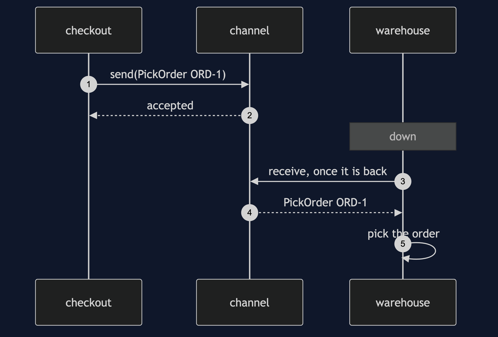
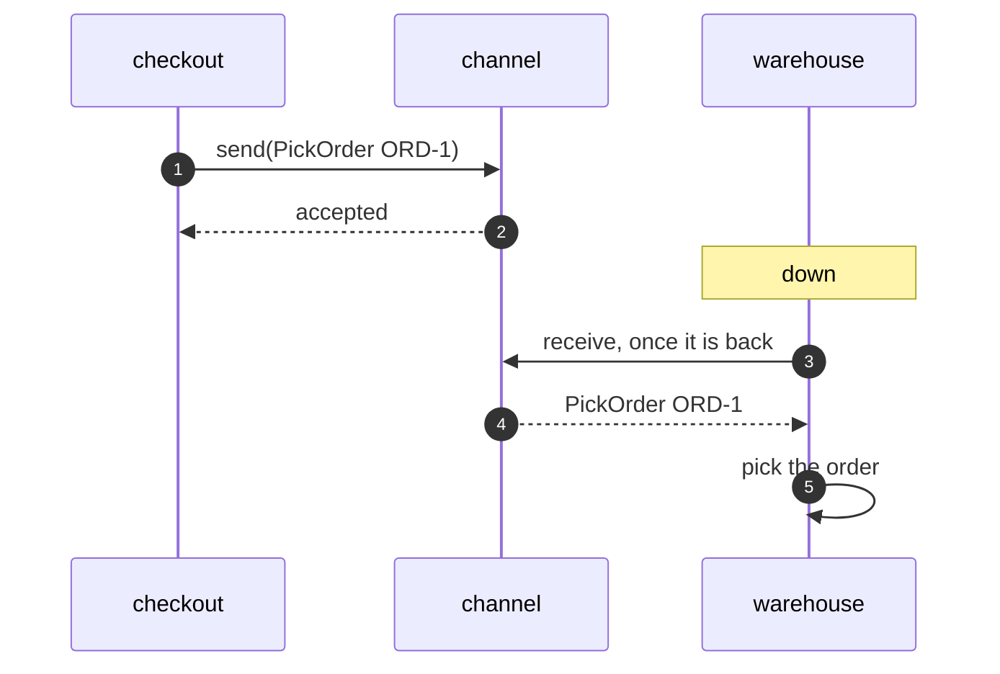

# Message Channel Pattern — Sequence Diagram

Written for a listener with the screen off.

Say it in words. Checkout places an order and sends a pick order message to the channel, and carries on straight away. The warehouse is down, so nothing takes the message, and it waits. Later the warehouse comes back and asks the channel for a message, and takes the pick order. It picks the order. Checkout was never held up.

Mermaid source

The load-bearing sentence: **the sender is not held up by the receiver.**
