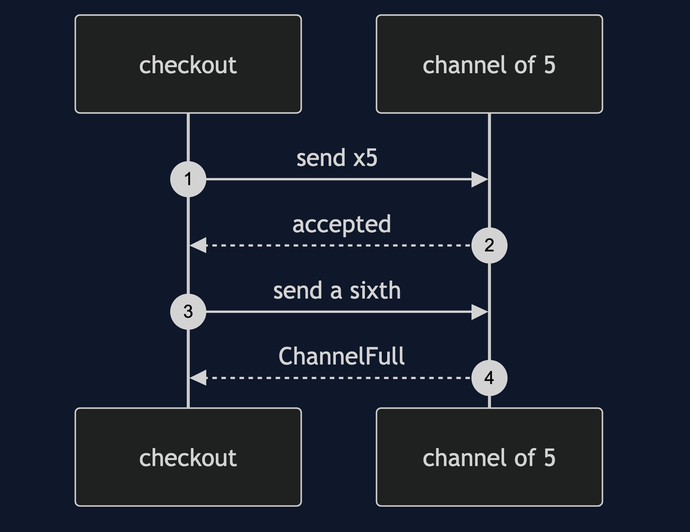
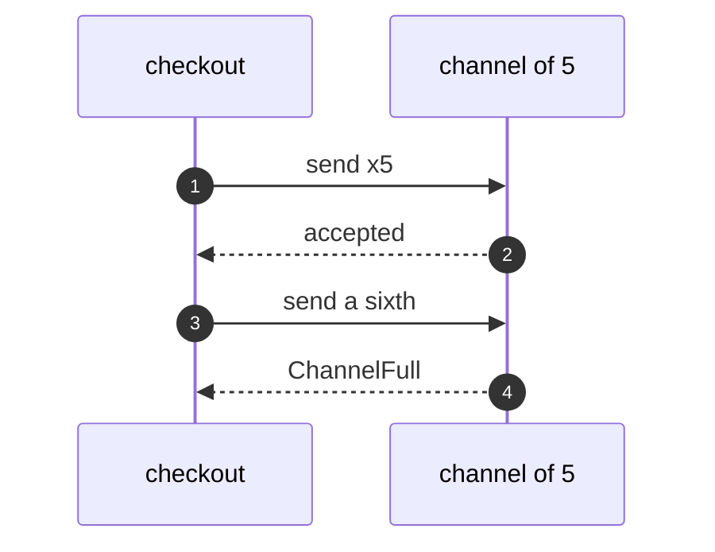

# Message Channel Pattern — UML Sequence Diagrams

Four sequences.

## 1. A Full Channel

Mermaid source

```mermaid
sequenceDiagram
    autonumber
    participant C as checkout
    participant Q as channel of 5
    C->>Q: send x5
    Q-->>C: accepted
    C->>Q: send a sixth
    Q-->>C: ChannelFull
```

