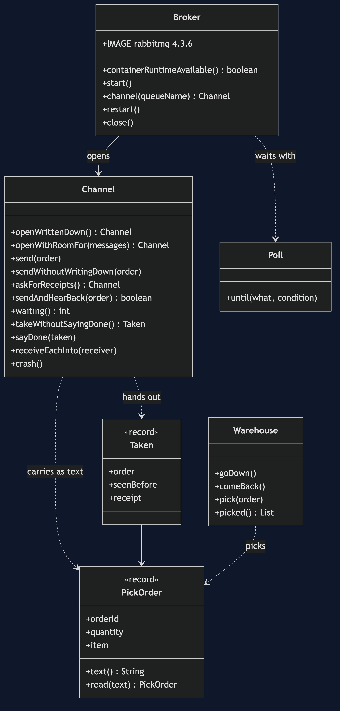
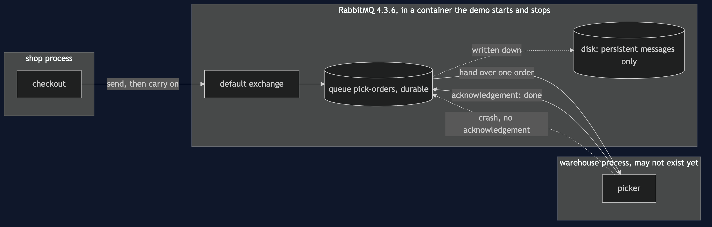
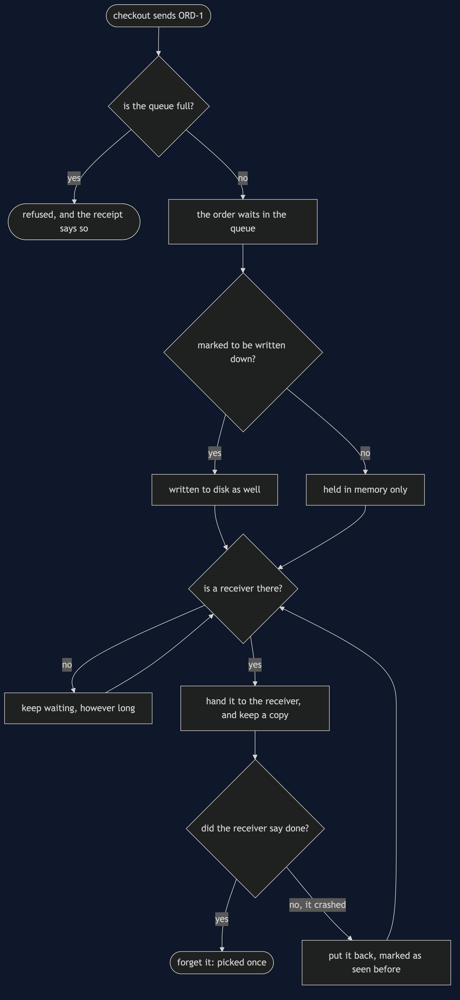

# Message Channel with RabbitMQ Pattern

```
src/main/java/com/jk/explore/messagechannelrabbitmq/
├── RabbitMessageChannelDemo.java   the six acts
├── Broker.java                     starts, restarts and stops a real RabbitMQ container
├── Channel.java                    the pattern: a named queue on the broker, send, take, say done
├── PickOrder.java                  the message, and the text it travels as
├── Warehouse.java                  the system on the other end; can be taken down
└── Poll.java                       every wait is a question asked until the answer is yes
```

**On a real broker, the channel is a separate program. It keeps a message while nobody is listening, keeps it again if the receiver dies half-way through, and keeps it through its own restart — but only if you asked for each of those things.**

**This project needs a container runtime.** Docker Desktop, or anything Docker-compatible, must be running before you start. The demo brings a RabbitMQ broker up in a container and takes it down again at the end; nothing is installed and nothing is left behind. With no runtime, the demo prints two sentences saying what to do, and stops, rather than a stack trace.

This project is the real-infrastructure version of [Message Channel](../message-channel-pattern). That project built the channel as a queue inside one Java program. This one puts the channel in RabbitMQ, a message broker running as its own process, and shows the three things a channel inside one program cannot do: outlive the receiver, be told a message was handled, and outlive itself.

## Run

```bash
./gradlew run
```

Six acts, against a real broker. Every number quoted below, and in every document and slide in this project, comes from this program's own output. Two runs back to back print exactly the same thing.

```
ONE. Checkout calls the warehouse.
  the warehouse system is down for maintenance. orders placed: 3. checkouts that failed: 3.
  the shop cannot sell while another system is away, though selling does not need it to answer yet.
TWO. A real channel between them.
  a RabbitMQ broker is running in a container. checkout sends 3 pick orders and carries on.
  the warehouse is listening and takes them, each once: [ORD-1, ORD-2, ORD-3]. left waiting: 0.
THREE. Nobody is listening yet.
  the warehouse is not running, so no receiver exists. checkout sends 3, and none fail. the broker is holding: 3.
  the warehouse starts up afterwards and works through them, in order: [ORD-1, ORD-2, ORD-3].
FOUR. Saying done.
  a picker takes ORD-1 and crashes before saying it is done. the broker puts it back. waiting again: 1.
  a second picker is handed the same ORD-1, marked as seen before: true, and says done. deliveries: 2, orders picked: 1, waiting: 0.
FIVE. Written to disk, or only held in memory.
  two channels hold 3 orders each. the broker is asked to write one channel's messages to disk and to hold the other's in memory only.
  the broker program is stopped and started again. written to disk: 3 orders still waiting. held in memory only: 0.
  a channel that outlives the sender, the receiver and the broker itself is the whole reason to pay for a broker.
SIX. The bill.
  the warehouse stays down and a channel with room for 5 is given 8: 5 accepted, 3 refused. a channel must have a limit, and somebody must decide what to do at it.
  and the sender no longer learns whether the warehouse picked the order. it learns only that the broker took the message.
  and a broker is a third system to run, secure, upgrade and watch: this demo needed 1 container for 1 shop and 1 warehouse.
```

The first run downloads the RabbitMQ image, about 256 MB once unpacked, and takes longer. After that a run takes about ten seconds, most of it the broker starting.

## Test

```bash
./gradlew test
```

3 test classes, 12 test methods. `PlainPartsTest` needs nothing installed. `RealBrokerTest` starts one broker for the whole class and asks it directly: a message waits while nobody listens, order is kept, an unacknowledged message comes back marked as seen before, a full channel refuses rather than drops, and a restart keeps only what was written to disk. `DemoRunsTest` runs the demo and asserts every figure the documents quote.

There is no `Thread.sleep` anywhere under `src/test`. Every wait is a poll on something the broker can actually be asked about — how many messages are waiting, whether a message was handed over — with a sixty-second limit that fails the test rather than hanging it. The tests that need the broker are skipped when no container runtime is there; the rest still run.

## What the simulation got right, and what it left out

This is the reason this project exists, so it comes before anything else.

**What [Message Channel](../message-channel-pattern) got right.** All of the shape. The sender puts a message in and carries on. The receiver takes it out when it is ready, each message once, in the order it went in. A receiver that is away does not make the sender fail; the messages simply wait. A channel has to have a limit, and somebody has to decide what happens at it. And once the channel is in the middle, the sender learns only that the message was accepted, never whether the work was done. Every one of those lessons holds on RabbitMQ, and this project's first, second, third and sixth acts reproduce them with the same figures: 3 failed checkouts, 3 held while nobody listens, 5 accepted and 3 refused.

**What it left out, first: the channel lived inside the sender.** The simulation's channel was a list in the same program as the shop and the warehouse. "The warehouse is away" was a flag on an object. If that program had stopped, every waiting message would have gone with it, so the simulation could only ever show a receiver that was away, never a receiver that did not exist yet. Here the channel is in another process, and the third act sends three orders to a queue with no receiver at all, then starts the warehouse afterwards.

**Second: a message handed over is not a message finished.** In the simulation, taking a message out of the list removed it. On a broker, handing a message to a receiver and forgetting it are two separate steps, and the second only happens when the receiver says it is done — RabbitMQ calls that an acknowledgement. The fourth act shows why: a picker takes order ORD-1 and crashes before saying done, and the broker puts it back and hands it to the next picker, flagged as seen before. That is 2 deliveries for 1 order picked. The cost is that the receiver must be ready to see the same message twice.

**Third, and the headline find: "keep it safe" is two settings, not one.** The simulation had no disk to write to, so it never had to say what survives. RabbitMQ asks twice: once when the queue is created, whether the queue itself is written down, and again on every message, whether that message is. The fifth act makes both queues written down and differs only in the messages. After the broker program is stopped and started again, both queues are still there, but one holds 3 orders and the other holds 0. A queue that survived a restart and came back empty looks, from outside, exactly like a quiet day.

**Fourth: a full channel quietly throws away by default.** The simulation's full channel refused the sixth message with an exception the sender could not miss. RabbitMQ's queues have no limit at all unless you set one, and when you set one, its default is to make room by silently dropping the *oldest* waiting message. The sixth act has to ask for two things to get the simulation's behaviour back: a limit that refuses new messages instead, and receipts from the broker for every send — RabbitMQ calls them publisher confirms — because without a receipt a refused message simply vanishes and the sender never hears about it.

**What the simulation had that the broker does not.** The simulation's channel refused a message of the wrong type. A RabbitMQ queue carries bytes, so the pick order is turned into text on the way in and read back on the way out, and nothing stops a refund request being put into the pick-order queue. If one kind of message per channel matters, it is a rule the application keeps, not the broker.

## Technologies and versions

| What | Version | Why it is here |
| --- | --- | --- |
| Java | 21 | The repository standard, via the Gradle toolchain block |
| Gradle | 9.2.1 | The wrapper in this directory; no separate install needed |
| RabbitMQ | 4.3.6 | The broker, as the official `rabbitmq:4.3.6` container image; the newest release |
| RabbitMQ Java client | 5.36.0 | `com.rabbitmq:amqp-client`, the newest release; speaks AMQP 0-9-1 to the broker |
| Testcontainers | 2.0.5 | `testcontainers-rabbitmq`; starts, restarts and stops the broker container from inside the demo |
| slf4j-simple | 2.0.17 | Logging for the two libraries above, turned off so the demo's own output is the only output |
| JUnit 5 | 5.10.2 | Test runner |
| A container runtime | Docker 24 or later, or compatible | Runs the broker. Must be running before you start |

Nothing is held back: every version is the newest generally available release. See [`docs/dependencies.md`](docs/dependencies.md) and [`docs/prerequisites.md`](docs/prerequisites.md).

## Learning Material

| Document | What it covers |
| --- | --- |
| [`docs/problem-statement.md`](docs/problem-statement.md) | The partner's version, and what is new |
| [`docs/message-channel-with-rabbitmq-pattern-explained.md`](docs/message-channel-with-rabbitmq-pattern-explained.md) | The broker's words in plain language, and six acts |
| [`docs/class-diagram.md`](docs/class-diagram.md) | The types |
| [`docs/architecture-diagram.md`](docs/architecture-diagram.md) | Three processes, and where the message lives |
| [`docs/data-flow-diagram.md`](docs/data-flow-diagram.md) | What the broker does with one message |
| [`docs/sequence-diagram.md`](docs/sequence-diagram.md) | Written for a listener with the screen off |
| [`docs/uml-diagram.md`](docs/uml-diagram.md) | Four sequences |
| [`docs/animation.html`](docs/animation.html) | The six acts in a browser |
| [`docs/prerequisites.md`](docs/prerequisites.md) | What you need installed, and what you need to know |
| [`docs/session.md`](docs/session.md) | A one-hour taught session |
| [`docs/dependencies.md`](docs/dependencies.md) | What RabbitMQ and Testcontainers are, what they cost, and that skipping this project loses none of the pattern |
| [`docs/spec.md`](docs/spec.md) | The generated specification |
| [`docs/youtube.md`](docs/youtube.md) | Title, description and chapters |

### The pattern in one picture



### Where each piece sits



### How one request moves



### Who calls whom, in order


### All four sequences


### Video

Built from [`video/scenes.py`](video/scenes.py) by
[`video/build_video.sh`](video/build_video.sh). The rendered file is not
committed; see the repository README for why.

## Where you have already met this

Any system where one part hands work to another that may not be up: an order handed to a warehouse, an email handed to a sending service, a payment handed to a settlement job. RabbitMQ, Amazon SQS, Azure Service Bus, ActiveMQ and IBM MQ are all this pattern as a product, and every one of them makes you choose, as RabbitMQ does, what is written to disk and when a message counts as handled.

## When this is too much

If both systems are always up together and the caller needs the answer now, a direct call is simpler and tells you more. If losing a message on a restart is acceptable, a queue inside the program, like the partner project's, costs nothing to run. A broker is a third system to install, secure, upgrade and watch, and it earns that only when the sender and the receiver genuinely live on different schedules.

## Where this sits

This project pairs with [Message Channel](../message-channel-pattern), and is the real-infrastructure version in [`messaging-integration-patterns`](..).
