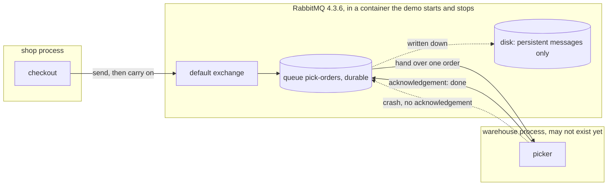

# Message Channel with RabbitMQ Pattern — Architecture Diagram

Three processes, not one. The message lives in the broker, which neither the shop nor the warehouse owns, and what survives a restart is decided twice.

Mermaid source

