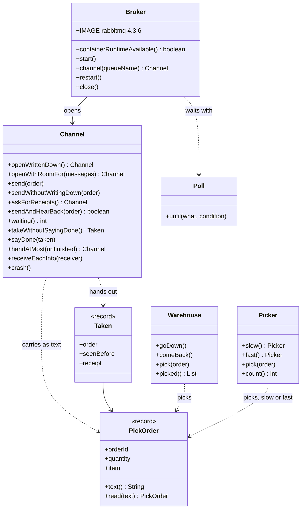

# Message Channel with RabbitMQ Pattern — Class Diagram

The pattern is one class, `Channel`. `Broker` owns the container; everything else is the store's own vocabulary.

Mermaid source

```mermaid
classDiagram
    class Broker {
        +IMAGE rabbitmq 4.3.6
        +containerRuntimeAvailable() boolean
        +start()
        +channel(queueName) Channel
        +restart()
        +close()
    }
    class Channel {
        +openWrittenDown() Channel
        +openWithRoomFor(messages) Channel
        +send(order)
        +sendWithoutWritingDown(order)
        +askForReceipts() Channel
        +sendAndHearBack(order) boolean
        +waiting() int
        +takeWithoutSayingDone() Taken
        +sayDone(taken)
        +handAtMost(unfinished) Channel
        +receiveEachInto(receiver)
        +crash()
    }
    class Taken {
        <<record>>
        +order
        +seenBefore
        +receipt
    }
    class PickOrder {
        <<record>>
        +orderId
        +quantity
        +item
        +text() String
        +read(text) PickOrder
    }
    class Warehouse {
        +goDown()
        +comeBack()
        +pick(order)
        +picked() List
    }
    class Picker {
        +slow() Picker
        +fast() Picker
        +pick(order)
        +count() int
    }
    class Poll {
        +until(what, condition)
    }
    Broker --> Channel : opens
    Channel ..> PickOrder : carries as text
    Channel ..> Taken : hands out
    Taken --> PickOrder
    Warehouse ..> PickOrder : picks
    Picker ..> PickOrder : picks, slow or fast
    Broker ..> Poll : waits with
```

