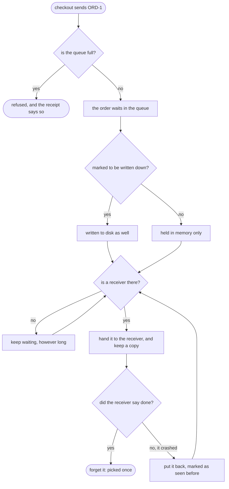

# Message Channel with RabbitMQ Pattern — Data Flow Diagram

What the broker does with one pick order, from the moment checkout sends it to the moment the broker is allowed to forget it.

Mermaid source

