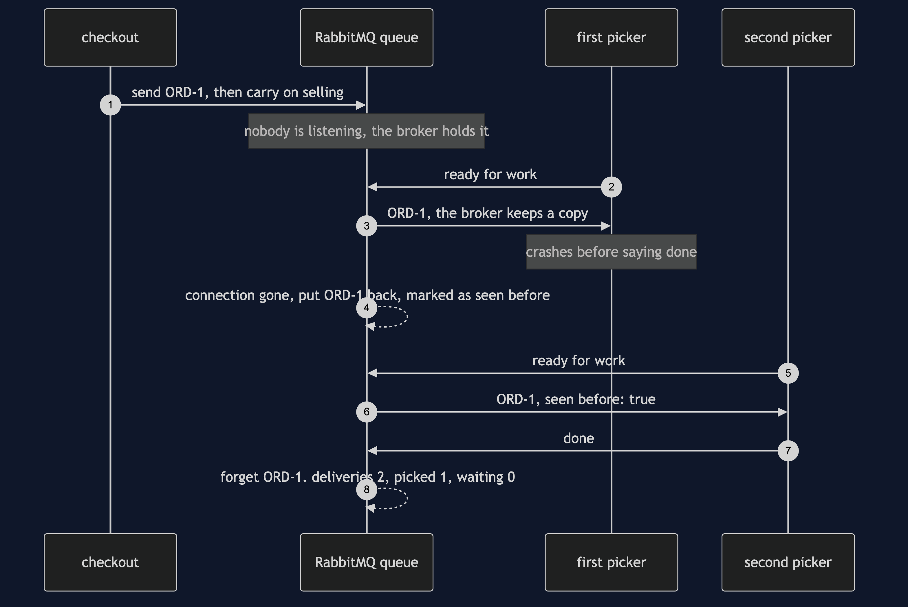
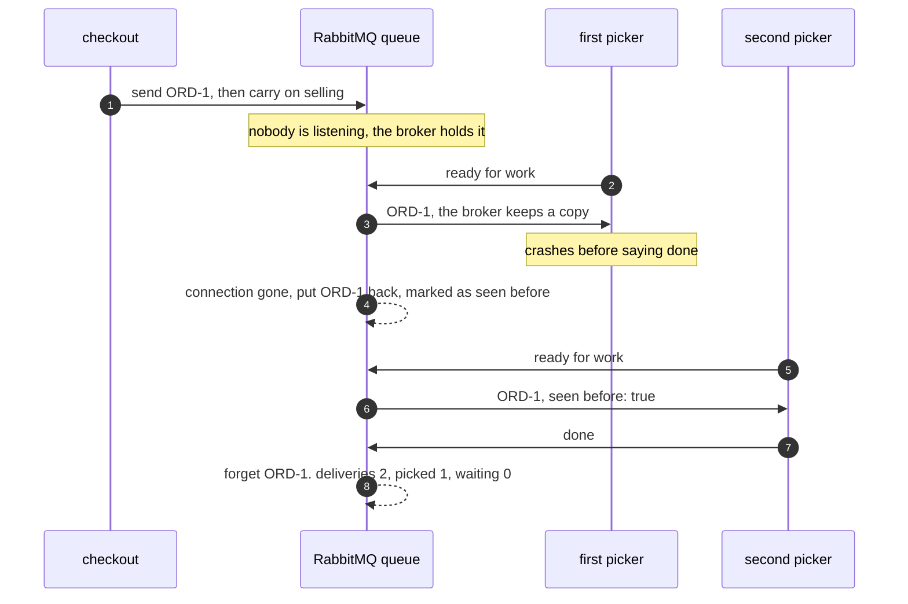

# Message Channel with RabbitMQ Pattern — Sequence Diagram

Written for a listener with the screen off.

Say it in words. Checkout sends one pick order, for order number one, to the broker, and goes straight back to selling; nobody is listening yet. The broker puts the order in a queue and holds it. Some time later a picker in the warehouse starts up and asks for work. The broker hands the order over, but keeps its own copy. The picker crashes before it says it is done. The broker notices the connection has gone, and puts the order back in the queue, marked as seen before. A second picker starts and asks for work. The broker hands it the same order, with the mark on it. This picker picks it and says done. Only now does the broker forget the order. Two deliveries, one order picked, nothing left waiting.

Mermaid source

The load-bearing sentence: **a broker forgets a message only when the receiver says it is done, so a crash costs a second delivery, never a lost order.**

For the restart, the full channel and the rest of the failure modes, see [`uml-diagram.md`](uml-diagram.md).
