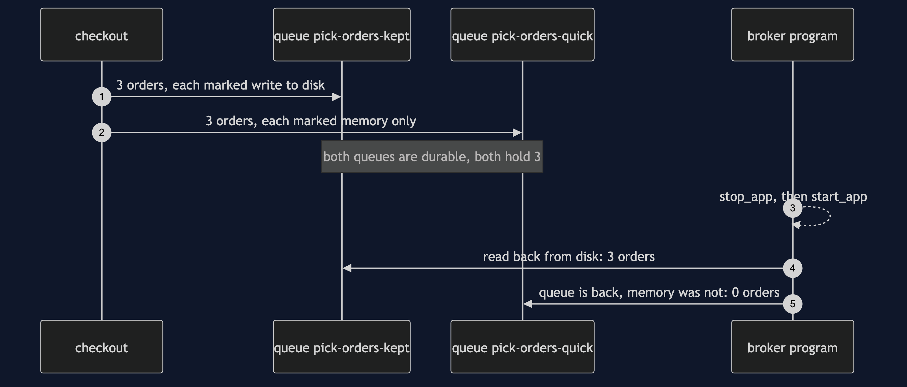
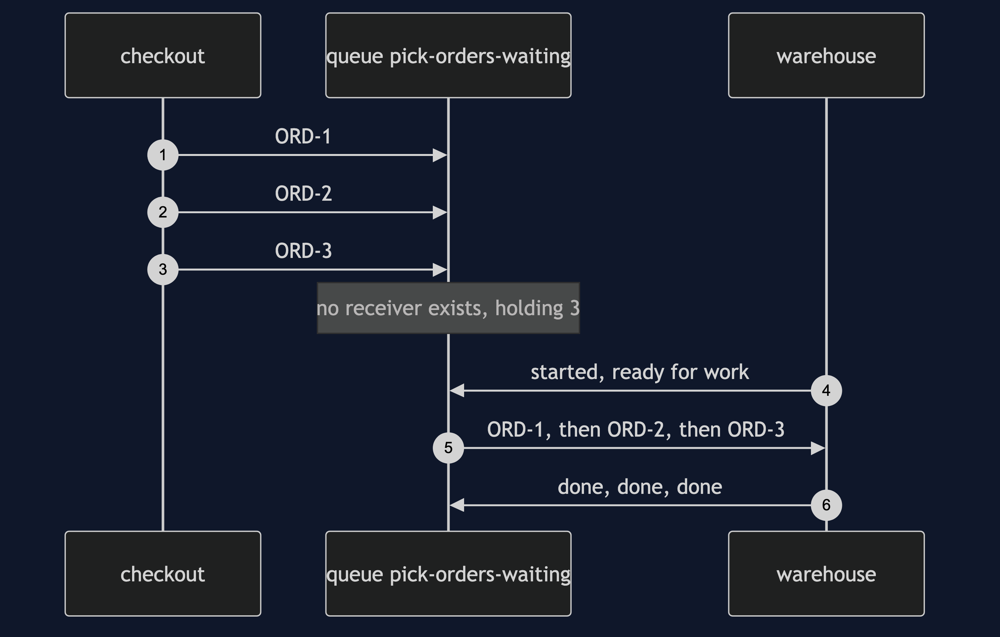
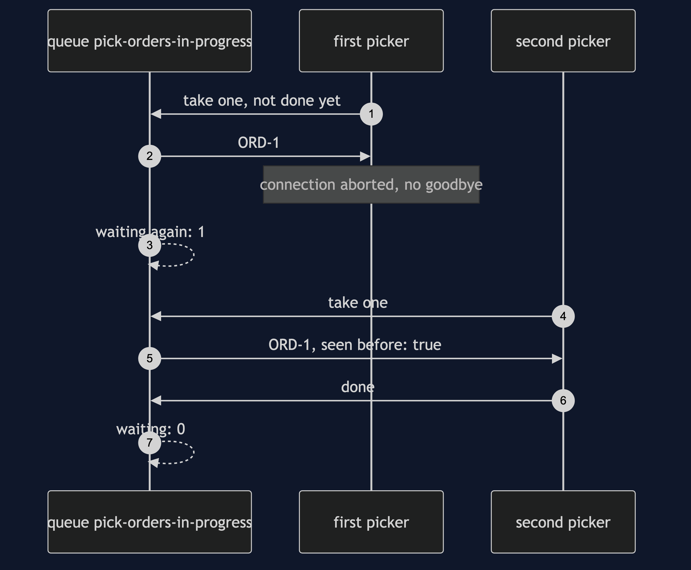
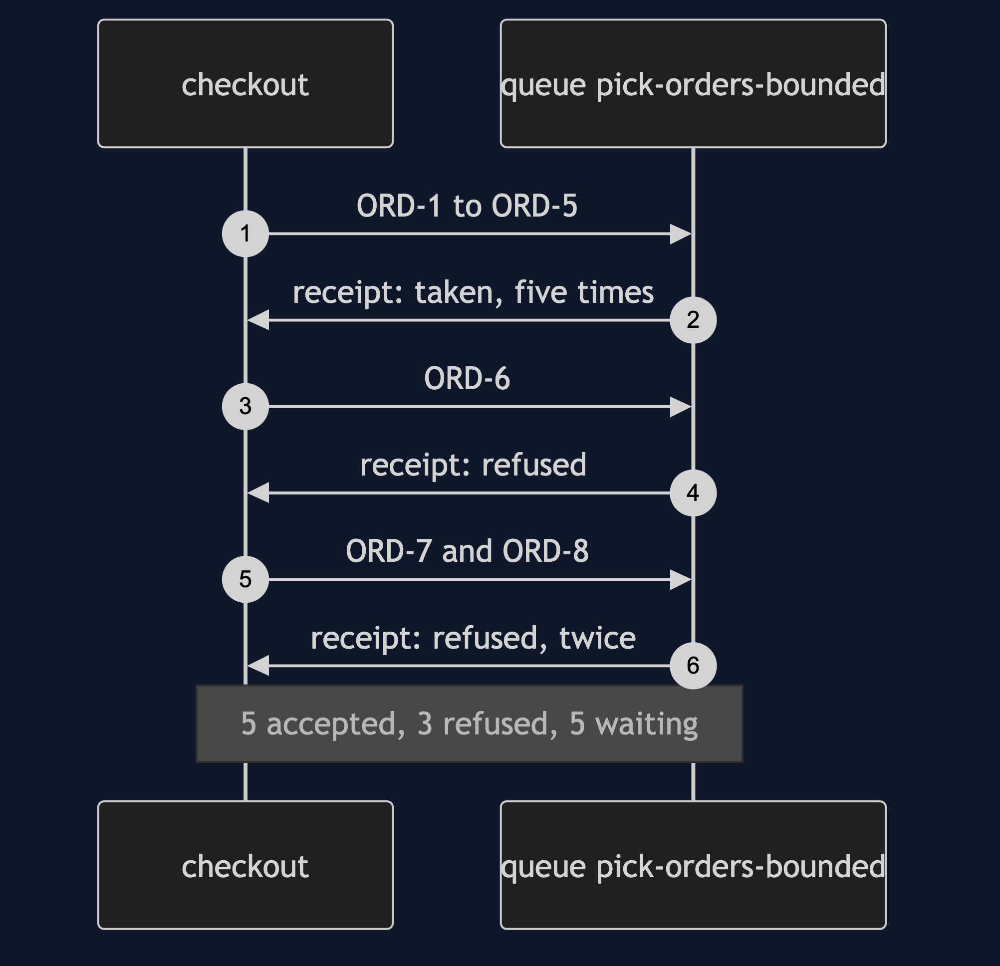

# Message Channel with RabbitMQ Pattern — UML Sequence Diagrams

Four sequences. The restart comes first, because it is the one thing a channel inside one program can never show.

## 1. The Broker Restarts

Two queues, both written down, each holding the same three orders. The only difference is the flag on each message. The broker program is stopped and started again, and only the messages that were marked to be written down come back.

## 2. Nobody Is Listening Yet

The warehouse is not running, so no receiver exists anywhere. Checkout sends three orders and none of them fail. The broker holds all three. When the warehouse starts, it works through them in the order they went in.

## 3. A Crash Before Saying Done

A picker takes the order and dies without a word. The broker had kept a copy, so it puts the order back and hands it to the next picker, marked as seen before.

## 4. A Channel With Room For Five

The warehouse stays down and checkout sends eight. The queue has room for five and has been told to refuse, not to drop the oldest. Checkout asked for a receipt on every send, so it hears each refusal.

