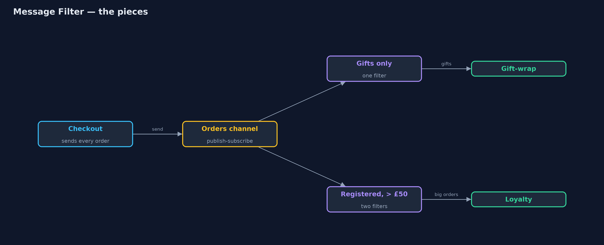
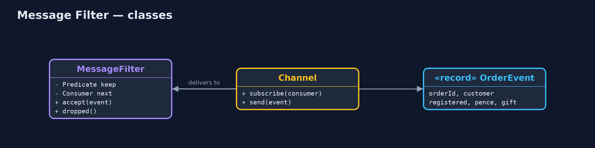
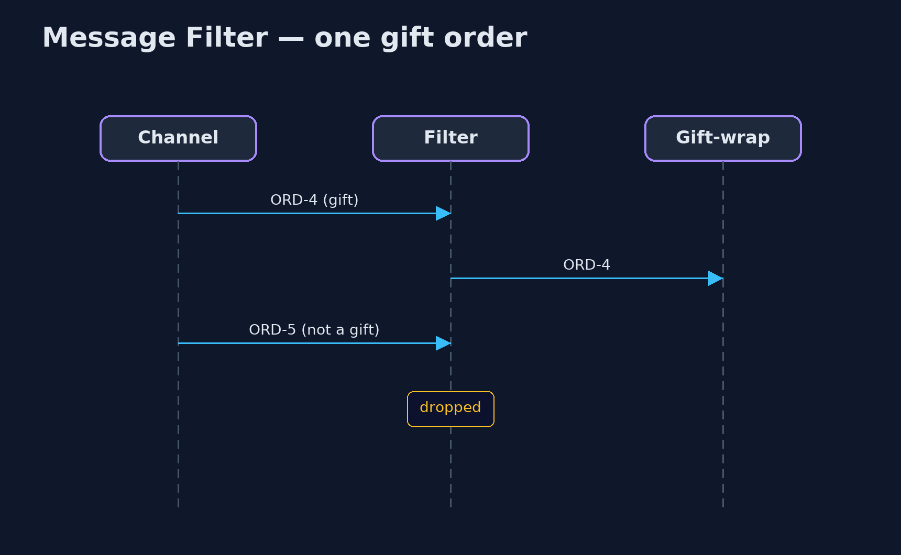

# Message Filter Pattern

```
src/main/java/com/jk/explore/messagefilter/
├── Channel.java            A publish-subscribe channel: every message sent is delivered to every subscriber
├── MessageFilter.java      The pattern: stands between a channel and a receiver, and passes on only the messages that match its rule
├── MessageFilterDemo.java  The five acts: every receiver gets everything, a filter in front of one receiver, chained filters, a changed rule, and the bill
├── OrderEvent.java         "An order was placed": sent to every service that listens on the orders channel
└── Services.java           Receivers that only care about some orders: gift wrapping and loyalty bonuses
```

**Put a filter between a channel and a receiver that passes on only the messages matching its rule, so neither the sender nor the receiver has to know about it.**

Message Filter is one of the Enterprise Integration Patterns. On a
publish-subscribe channel, every subscriber receives every message, even
the ones it does not care about. A message filter sits between the channel
and one receiver, checks each message against a rule, and passes on only the
ones that match. Everything else is dropped.

The sender keeps sending everything, the receiver sees only what it wants,
and the rule lives in one small, replaceable place. Filters can be chained to
combine rules.

## The idea in everyday terms

Think of the spam filter on your email. The world sends you everything; the
filter decides what reaches your inbox. Senders do not know it exists, and you
never have to open the junk. But a good spam filter does not delete mail: it
puts it in a spam folder, because sometimes the rule is wrong.

## The scenario

Every order the online store takes is published on an orders channel. The
gift-wrap service only cares about gift orders, and the loyalty service only
about registered customers spending over £50. Both were handed every order and
had to open and ignore most of them, each repeating its own checks.

## Run

```bash
./gradlew run
```

The demo tells the story in 5 acts, each printing exact numbers that the tests check:

| Act | What it shows |
| --- | --- |
| 1. Everything to everyone | The gift-wrap service is handed 10 orders and wraps 2: 8 deliveries it had to open and ignore. |
| 2. A filter | A gifts-only filter in front of the gift-wrap service: it receives ORD-2 and ORD-4; 8 dropped. |
| 3. Chained filters | Registered, then over £50: the loyalty service receives ORD-1, ORD-4 and ORD-6; 3 guests and 4 small orders dropped. |
| 4. A changed rule | Raising the threshold to £60 leaves ORD-1 and ORD-4; checkout and the loyalty service are unchanged. |
| 5. The bill | 15 messages were dropped across the filters and none was kept; a wrong rule would drop orders silently. |

## Test

```bash
./gradlew test
```

6 tests in `DemoRunsTest`, `MessageFilterTest`. Every number the demo prints is asserted, and nothing depends on the clock, so every run gives the same result.

## Technologies and versions

| Technology | Version | Used for |
| --- | --- | --- |
| Java | 21 | the code (toolchain set in `build.gradle`) |
| Gradle | 9.2.1 (wrapper) | build and run, nothing to install |
| JUnit | 5.10.2 | the tests |
| videokit | repository tool | the narrated video and animation: Piper `en_US-amy-medium`, speed 0.8, longer pauses (the approved `amy-slow` voice) |

## Learning Material

| Document | What it is for |
| --- | --- |
| [Problem statement](docs/problem-statement.md) | the situation and what the project must show |
| [Prerequisites](docs/prerequisites.md) | what you need to know first |
| [Message Filter, explained](docs/message-filter-pattern-explained.md) | the acts in prose |
| [Session guide](docs/session.md) | a one-hour lesson with exercises |
| [Animated walkthrough](docs/animation.html) | the acts step by step, narrated |
| [Spec](docs/spec.md) | what this project must be true of |

### The pattern in one picture

Filters sit in front of receivers, not in the sender.



### Where each piece sits

A filter is just another subscriber that forwards some messages.



### How the data moves

Each filter narrows the stream.


### Who calls whom, in order

Passed on because it matches.



### Video

`video/message-filter-pattern-explained.mp4` (with `.m4a` audio and `.srt` subtitles) is built by `video/build_video.sh`. Rendered media is not committed.

## What it costs

- **Dropped means gone.** Fifteen messages were dropped across the demo's filters, and none was kept anywhere.
- **Silent mistakes.** A wrong rule drops real orders without any error.
- **Another hop.** Each filter is one more step every message passes through.

## When this is too much

When the receiver genuinely needs to see every message, a filter is pointless.
And when many receivers need very different subsets, a content-based router,
or separate channels per kind of message, may be clearer than many filters.

## Where you have already met this

- Apache Camel's `filter` and Spring Integration's `<int:filter>`.
- Subscription filters in cloud messaging, such as SNS or Azure Service Bus.
- Kafka Streams' `filter` step.
- Email rules and spam filters.

## Where this sits

This project is in [messaging-integration-patterns](..), next to
[Content-Based Router](../content-based-router-pattern), which sends each
message to one of several places instead of keeping or dropping it, and
[Dead Letter Channel](../dead-letter-channel-pattern), a home for messages
that cannot be delivered.
