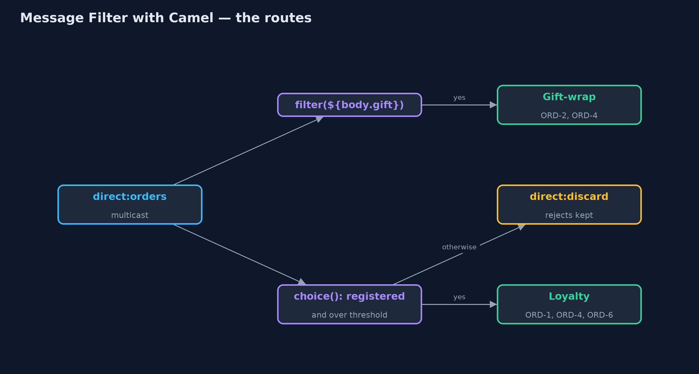
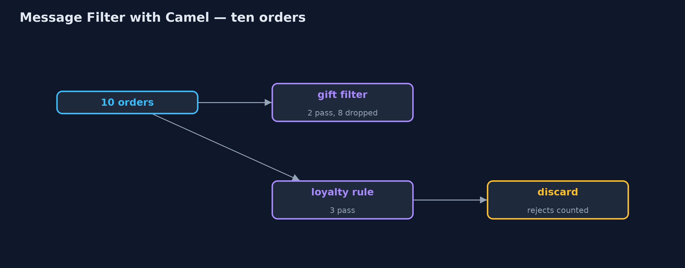
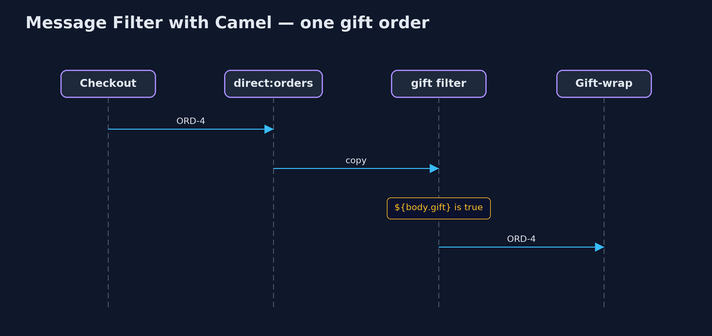

# Message Filter with Apache Camel Pattern

```
src/main/java/com/jk/explore/filtercamel/
├── CamelFilterDemo.java  The five acts, with Apache Camel's filter() and Simple expressions
├── OrderEvent.java       "An order was placed": sent to every service that listens for orders
├── Received.java         What one service was handed, in order
├── Rules.java            Settings the filter rules read at the moment each order passes, so they can change while routes run
└── ShopRoutes.java       The routes
```

**Build the message filter with Apache Camel: a filter() step, written in Camel's Simple expression language, in front of each service, with rules that read their settings as each message passes and a discard channel so nothing vanishes unseen.**

This is the framework version of the Message Filter pattern. The plain Java
version, a separate project in this category, writes the filter as a small
class. Here Apache Camel provides it: a `filter()` step in a route, with the
rule written in Camel's Simple expression language, such as
`${body.gift}`. Checkout sends every order to one endpoint; each service's
route lets through only the orders that service wants.

The Camel version also shows two things the framework makes easy: rules that
read a setting as each message passes, so a threshold can change while the
routes run, and a discard channel, so rejected messages can be counted
instead of disappearing.

## The idea in everyday terms

Think of a company post room that delivers to many departments. Instead of
every department opening every letter to see if it is for them, each
department gives the post room a rule, such as "only letters marked gift
wrap". The post room applies the rules. And a good post room keeps a tray of
letters nobody wanted, rather than throwing them away.

## The scenario

The online store's checkout announces every order. The gift-wrap service only
cares about gift orders, and the loyalty service only about registered
customers spending over £50. Without filters, every service was handed all
ten orders and had to check each one itself.

## Run

Nothing to install beyond a Java 21 JDK: Camel runs inside the program on its
in-memory `direct:` endpoints.

```bash
./gradlew run
```

The demo tells the story in 5 acts, each printing exact numbers that the tests check:

| Act | What it shows |
| --- | --- |
| 1. Every service gets every order | Without filters, the gift-wrap service is handed all 10 orders and must check each one itself. |
| 2. A filter in front | filter(simple("${body.gift}")) lets only ORD-2 and ORD-4 through and drops 8; checkout is unchanged. |
| 3. Two conditions | Registered and over £50: the loyalty service receives ORD-1, ORD-4 and ORD-6. |
| 4. Change the rule while running | The threshold rises to £60 while routes run: the loyalty service now receives ORD-1 and ORD-4, with no restart. |
| 5. The bill, and a discard channel | The 8 orders the loyalty rule rejected are kept on direct:discard; the costs are a string-based rule language and more than 10 library files. |

## Test

```bash
./gradlew test
```

3 tests in `DemoRunsTest`, `ShopRoutesTest`. Every number the demo prints is asserted, and nothing depends on the clock, so every run gives the same result.

## What the simulation got right, and what it left out

The plain Java version got the idea right: a filter is a yes-or-no rule in
front of a receiver, the sender never knows it exists, and a dropped message
is gone. What it left out is what a routing library adds: rules written as
expressions next to the route rather than in a class, rules that read a
setting as each message passes so they can change without a restart, and a
discard channel that is one line to add. It also left out the cost: a new
expression language and a dozen library files.

## Technologies and versions

| Technology | Version | Used for |
| --- | --- | --- |
| Java | 21 | the code (toolchain set in `build.gradle`) |
| Gradle | 9.2.1 (wrapper) | build and run, nothing to install |
| JUnit | 5.10.2 | the tests |
| Apache Camel | 4.22.1 | routes, filter(), choice() and the Simple language |
| SLF4J simple | 2.0.17 | Camel's logging, switched off |
| videokit | repository tool | the narrated video and animation: Piper `en_US-amy-medium`, speed 0.8, longer pauses (the approved `amy-slow` voice) |

## Learning Material

| Document | What it is for |
| --- | --- |
| [Dependencies](docs/dependencies.md) | what the framework and infrastructure are, and why they are here |
| [Problem statement](docs/problem-statement.md) | the situation and what the project must show |
| [Prerequisites](docs/prerequisites.md) | what you need to know first |
| [Message Filter with Apache Camel, explained](docs/message-filter-with-camel-pattern-explained.md) | the acts in prose |
| [Session guide](docs/session.md) | a one-hour lesson with exercises |
| [Animated walkthrough](docs/animation.html) | the acts step by step, narrated |
| [Spec](docs/spec.md) | what this project must be true of |

### The pattern in one picture

One endpoint for checkout; a filter in front of each service.



### Where each piece sits

Rules live in the route.


### How the data moves

Kept, delivered, or discarded.



### Who calls whom, in order

Through the filter to the service.



### Video

`video/message-filter-with-camel-pattern-explained.mp4` (with `.m4a` audio and `.srt` subtitles) is built by `video/build_video.sh`. Rendered media is not committed.

## What it costs

- **Rules in strings.** `${body.pence} > ${header.threshold}` is checked when it runs, not when it compiles; a typo shows up as a runtime error.
- **Still easy to drop silently.** `filter()` on its own discards rejects; the discard channel must be added on purpose.
- **More to carry.** More than ten library files instead of none.

## When this is too much

For one or two receivers with simple rules, the plain Java filter is clearer.
Camel's filter pays off when many services subscribe to the same messages
and the rules change over time.

## Where you have already met this

- Camel's `filter()` and Spring Integration's `@Filter`.
- Message selectors in JMS, and subscription filters in cloud queues.
- Email rules that sort or discard incoming mail.

## Where this sits

This project is in [messaging-integration-patterns](..). It is the framework
version of the plain Java Message Filter project in the same category, which
is left unchanged.
