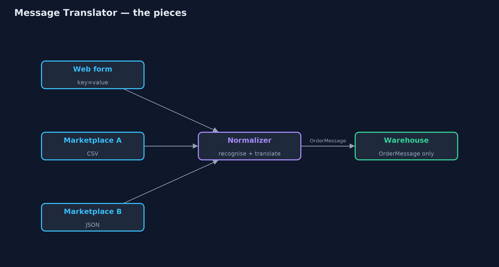
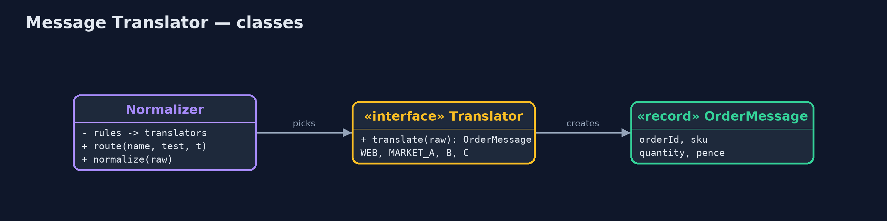
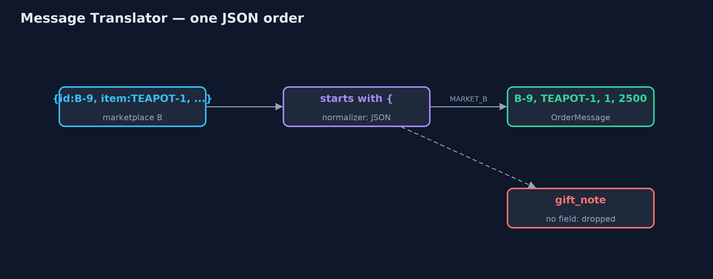
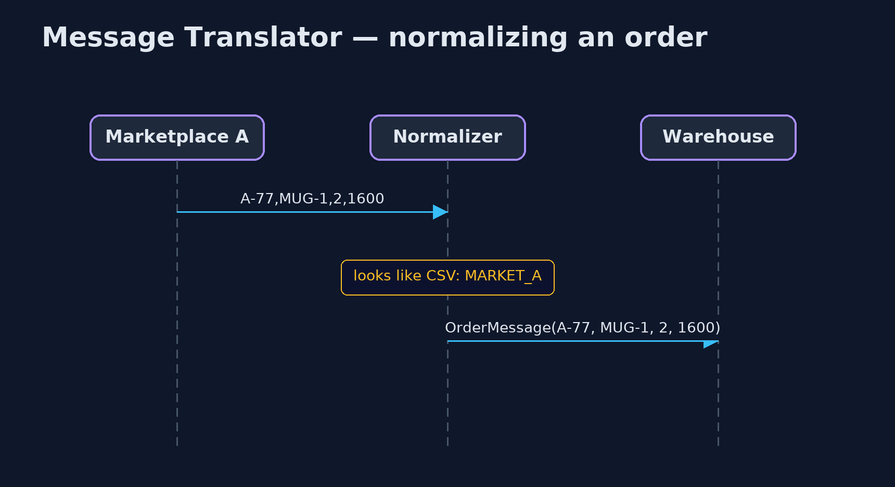

# Message Translator / Normalizer Pattern

```
src/main/java/com/jk/explore/translator/
├── MessageTranslatorDemo.java  The five acts: the warehouse reads every format, translators, the normalizer, a new marketplace, and the bill
├── Normalizer.java             Recognises which format an incoming message is in and sends it to the matching translator
├── OrderMessage.java           The canonical order: the one shape the warehouse understands, whatever the order came from
├── Translators.java            The pattern: one small translator per incoming format, each turning its format into the canonical OrderMessage
└── Warehouse.java              The warehouse
```

**Translate each incoming format into one canonical message at the edge, with one small translator per format and a normalizer that picks the right one, so the rest of the system speaks only one language.**

Message Translator is one of the Enterprise Integration Patterns. When systems
that send you messages each use their own format, a translator converts one
format into the format your system uses. The Normalizer builds on it: it looks
at each incoming message, recognises which format it is in, and passes it to
the matching translator, so everything that comes out is in one canonical
shape.

The code behind the normalizer, here a warehouse, then only ever deals with
one kind of message. Adding a new sender means adding one translator.

## The idea in everyday terms

Think of an international meeting with interpreters. Each delegate speaks
their own language, and an interpreter for each language turns it into the
one working language of the meeting. When a new country joins, you hire one
more interpreter; nobody else has to learn anything. But jokes and turns of
phrase that have no equivalent in the working language are often lost.

## The scenario

The online store takes orders from its own web form and from two
marketplaces. The web form sends key-value text, marketplace A sends CSV,
marketplace B sends JSON with its own field names. The warehouse parsed all
three formats itself, and when a third marketplace arrived with XML, the
warehouse could not read its orders.

## Run

```bash
./gradlew run
```

The demo tells the story in 5 acts, each printing exact numbers that the tests check:

| Act | What it shows |
| --- | --- |
| 1. The warehouse reads every format | The warehouse parses web form, CSV and JSON itself; a new XML marketplace fails: warehouse cannot read this order. |
| 2. Translators | One translator per format; each produces the same OrderMessage: W-1 kettle £30.00, A-77 2 mugs £16.00, B-9 teapot £25.00. |
| 3. The normalizer | The normalizer recognises each format and picks its translator; the warehouse only sees OrderMessage. |
| 4. A new marketplace | Marketplace C's XML gets one translator and one rule; the warehouse picks C-5's kettle unchanged. |
| 5. The bill | Marketplace B's gift note "Happy birthday, Mum" is lost: the canonical order has no field for it. |

## Test

```bash
./gradlew test
```

6 tests in `DemoRunsTest`, `TranslatorTest`. Every number the demo prints is asserted, and nothing depends on the clock, so every run gives the same result.

## Technologies and versions

| Technology | Version | Used for |
| --- | --- | --- |
| Java | 21 | the code (toolchain set in `build.gradle`) |
| Gradle | 9.2.1 (wrapper) | build and run, nothing to install |
| JUnit | 5.10.2 | the tests |
| videokit | repository tool | the narrated video and animation: Piper `en_US-amy-medium`, speed 0.8, longer pauses (the approved `amy-slow` voice) |

## Learning Material

| Document | What it is for |
| --- | --- |
| [Problem statement](docs/problem-statement.md) | the situation and what the project must show |
| [Prerequisites](docs/prerequisites.md) | what you need to know first |
| [Message Translator / Normalizer, explained](docs/message-translator-pattern-explained.md) | the acts in prose |
| [Session guide](docs/session.md) | a one-hour lesson with exercises |
| [Animated walkthrough](docs/animation.html) | the acts step by step, narrated |
| [Spec](docs/spec.md) | what this project must be true of |

### The pattern in one picture

Formats in, one message out.



### Where each piece sits

Rules pick translators; translators make OrderMessages.



### How the data moves

Field names mapped, pounds turned into pence, the gift note dropped.



### Who calls whom, in order

Recognise, translate, deliver.



### Video

`video/message-translator-pattern-explained.mp4` (with `.m4a` audio and `.srt` subtitles) is built by `video/build_video.sh`. Rendered media is not committed.

## What it costs

- **Lost details.** Marketplace B's gift note ("Happy birthday, Mum") has no place in the canonical order and disappears.
- **The canonical model must grow.** Every field someone needs has to be added to it, and to every translator.
- **Translators to maintain.** One per format, each changing whenever its sender changes.

## When this is too much

With a single sender whose format you control, just agree on the format. And
when senders' formats are nearly identical, one flexible parser may be
simpler than a translator each.

## Where you have already met this

- Apache Camel's data formats and `unmarshal`, and Spring Integration transformers.
- Canonical data models in enterprise integration.
- Adapters in payment and shipping integrations that map each provider's API to one internal model.

## Where this sits

This project is in [messaging-integration-patterns](..), next to
[Content Enricher](../content-enricher-pattern), which adds to a message, and
[Content-Based Router](../content-based-router-pattern), the routing idea the
normalizer uses to pick a translator.
