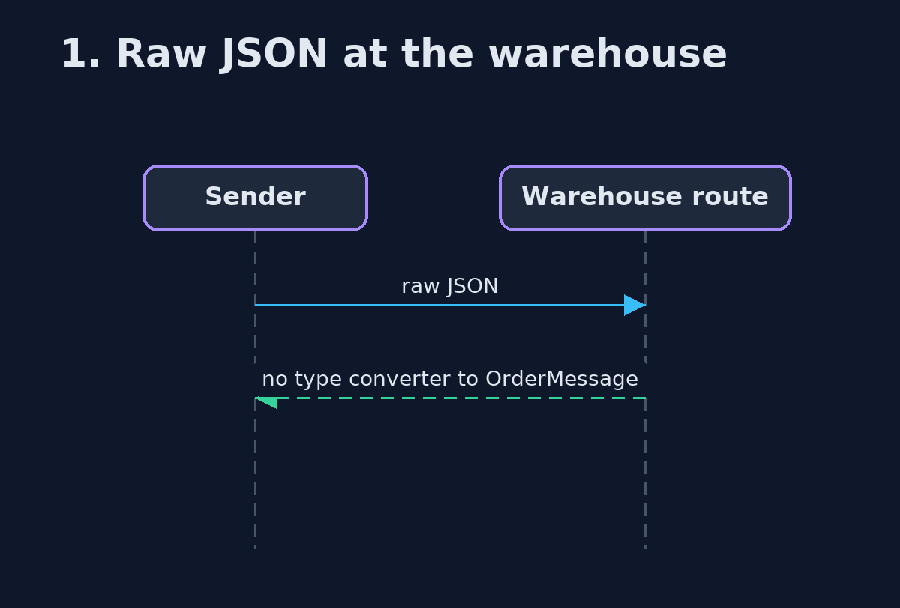
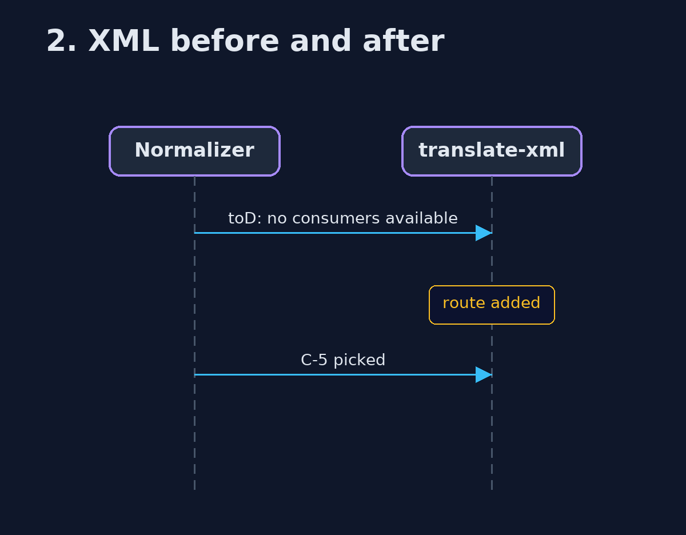

# Message Translator with Apache Camel Pattern — UML Sequence Diagrams

## 1. 1. Raw JSON at the warehouse

Refused by type conversion.

## 2. 2. XML before and after

One route added at run time.

