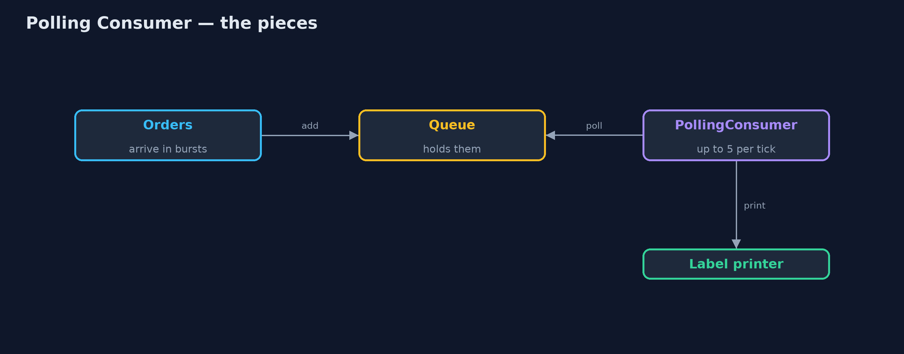
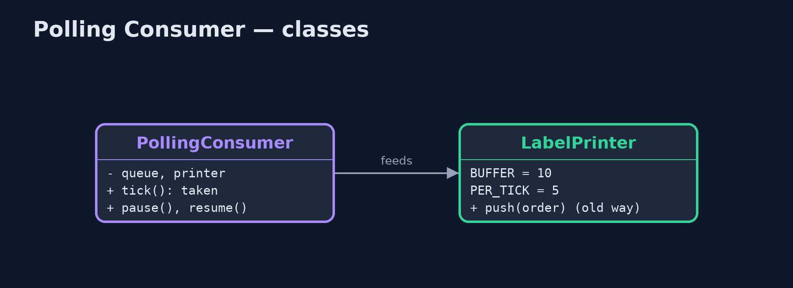
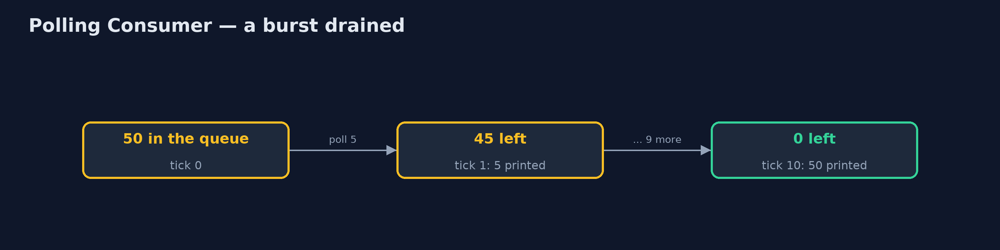
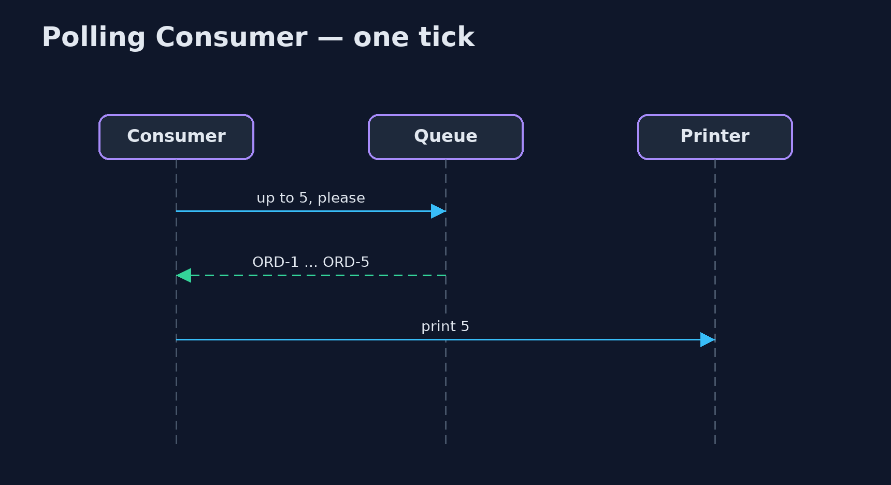

# Polling Consumer Pattern

```
src/main/java/com/jk/explore/pollingconsumer/
├── LabelPrinter.java         The warehouse label printer: can hold 10 jobs in its buffer and prints 5 labels every tick (a tenth of a second)
├── PollingConsumer.java      The pattern: the consumer decides when to take messages
└── PollingConsumerDemo.java  The five acts: orders pushed at the printer, a polling consumer, pausing, how often to poll, and the bill
```

**Let the consumer decide when to take messages: each time it is ready, it asks the queue for as many as it can handle, and everything else waits safely in the queue.**

Polling Consumer is one of the Enterprise Integration Patterns. A consumer can
receive messages in two ways. An event-driven consumer has messages pushed to
it the moment they arrive. A polling consumer pulls: whenever it is ready, it
asks the queue for the next messages, as many as it can handle, and the rest
stay in the queue until it asks again.

The consumer sets its own pace, a burst cannot overwhelm it, and pausing is
simply not asking. The cost is choosing how often to ask: too often wastes
requests, too rarely leaves messages waiting.

## The idea in everyday terms

Think of a post office box instead of home delivery. The courier does not ring
your doorbell while you are in the shower; letters wait safely in the box
until you go and collect them. If you go every five minutes, you mostly walk
there for nothing. If you go once a day, a letter can wait a day.

## The scenario

The online store's warehouse label printer can hold ten jobs in its buffer
and prints five labels a tenth of a second. Orders were pushed at it the
moment they arrived. During a burst of fifty orders, forty were refused
because the printer was busy.

## Run

```bash
./gradlew run
```

The demo tells the story in 5 acts, each printing exact numbers that the tests check:

| Act | What it shows |
| --- | --- |
| 1. Pushed at the printer | A burst of 50 orders pushed at a printer with a 10-job buffer: 10 printed, 40 refused. |
| 2. A polling consumer | Every tick the printer asks for up to 5: all 50 printed in 10 ticks (1.0 s), none refused. |
| 3. Pausing | Paper runs out: polling stops for 3 s; 15 orders wait in the queue; when polling resumes, all 20 print. |
| 4. How often to poll | A quiet minute polled every 0.1 s is 600 polls, all empty; long polling needs 3. |
| 5. The bill | An order arriving just after a poll waits a whole interval; poll often and waste, or rarely and wait. |

## Test

```bash
./gradlew test
```

6 tests in `DemoRunsTest`, `PollingConsumerTest`. Every number the demo prints is asserted, and nothing depends on the clock, so every run gives the same result.

## Technologies and versions

| Technology | Version | Used for |
| --- | --- | --- |
| Java | 21 | the code (toolchain set in `build.gradle`) |
| Gradle | 9.2.1 (wrapper) | build and run, nothing to install |
| JUnit | 5.10.2 | the tests |
| videokit | repository tool | the narrated video and animation: Piper `en_US-amy-medium`, speed 0.8, longer pauses (the approved `amy-slow` voice) |

## Learning Material

| Document | What it is for |
| --- | --- |
| [Problem statement](docs/problem-statement.md) | the situation and what the project must show |
| [Prerequisites](docs/prerequisites.md) | what you need to know first |
| [Polling Consumer, explained](docs/polling-consumer-pattern-explained.md) | the acts in prose |
| [Session guide](docs/session.md) | a one-hour lesson with exercises |
| [Animated walkthrough](docs/animation.html) | the acts step by step, narrated |
| [Spec](docs/spec.md) | what this project must be true of |

### The pattern in one picture

The printer asks; the queue answers with what it can take.



### Where each piece sits

The consumer owns the loop and the pace.



### How the data moves

Fifty orders in, five per tick out.



### Who calls whom, in order

Ask, take, print.



### Video

`video/polling-consumer-pattern-explained.mp4` (with `.m4a` audio and `.srt` subtitles) is built by `video/build_video.sh`. Rendered media is not committed.

## What it costs

- **Waiting for the next poll.** A message that arrives just after a poll waits until the next one.
- **Empty polls.** A quiet minute polled every tenth of a second is 600 requests that find nothing.
- **The consumer must keep asking.** Someone has to run the polling loop and stop it cleanly.

## When this is too much

When messages are rare and must be handled the instant they arrive, and the
consumer can always keep up, an event-driven consumer is simpler. Many
systems combine the two: long polling, where each request waits for up to
some seconds for a message to arrive.

## Where you have already met this

- Kafka consumers calling `poll()` in a loop.
- Amazon SQS `ReceiveMessage` with long polling.
- Spring Integration's polling channel adapters.
- Checking email with IMAP rather than push notifications.

## Where this sits

This project is in [messaging-integration-patterns](..), next to
[Message Channel](../message-channel-pattern), the queue a polling consumer
reads, and near [Backpressure](../../micro-services-design-patterns/backpressure-pattern),
the wider idea of consumers setting the pace.
