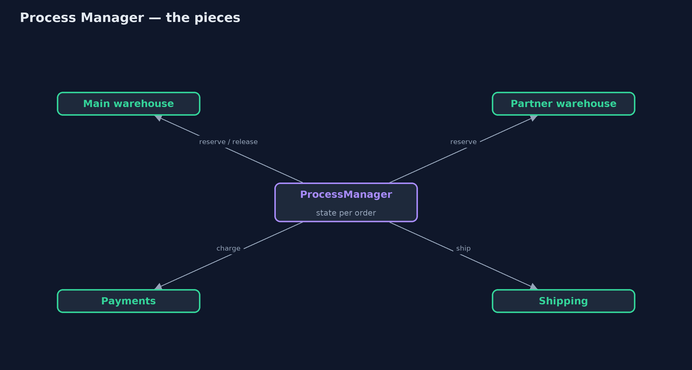
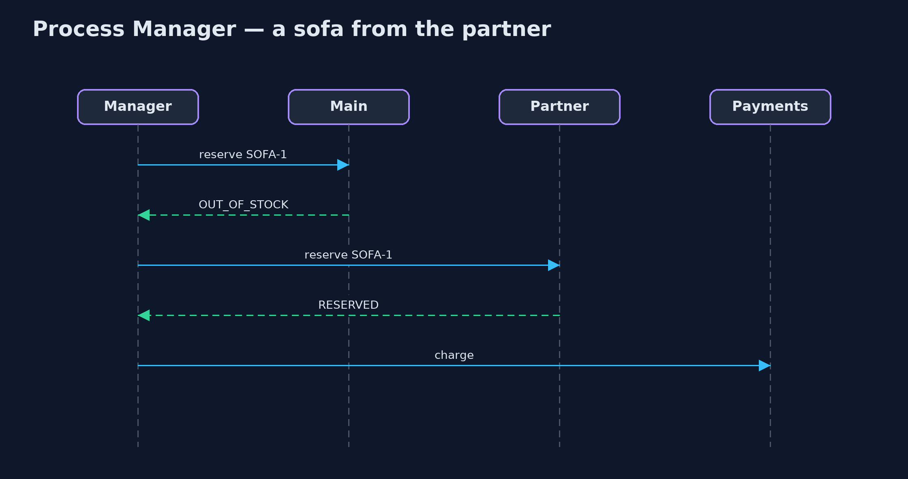

# Process Manager Pattern

```
src/main/java/com/jk/explore/processmanager/
├── Chained.java             Without the pattern: each step hands straight on to the next, and nobody owns the order's journey
├── Order.java               An order to fulfil: which product, and which card to charge
├── ProcessManager.java      The pattern: one component that keeps each order's state, sends it to the next step, and decides what happens after each reply
├── ProcessManagerDemo.java  The five acts: services chained together, a process manager, a branch to a partner, a failure path, and the bill
└── Services.java            The services an order passes through
```

**Put one component in charge of a multi-step process: it keeps each instance's state, sends it to the next step, and decides what happens after every reply, including the unhappy paths.**

Process Manager is one of the Enterprise Integration Patterns. When a piece
of work passes through several services, and the route depends on what
happens along the way, one component takes charge. It keeps the state of each
process instance, sends the instance to the next step, receives the reply, and
decides the step after that: continue, take a different branch, or undo what
was done.

The services never call each other; they only answer the process manager.
So the whole route, including failures, lives in one place that can also say
where every instance is right now.

## The idea in everyday terms

Think of a wedding planner. The caterer, the florist and the venue never talk
to each other; they each talk to the planner. The planner knows exactly where
everything stands. When the florist cannot deliver, the planner calls the
backup florist. When the venue cancels, the planner cancels the caterer too.

## The scenario

The online store fulfils an order in three steps: reserve stock, take
payment, ship. Each service simply passed the order on to the next. When a
card was declined, the chain stopped at payments; the warehouse never heard,
and the kettle stayed reserved for ever. And nobody could say where a given
order was.

## Run

```bash
./gradlew run
```

The demo tells the story in 5 acts, each printing exact numbers that the tests check:

| Act | What it shows |
| --- | --- |
| 1. Steps chained together | A declined card stops the chain at payments; the warehouse never hears, so stock shows 1 of 3 though only one kettle shipped. |
| 2. A process manager | The manager runs ORD-1: main RESERVED, PAID, SHIPPED, then DONE. |
| 3. A branch | ORD-2's sofa is out of stock at main; the manager asks the partner warehouse, which reserves it; the order completes. |
| 4. The unhappy path | ORD-3's card is declined; the manager releases the kettle (stock back to 2 of 3) and emails the customer. |
| 5. The bill | The manager can say where every order is; but every route lives in one class, and its state is lost on a restart. |

## Test

```bash
./gradlew test
```

6 tests in `DemoRunsTest`, `ProcessManagerTest`. Every number the demo prints is asserted, and nothing depends on the clock, so every run gives the same result.

## Technologies and versions

| Technology | Version | Used for |
| --- | --- | --- |
| Java | 21 | the code (toolchain set in `build.gradle`) |
| Gradle | 9.2.1 (wrapper) | build and run, nothing to install |
| JUnit | 5.10.2 | the tests |
| videokit | repository tool | the narrated video and animation: Piper `en_US-amy-medium`, speed 0.8, longer pauses (the approved `amy-slow` voice) |

## Learning Material

| Document | What it is for |
| --- | --- |
| [Problem statement](docs/problem-statement.md) | the situation and what the project must show |
| [Prerequisites](docs/prerequisites.md) | what you need to know first |
| [Process Manager, explained](docs/process-manager-pattern-explained.md) | the acts in prose |
| [Session guide](docs/session.md) | a one-hour lesson with exercises |
| [Animated walkthrough](docs/animation.html) | the acts step by step, narrated |
| [Spec](docs/spec.md) | what this project must be true of |

### The pattern in one picture

Every service answers the manager; none talks to another.



### Where each piece sits

The manager holds the route; services hold one job each.


### How the data moves

A decline leads to release and an email.


### Who calls whom, in order

The reply decides the next step.



### Video

`video/process-manager-pattern-explained.mp4` (with `.m4a` audio and `.srt` subtitles) is built by `video/build_video.sh`. Rendered media is not committed.

## What it costs

- **One brain.** Every route and branch lives in one class, which grows with every new step.
- **State must survive.** Held in memory, every order in progress is forgotten on a restart; real process managers store their state.
- **A central dependency.** If the process manager is down, no process moves.

## When this is too much

When the steps are always the same and never fail in ways that need undoing,
a simple chain or a routing slip is enough. And when services are owned by
different teams that prefer to react to each other's events, choreography
avoids a central brain, at the price of nobody seeing the whole journey.

## Where you have already met this

- Workflow engines such as Camunda, Temporal and AWS Step Functions.
- Orchestrated sagas in microservices.
- Order management systems that track every order's status.

## Where this sits

This project is in [messaging-integration-patterns](..), next to
[Routing Slip](../routing-slip-pattern), which attaches a fixed route to the
message instead, and near [Saga](../../micro-services-design-patterns/saga-pattern),
a process manager's close relative for undoing work across services.
