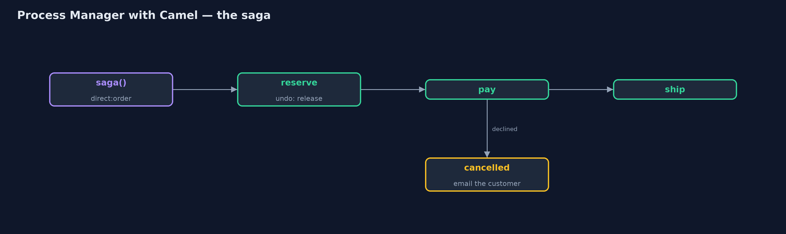
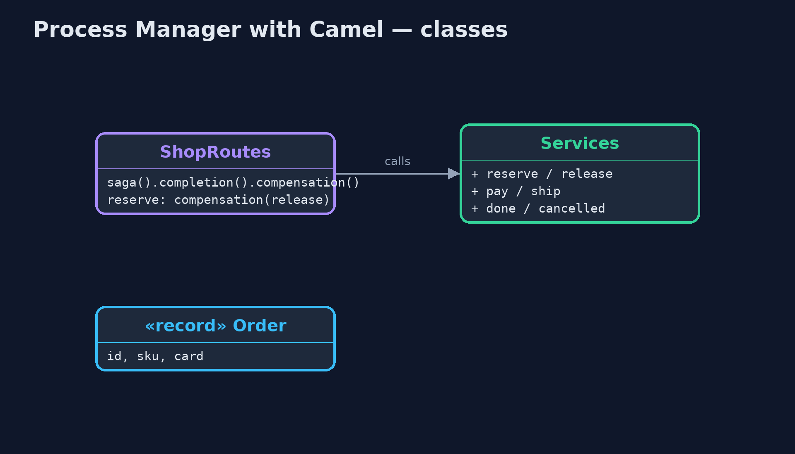
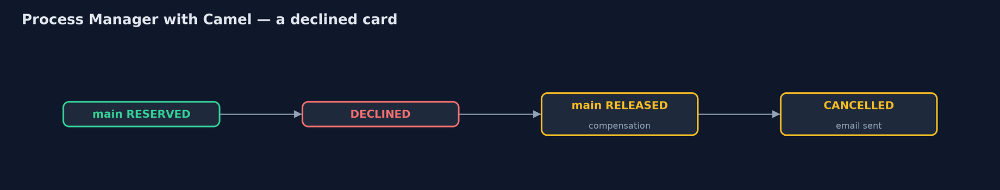
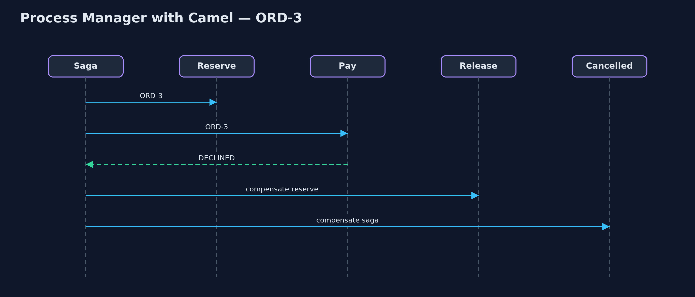

# Process Manager with Apache Camel Pattern

```
src/main/java/com/jk/explore/processcamel/
├── CamelProcessManagerDemo.java  The five acts, with a Camel saga as the process manager
├── Order.java                    An order for one item, paid with one card
├── Services.java                 The shop's services: two warehouses, payments, shipping and email
└── ShopRoutes.java               The process manager, written as a Camel saga: one route runs each order's journey; each step says how to undo itself; Camel calls the undo steps when a later step fails, and the completion or compensation route when the journey ends
```

**Build the process manager with Apache Camel's Saga step: one route owns each order's journey, each step names how to undo itself, and Camel runs the undo steps and a final completion or cancellation route for you.**

This is the framework version of the Process Manager pattern. The plain Java
version, a separate project in this category, writes the manager as a class
that tracks every order and decides each next step. Here Apache Camel's Saga
step does much of that work: one route runs each order's journey, each step
that changes something names a compensation, the step that undoes it, and
when a later step fails, Camel calls the compensations and then a
cancellation route. When the journey succeeds, Camel calls a completion route.

A saga is the form a process manager usually takes when a journey crosses
several services that cannot share one database transaction.

## The idea in everyday terms

Think of a travel agent booking a holiday: flight, then hotel, then car. The
agent keeps a note of how to cancel each booking. If the car cannot be booked,
the agent works back through the notes, cancelling the hotel and the flight,
and then rings the customer. Nobody else has to remember what was booked.

## The scenario

The online store's orders pass through reserve stock, take payment and ship.
Each step used to hand on to the next. When a card was declined, the kettle
reserved for that order was never given back, and nobody could say where the
order had got to.

## Run

Nothing to install beyond a Java 21 JDK: Camel and its in-memory saga service
run inside the program.

```bash
./gradlew run
```

The demo tells the story in 5 acts, each printing exact numbers that the tests check:

| Act | What it shows |
| --- | --- |
| 1. Steps hand on to each other | A declined card stops ORD-3 at payments, but its kettle is never given back: kettles in stock 1 of 3, though only one was shipped. |
| 2. A saga | The saga route runs ORD-1: main RESERVED, PAID, SHIPPED, and Camel calls the completion route: DONE. |
| 3. A branch | ORD-2's teapot is out of stock at main, so the reserve step asks the partner warehouse; then paid, shipped, DONE. |
| 4. Camel runs the undo steps | ORD-3's card is declined: Camel calls the reserve step's compensation, main RELEASED, then the cancellation route; kettles 2 of 3, an email sent. |
| 5. The bill | Every order has a status; but every step needs an undo written for it, and the in-memory saga service forgets journeys on a restart. |

## Test

```bash
./gradlew test
```

1 tests in `DemoRunsTest`. Every number the demo prints is asserted, and nothing depends on the clock, so every run gives the same result.

## What the simulation got right, and what it left out

The plain Java version got the idea right: one place runs each order's
journey, branches on the replies, treats the unhappy path as part of the
process, and can say where every order is. What it left out is the
production form: the journey as a saga, where each step declares its own
undo, and the framework, not hand-written code, calls the undo steps in the
right order and then the completion or cancellation route. It also left out
the honest cost that a saga makes plain: every step needs an undo written for
it, an undo is not the same as never having happened, and an in-memory saga
service forgets every journey on a restart.

## Technologies and versions

| Technology | Version | Used for |
| --- | --- | --- |
| Java | 21 | the code (toolchain set in `build.gradle`) |
| Gradle | 9.2.1 (wrapper) | build and run, nothing to install |
| JUnit | 5.10.2 | the tests |
| Apache Camel | 4.22.1 | saga(), compensation and completion routes |
| Camel InMemorySagaService | 4.22.1 | tracks each saga while the program runs |
| SLF4J simple | 2.0.17 | Camel's logging, switched off |
| videokit | repository tool | the narrated video and animation: Piper `en_US-amy-medium`, speed 0.8, longer pauses (the approved `amy-slow` voice) |

## Learning Material

| Document | What it is for |
| --- | --- |
| [Dependencies](docs/dependencies.md) | what the framework and infrastructure are, and why they are here |
| [Problem statement](docs/problem-statement.md) | the situation and what the project must show |
| [Prerequisites](docs/prerequisites.md) | what you need to know first |
| [Process Manager with Apache Camel, explained](docs/process-manager-with-camel-pattern-explained.md) | the acts in prose |
| [Session guide](docs/session.md) | a one-hour lesson with exercises |
| [Animated walkthrough](docs/animation.html) | the acts step by step, narrated |
| [Spec](docs/spec.md) | what this project must be true of |

### The pattern in one picture

Steps forward; compensations back.



### Where each piece sits

The routes declare the journey; the services do the work.



### How the data moves

Camel walks back through the undo steps.



### Who calls whom, in order

The failure triggers the compensations.



### Video

`video/process-manager-with-camel-pattern-explained.mp4` (with `.m4a` audio and `.srt` subtitles) is built by `video/build_video.sh`. Rendered media is not committed.

## What it costs

- **An undo for every step.** Each step that changes something must name a compensation, and someone must write it.
- **Undo is not rewind.** The customer may already have seen the reservation, or an email.
- **Memory only.** The in-memory saga service forgets journeys on a restart; production needs a durable coordinator, such as an LRA coordinator.

## When this is too much

If a journey has one or two steps that cannot fail halfway, a plain route is
enough. A saga pays off when several services each change something and a
later failure must undo the earlier changes.

## Where you have already met this

- Camel's Saga EIP, with the in-memory service or an LRA coordinator.
- Axon, Temporal and other workflow engines that run long business processes.
- Travel bookings, where a failed step cancels the earlier ones.

## Where this sits

This project is in [messaging-integration-patterns](..). It is the framework
version of the plain Java Process Manager project in the same category, which
is left unchanged.
