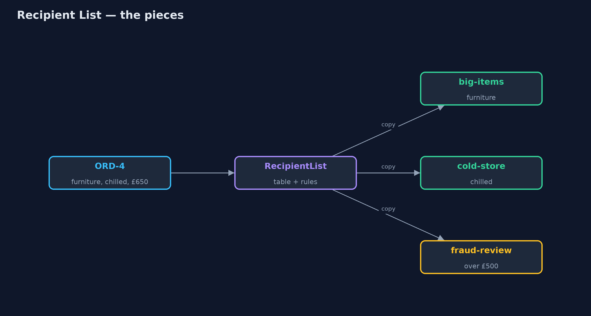
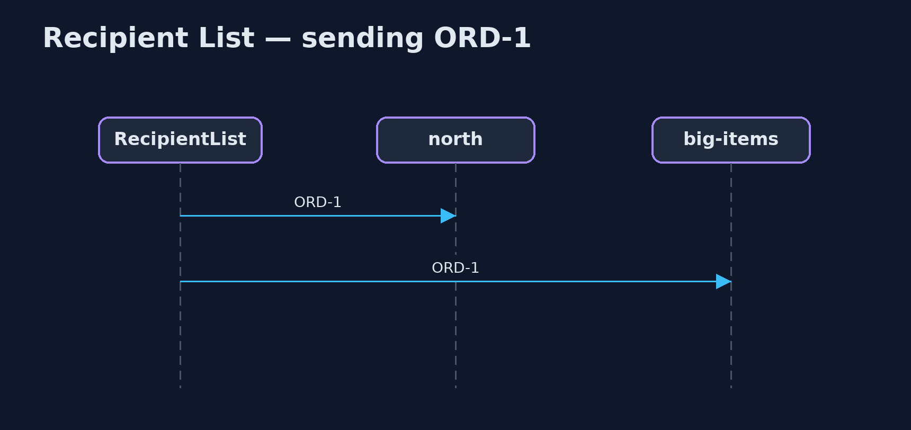

# Recipient List Pattern

```
src/main/java/com/jk/explore/recipientlist/
├── Inboxes.java            Every destination's inbox, and which destinations are currently unreachable
├── Order.java              An order: its lines, each with a product category, its total, and whether it is a gift
├── RecipientList.java      The pattern: works out, for each message, the list of destinations that need it, and sends a copy to each
└── RecipientListDemo.java  The five acts: send everything everywhere, a recipient list, rules that add recipients, a changed table, and the bill
```

**For each message, work out the list of destinations that need it, from the message itself and from rules that can change, and send a copy to each of them and no one else.**

Recipient List is one of the Enterprise Integration Patterns. A router looks
at each message and works out the list of destinations that need it: not one
destination, as a content-based router chooses, and not everyone, as a
broadcast does, but exactly the ones that are relevant this time. It then
sends a copy to each.

The list is computed from the message (what it contains, what it is worth)
and from tables and rules that can change while the system runs, so senders
never need to know who the recipients are.

## The idea in everyday terms

Think of an office post room. A letter arrives about a new supplier contract.
The post room checks its routing sheet: contracts go to legal, anything with
a price goes to accounts, and anything over a certain amount goes to the
finance director as well. It makes a copy for each, and nobody else is
bothered with it.

## The scenario

The online store ships from four warehouses: north for kitchen items, big-items
for furniture, cold-store for chilled food, and south as a spare. Every order
was sent to every warehouse, and each one sorted through orders it had
nothing to do with: twenty deliveries for five orders, when eight were
needed.

## Run

```bash
./gradlew run
```

The demo tells the story in 5 acts, each printing exact numbers that the tests check:

| Act | What it shows |
| --- | --- |
| 1. Everything everywhere | 5 orders sent to 4 warehouses: 20 deliveries, 8 of them needed. |
| 2. A recipient list | Each order goes where its items are: ORD-1 kitchen and furniture to north and big-items; 8 deliveries in all. |
| 3. Rules add recipients | Over £500 adds fraud-review: ORD-4 goes to big-items, cold-store and fraud-review; a gift adds gift-wrap. |
| 4. A changed table | North closes for stocktake; kitchen items now go to south; ORD-5 goes to south and cold-store. |
| 5. The bill | Big-items is unreachable: ORD-1 reaches south but fails for big-items; half the order is out. |

## Test

```bash
./gradlew test
```

7 tests in `DemoRunsTest`, `RecipientListTest`. Every number the demo prints is asserted, and nothing depends on the clock, so every run gives the same result.

## Technologies and versions

| Technology | Version | Used for |
| --- | --- | --- |
| Java | 21 | the code (toolchain set in `build.gradle`) |
| Gradle | 9.2.1 (wrapper) | build and run, nothing to install |
| JUnit | 5.10.2 | the tests |
| videokit | repository tool | the narrated video and animation: Piper `en_US-amy-medium`, speed 0.8, longer pauses (the approved `amy-slow` voice) |

## Learning Material

| Document | What it is for |
| --- | --- |
| [Problem statement](docs/problem-statement.md) | the situation and what the project must show |
| [Prerequisites](docs/prerequisites.md) | what you need to know first |
| [Recipient List, explained](docs/recipient-list-pattern-explained.md) | the acts in prose |
| [Session guide](docs/session.md) | a one-hour lesson with exercises |
| [Animated walkthrough](docs/animation.html) | the acts step by step, narrated |
| [Spec](docs/spec.md) | what this project must be true of |

### The pattern in one picture

One order, the destinations it needs.



### Where each piece sits

A table, some rules, and a send loop.


### How the data moves

Categories through the table, then the rules.


### Who calls whom, in order

A copy to each recipient.



### Video

`video/recipient-list-pattern-explained.mp4` (with `.m4a` audio and `.srt` subtitles) is built by `video/build_video.sh`. Rendered media is not committed.

## What it costs

- **The list knows everyone.** The recipient list must know every destination and what each one handles.
- **Half-sent messages.** If one recipient is unreachable, the others already have their copy; the list must retry or undo.
- **More moving parts.** Tables and rules must be kept correct as destinations change.

## When this is too much

When every message has exactly one destination, a content-based router is
simpler. When every destination really does need every message, a
publish-subscribe channel is simpler. A recipient list is for the case in
between: a different set of destinations for each message.

## Where you have already met this

- Apache Camel's `recipientList`.
- Order splitting across fulfilment centres in large shops.
- The To and Cc lines of an email, chosen per message.

## Where this sits

This project is in [messaging-integration-patterns](..), next to
[Content-Based Router](../content-based-router-pattern), which picks one
destination, and [Message Filter](../message-filter-pattern), which lets
receivers drop what they do not want.
