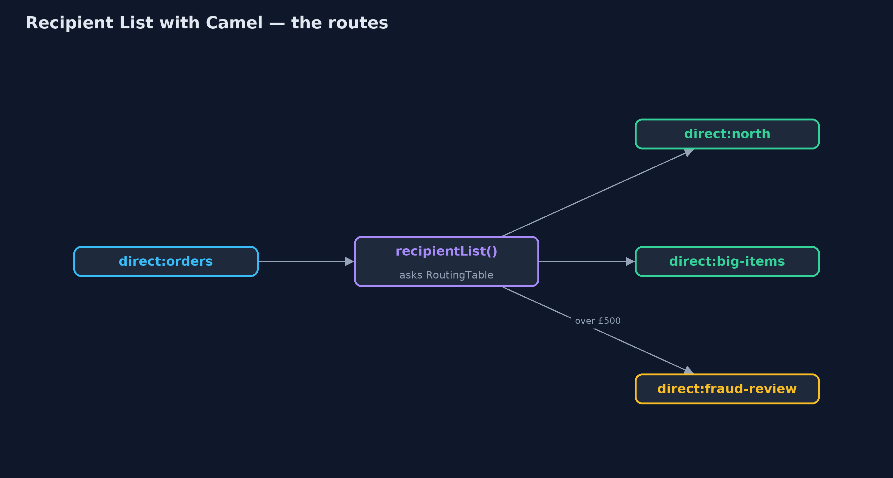
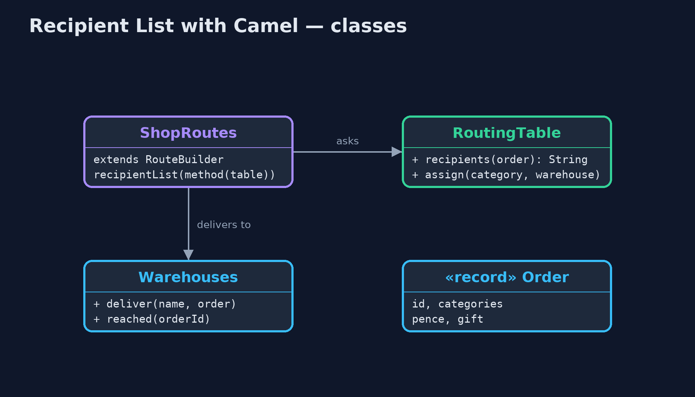
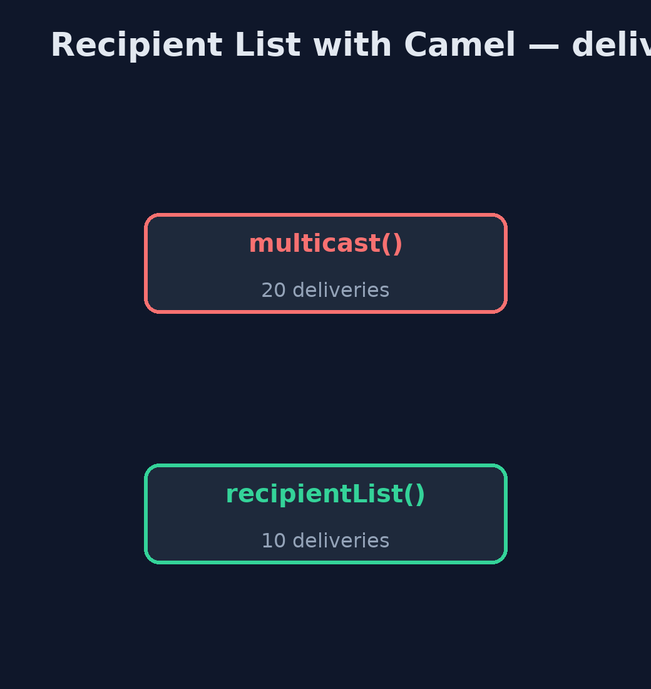

# Recipient List with Apache Camel Pattern

```
src/main/java/com/jk/explore/recipientcamel/
├── CamelRecipientListDemo.java  The five acts, with Apache Camel's recipientList()
├── Order.java                   An order: which kinds of item it holds, its value in pence, and whether it is a gift
├── RoutingTable.java            Who should get an order
├── ShopRoutes.java              direct:orders is the recipient list; each destination is a direct: endpoint with its own route
└── Warehouses.java              Every destination's inbox, plus a switch to make one unreachable
```

**Build the recipient list with Apache Camel: recipientList() asks a routing table, for each order, which endpoints should get a copy, and sends one to each; the table can change while the routes run.**

This is the framework version of the Recipient List pattern. The plain Java
version, a separate project in this category, writes the list and the sending
loop by hand. Here Apache Camel does the sending: `recipientList()` calls a
routing table for each order, gets back a list of endpoint addresses, and
sends a copy of the order to each one.

The routing table is still plain Java, because deciding who needs an order is
the shop's business. Camel handles the part every recipient list needs:
sending copies, and reporting when one of the sends fails.

## The idea in everyday terms

Think of an office that sends each letter only to the people it concerns.
A clerk reads the letter, looks at a list of who handles what, writes the
names on a routing slip, and the post room makes one copy per name. If one
department is closed, the post room tells the clerk; it does not quietly
drop that copy.

## The scenario

The online store's orders were sent to every warehouse: five orders to four
warehouses made twenty deliveries, most of them for items that warehouse did
not stock. Each order should go only to the warehouses that hold its items,
plus fraud review for large orders and gift wrap for gifts.

## Run

Nothing to install beyond a Java 21 JDK: Camel runs inside the program on its
in-memory `direct:` endpoints.

```bash
./gradlew run
```

The demo tells the story in 5 acts, each printing exact numbers that the tests check:

| Act | What it shows |
| --- | --- |
| 1. Every order to every warehouse | With multicast(), 5 orders to 4 warehouses make 20 deliveries. |
| 2. A recipient list | recipientList() asks the table per order: ORD-1 to north and big-items, ORD-3 to cold-store only; 10 deliveries in all. |
| 3. Rules add recipients | ORD-4 (£650) also reaches fraud-review; ORD-2, a gift, also reaches gift-wrap. |
| 4. The table changes while running | North closes for stocktake and kitchen moves to south: ORD-5 now reaches south and cold-store, with no route change. |
| 5. One recipient fails | big-items is unreachable: Camel reports it, but ORD-1 already reached south, so half the order is out. |

## Test

```bash
./gradlew test
```

3 tests in `DemoRunsTest`, `RoutingTableTest`. Every number the demo prints is asserted, and nothing depends on the clock, so every run gives the same result.

## What the simulation got right, and what it left out

The plain Java version got the idea right: a list computed per message, a
copy to each name on it, rules that add recipients, and the danger of a send
that half fails. What it left out is what Camel adds: the copying and sending
as one step in a route, recipients named as endpoint addresses that could be
queues, files or web services without changing the route, and a clear error
when one recipient fails while the others still received their copy. What
Camel does not add is the fix: retrying or undoing the half that went out is
still the shop's job.

## Technologies and versions

| Technology | Version | Used for |
| --- | --- | --- |
| Java | 21 | the code (toolchain set in `build.gradle`) |
| Gradle | 9.2.1 (wrapper) | build and run, nothing to install |
| JUnit | 5.10.2 | the tests |
| Apache Camel | 4.22.1 | recipientList(), multicast() and direct: endpoints |
| SLF4J simple | 2.0.17 | Camel's logging, switched off |
| videokit | repository tool | the narrated video and animation: Piper `en_US-amy-medium`, speed 0.8, longer pauses (the approved `amy-slow` voice) |

## Learning Material

| Document | What it is for |
| --- | --- |
| [Dependencies](docs/dependencies.md) | what the framework and infrastructure are, and why they are here |
| [Problem statement](docs/problem-statement.md) | the situation and what the project must show |
| [Prerequisites](docs/prerequisites.md) | what you need to know first |
| [Recipient List with Apache Camel, explained](docs/recipient-list-with-camel-pattern-explained.md) | the acts in prose |
| [Session guide](docs/session.md) | a one-hour lesson with exercises |
| [Animated walkthrough](docs/animation.html) | the acts step by step, narrated |
| [Spec](docs/spec.md) | what this project must be true of |

### The pattern in one picture

The table picks; Camel copies.



### Where each piece sits

The decision is plain Java; the sending is Camel.



### How the data moves

Everyone, or only who needs it.



### Who calls whom, in order

Three copies, one per recipient.


### Video

`video/recipient-list-with-camel-pattern-explained.mp4` (with `.m4a` audio and `.srt` subtitles) is built by `video/build_video.sh`. Rendered media is not committed.

## What it costs

- **Half-sent orders.** When one recipient fails, the others already have their copy; Camel reports it, but retry or undo is still the shop's job.
- **Addresses in strings.** A wrong endpoint name is only found when a message is sent to it.
- **More to carry.** More than ten library files instead of none.

## When this is too much

If every message always goes to the same fixed set of receivers, a plain
`multicast()` or a publish-subscribe channel is simpler. A recipient list pays
off when who needs a message depends on what is in it.

## Where you have already met this

- Camel's `recipientList()` and Spring Integration's recipient list router.
- Email's To and Cc lines, chosen per message.
- Routing rules in order-management systems that split orders across warehouses.

## Where this sits

This project is in [messaging-integration-patterns](..). It is the framework
version of the plain Java Recipient List project in the same category, which
is left unchanged.
