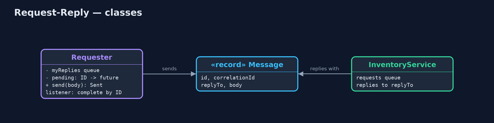

# Request-Reply with Correlation Identifier Pattern

```
src/main/java/com/jk/explore/requestreply/
├── InOrderRequester.java  Without the pattern: sends several requests, then assumes the replies come back in the same order
├── InventoryService.java  Takes "reserve SKU x N" requests from its queue, works on several at once, and replies to each request's return address
├── Message.java           A message on a queue: its own ID, the ID of the request it answers (for replies), where to send the reply, and a body
├── RequestReplyDemo.java  The five acts: replies matched by arrival order, correlation IDs, return addresses, many requests in flight, and the bill
└── Requester.java         The pattern: every request gets a unique ID and a return address; every reply names the request it answers
```

**Give every request over a queue a unique ID and a return address, and make every reply name the ID it answers, so replies can arrive in any order and still be matched.**

Request-Reply over messaging is how one service asks another a question when
they only talk through queues. Three Enterprise Integration Patterns work
together. The request carries a return address, the queue the answer should
go to. It carries a unique ID. And the reply carries a correlation identifier,
the ID of the request it answers.

Replies can then come back in any order, from a service working on many
requests at once, and each is matched to the right question. Several
requesters can share one service, each receiving only its own replies.

## The idea in everyday terms

Think of a theatre cloakroom. You hand in your coat and get a numbered
ticket. The attendant brings coats back in whatever order they find them, but
you only take the one whose number matches your ticket. And if your coat
never comes back, you are left holding a ticket, not knowing whether it was
hung up or lost.

## The scenario

The online store's checkout asks the inventory service to reserve stock by
sending requests over a queue. The inventory service works on several requests
at once: kettles are checked in a slow warehouse system, mugs in a fast one.
Checkout assumed the replies came back in the order it asked, and a refusal
for kettles was taken as the answer about mugs.

## Run

```bash
./gradlew run
```

The demo tells the story in 5 acts, each printing exact numbers that the tests check:

| Act | What it shows |
| --- | --- |
| 1. Replies matched by order | Checkout asks about kettles then mugs; the mug reply arrives first and is taken as the kettle's: kettle RESERVED, mug REFUSED. |
| 2. Correlation IDs | Requests WEB-1 and WEB-2 carry IDs; replies name them: kettle REFUSED, mug RESERVED, whatever order they arrive in. |
| 3. Return addresses | The phone app and web checkout share the inventory service; each reply goes to the queue named in its request. |
| 4. Many in flight | 20 requests sent before any reply: all 20 answered and matched; 0 left waiting. |
| 5. The bill | A reply is lost: WEB-24 gets no reply after 500 ms and stays in the waiting table; was it reserved? |

## Test

```bash
./gradlew test
```

7 tests in `DemoRunsTest`, `RequesterTest`. Every number the demo prints is asserted, and nothing depends on the clock, so every run gives the same result.

## Technologies and versions

| Technology | Version | Used for |
| --- | --- | --- |
| Java | 21 | the code (toolchain set in `build.gradle`) |
| Gradle | 9.2.1 (wrapper) | build and run, nothing to install |
| JUnit | 5.10.2 | the tests |
| videokit | repository tool | the narrated video and animation: Piper `en_US-amy-medium`, speed 0.8, longer pauses (the approved `amy-slow` voice) |

## Learning Material

| Document | What it is for |
| --- | --- |
| [Problem statement](docs/problem-statement.md) | the situation and what the project must show |
| [Prerequisites](docs/prerequisites.md) | what you need to know first |
| [Request-Reply with Correlation Identifier, explained](docs/request-reply-pattern-explained.md) | the acts in prose |
| [Session guide](docs/session.md) | a one-hour lesson with exercises |
| [Animated walkthrough](docs/animation.html) | the acts step by step, narrated |
| [Spec](docs/spec.md) | what this project must be true of |

### The pattern in one picture

Requests carry an ID and a return address; replies carry the ID back.


### Where each piece sits

The requester keeps a table of questions waiting for answers.



### How the data moves

The correlation ID puts each answer with its question.


### Who calls whom, in order

Send with an ID; the reply names it.


### Video

`video/request-reply-pattern-explained.mp4` (with `.m4a` audio and `.srt` subtitles) is built by `video/build_video.sh`. Rendered media is not committed.

## What it costs

- **Replies that never come.** A lost reply leaves the request in the waiting table until something times it out.
- **Unknown outcomes.** After a timeout, the requester cannot tell whether the stock was reserved or not.
- **More plumbing.** IDs, reply queues, a waiting table and a listener, where a method call had none.

## When this is too much

When a direct call over HTTP is possible and the service answers quickly, a
plain request and response is simpler. Messaging request-reply is for
services that only talk through queues, or where requests must survive the
service being briefly unavailable.

## Where you have already met this

- JMS's `JMSCorrelationID` and `JMSReplyTo` headers.
- RabbitMQ's `correlation_id` and `reply_to` properties.
- Tracking numbers and order references on any reply you receive by email.

## Where this sits

This project is in [messaging-integration-patterns](..), next to
[Message Channel](../message-channel-pattern), the queues the requests and
replies travel on, and near
[Asynchronous Request-Reply](../../micro-services-design-patterns/async-request-reply-pattern),
the same idea over HTTP.
