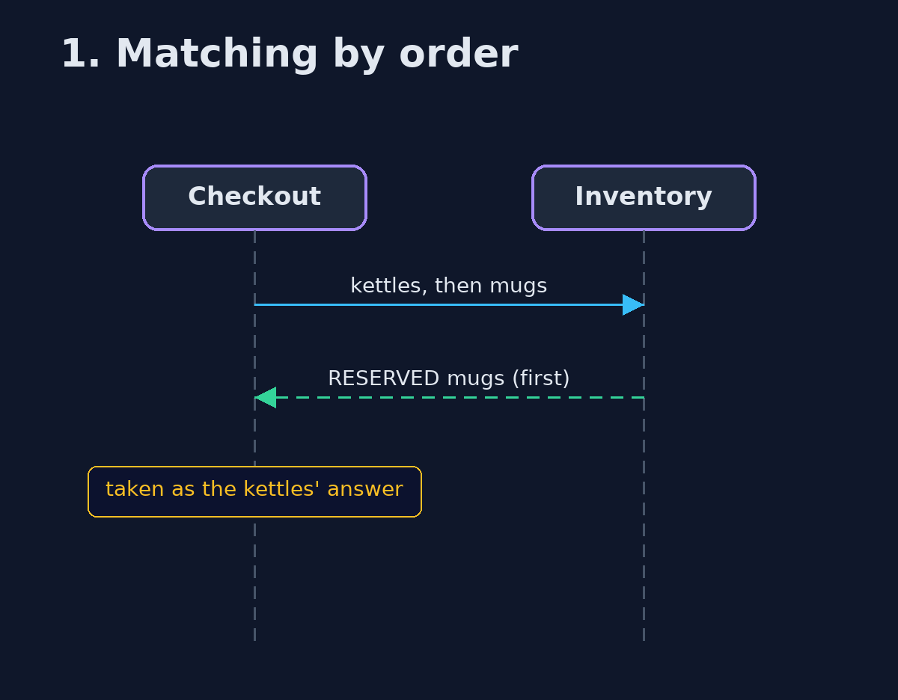
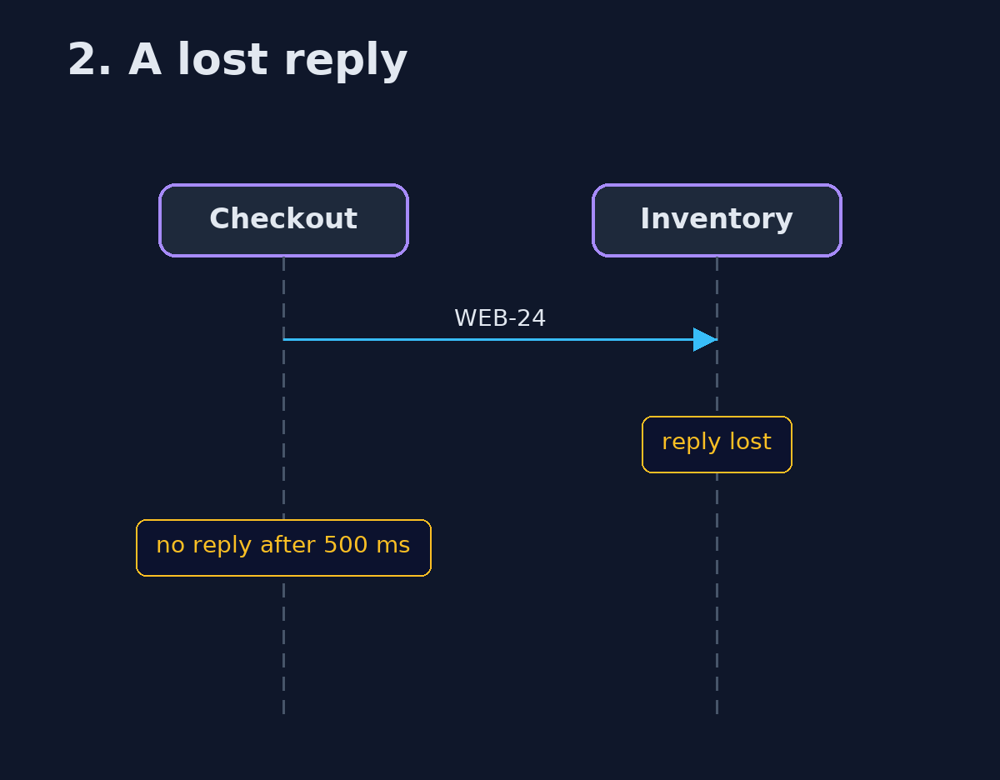

# Request-Reply with Correlation Identifier Pattern — UML Sequence Diagrams

## 1. 1. Matching by order

The first reply is taken as the first question's answer.

## 2. 2. A lost reply

The question waits; the answer never comes.

