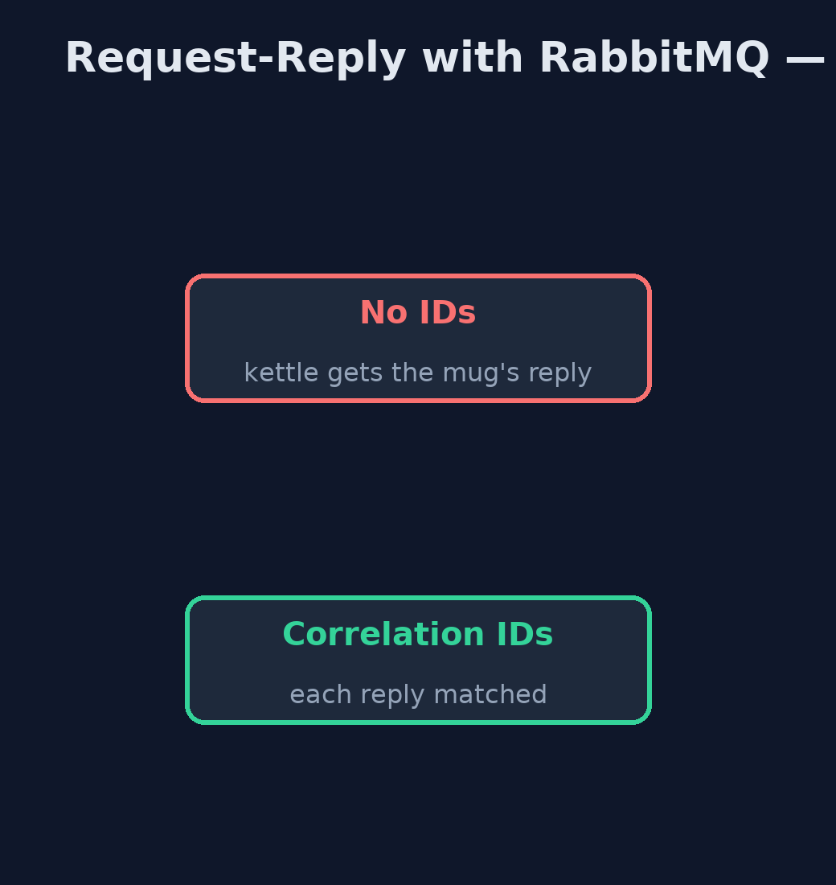

# Request-Reply with RabbitMQ Pattern

```
src/main/java/com/jk/explore/requestreplyrabbit/
├── Broker.java                  A real RabbitMQ broker, running in a container that this demo starts and stops itself
├── InventoryService.java        The inventory service: reads reservation requests from its queue and replies to whatever address each request names, copying the request's correlation ID
├── Poll.java                    Waits for a real condition, checking often, and gives up after a limit
├── RabbitRequestReplyDemo.java  The five acts, against a real RabbitMQ broker started and stopped by this program
└── Requester.java               A caller of the inventory service: sends requests with a return address and a correlation ID, and matches each reply to its request by that ID
```

**Ask and answer over a real RabbitMQ broker: each request carries a return address and a correlation ID, the inventory service replies to that address with that ID, and an expiry on the request makes sure an abandoned request is never handled late.**

This is the real-infrastructure version of the Request-Reply pattern. The
plain Java version, a separate project in this category, builds channels in
memory. Here a real RabbitMQ broker, started in a container by the demo
itself, carries the requests and the replies.

RabbitMQ has the pattern's two ideas built into every message: a `replyTo`
property, the return address, and a `correlationId` property, which the
replier copies so the requester can match the answer to its question. It also
offers direct reply-to, a way to receive replies without declaring any reply
queue, and per-message expiry, which the last act uses to deal honestly with
a reply that never comes.

## The idea in everyday terms

Think of sending several letters to a supplier, each asking about a
different item. On each you write your address and a reference number. The
supplier answers in whatever order suits them, but writes your reference on
each reply, so you know which question it answers. And if you write "ignore
after Friday", a letter that sat unopened does not get acted on the week
after.

## The scenario

The online store's checkout asks the inventory service to reserve items and
waits for the answer. The inventory service answers items it has cached
first, so replies can come back in a different order from the requests. The
web checkout and the phone app both ask, and each must get its own answers.

## Run

This project needs a running container runtime, such as Docker Desktop: the
demo starts a real RabbitMQ 4.3.6 broker in a container and removes it again.
Without one, it prints a sentence saying what to start, rather than failing.

```bash
./gradlew run
```

The demo tells the story in 5 acts, each printing exact numbers that the tests check:

| Act | What it shows |
| --- | --- |
| 1. Replies taken in arrival order | Two requests, no IDs: the mug is answered first from the cache and taken as the kettle's reply: KETTLE -> RESERVED 2 x MUG-1. |
| 2. Correlation IDs | WEB-1 and WEB-2 carry correlation IDs: each reply is matched, the kettle REFUSED and the mug RESERVED. |
| 3. Return addresses | The phone app uses RabbitMQ's direct reply-to and the web checkout its own exclusive queue; each gets its own reply. |
| 4. Many in flight | 20 requests are sent before any reply; the service handles 20, all are matched, and none is left waiting. |
| 5. A reply that never comes | WEB-24 gets no reply in 0.5 s and must be timed out; its 0.5 s expiry means RabbitMQ drops it, so the service later handles 0. |

## Test

```bash
./gradlew test
```

2 tests in `DemoRunsTest`. Every number the demo prints is asserted against a real broker. Waits are bounded polls on real conditions, never fixed sleeps. Without a container runtime, the broker test is skipped rather than failed.

## What the simulation got right, and what it left out

The plain Java version got the idea right: replies can overtake each other,
so each carries a correlation ID; each requester names its own return
address; many requests can be in flight; and a missing reply must be timed
out. What it left out is what a real broker adds and demands. The return
address and ID are standard message properties. RabbitMQ's direct reply-to
lets the phone app receive replies with no reply queue at all. Publishing does
not wait, so a service can look before a request has even arrived, and the
demo must wait for real conditions. And per-message expiry answers the
question the plain version could not: whether an abandoned request would
still be handled late.

## Technologies and versions

| Technology | Version | Used for |
| --- | --- | --- |
| Java | 21 | the code (toolchain set in `build.gradle`) |
| Gradle | 9.2.1 (wrapper) | build and run, nothing to install |
| JUnit | 5.10.2 | the tests |
| RabbitMQ | 4.3.6 (container image) | the broker: queues, replyTo, correlationId, expiry, direct reply-to |
| RabbitMQ Java client | 5.36.0 | publishing, consuming, basicGet |
| Testcontainers | 2.0.5 | starts and stops the broker container from the demo |
| Docker | 24 or later | runs the container |
| SLF4J simple | 2.0.17 | library logging, switched off |
| videokit | repository tool | the narrated video and animation: Piper `en_US-amy-medium`, speed 0.8, longer pauses (the approved `amy-slow` voice) |

## Learning Material

| Document | What it is for |
| --- | --- |
| [Dependencies](docs/dependencies.md) | what the framework and infrastructure are, and why they are here |
| [Problem statement](docs/problem-statement.md) | the situation and what the project must show |
| [Prerequisites](docs/prerequisites.md) | what you need to know first |
| [Request-Reply with RabbitMQ, explained](docs/request-reply-with-rabbitmq-pattern-explained.md) | the acts in prose |
| [Session guide](docs/session.md) | a one-hour lesson with exercises |
| [Animated walkthrough](docs/animation.html) | the acts step by step, narrated |
| [Spec](docs/spec.md) | what this project must be true of |

### The pattern in one picture

Requests to one queue; replies to each return address.


### Where each piece sits

The properties do the matching.


### How the data moves

The mug reply always comes first.



### Who calls whom, in order

The ID travels there and back.


### Video

`video/request-reply-with-rabbitmq-pattern-explained.mp4` (with `.m4a` audio and `.srt` subtitles) is built by `video/build_video.sh`. Rendered media is not committed.

## What it costs

- **A waiting table.** The requester must remember what it asked, time out missing replies and clean up.
- **Expiry is a choice.** Without an expiry, a request abandoned by the requester may still be handled later.
- **Another system.** The broker must be running for anyone to ask anything.

## When this is too much

If a caller needs an answer at once and the service is always reachable, a
plain HTTP call is simpler. Request-reply over a broker pays off when callers
and services are decoupled, replies can be slow, and many requests are in
flight.

## Where you have already met this

- RabbitMQ RPC tutorials and Spring AMQP's `RabbitTemplate.convertSendAndReceive`.
- JMS `JMSReplyTo` and `JMSCorrelationID`.
- Email threads, where a reply carries a reference to the original.

## Where this sits

This project is in [messaging-integration-patterns](..). It is the
real-infrastructure version of the plain Java Request-Reply project in the
same category, which is left unchanged.
