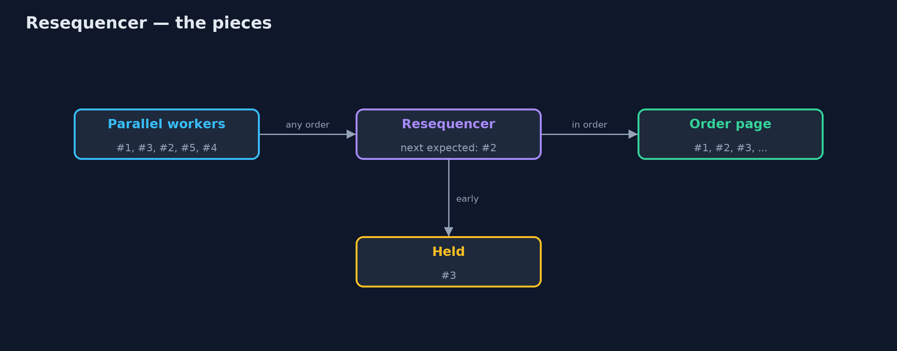
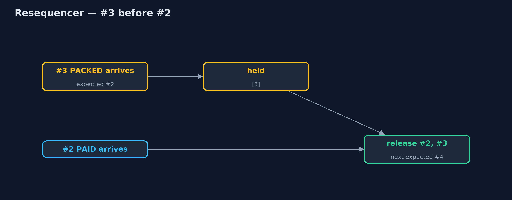

# Resequencer Pattern

```
src/main/java/com/jk/explore/resequencer/
├── OrderPage.java        The customer's order page: shows the latest status it was given, and remembers what it showed
├── Resequencer.java      The pattern: holds messages that arrive early, and releases each order's messages strictly in sequence
├── ResequencerDemo.java  The five acts: updates applied as they arrive, a resequencer, holding and releasing, several orders at once, and the bill
└── StatusUpdate.java     "Order ORD-1 is now PAID": numbered by the order service so the receiver can tell the right order
```

**When numbered messages can arrive out of order, hold the early ones and release each sequence strictly in order, with a limit so a lost message cannot block everything for ever.**

Resequencer is one of the Enterprise Integration Patterns. Messaging systems
often deliver messages out of order: several consumers work in parallel, one
message is retried, another takes a slower path. When order matters, each
message carries a sequence number, and a resequencer sits in front of the
receiver. It passes on a message only when it is the next one expected, and
holds early arrivals until the gap before them is filled.

Each sequence, such as each order's updates, is resequenced on its own, and a
limit decides when to give up waiting for a message that is never coming.

## The idea in everyday terms

Think of a long letter sent in five numbered envelopes, which the post
delivers in a muddle: 1, 3, 2, 5, 4. You read envelope 1, put 3 aside, read 2
when it arrives, then 3, and so on. But if envelope 3 is lost for good, at
some point you have to stop waiting and read on without it.

## The scenario

The online store's order service sends status updates for each order:
placed, paid, packed, shipped, delivered. They pass through several parallel
workers, so they reach the customer's order page out of order. The page
applied them as they arrived: Priya's order showed packed before paid, and
finished on shipped, although the parcel had been delivered.

## Run

```bash
./gradlew run
```

The demo tells the story in 5 acts, each printing exact numbers that the tests check:

| Act | What it shows |
| --- | --- |
| 1. Applied as they arrive | Updates arrive #1, #3, #2, #5, #4; the customer sees PACKED before PAID and ends on SHIPPED, not DELIVERED. |
| 2. A resequencer | With a resequencer the customer sees PLACED, PAID, PACKED, SHIPPED, DELIVERED, and ends on DELIVERED. |
| 3. Hold and release | #3 arrives early and is held; #2 releases 2 and 3; #5 is held until #4 releases both. |
| 4. One sequence per order | Interleaved updates for ORD-2 and ORD-3 are each released in their own order. |
| 5. The bill | #3 is lost: #4 is held and the page stays on PAID; when #5 arrives the gap is skipped and the page shows DELIVERED. |

## Test

```bash
./gradlew test
```

7 tests in `DemoRunsTest`, `ResequencerTest`. Every number the demo prints is asserted, and nothing depends on the clock, so every run gives the same result.

## Technologies and versions

| Technology | Version | Used for |
| --- | --- | --- |
| Java | 21 | the code (toolchain set in `build.gradle`) |
| Gradle | 9.2.1 (wrapper) | build and run, nothing to install |
| JUnit | 5.10.2 | the tests |
| videokit | repository tool | the narrated video and animation: Piper `en_US-amy-medium`, speed 0.8, longer pauses (the approved `amy-slow` voice) |

## Learning Material

| Document | What it is for |
| --- | --- |
| [Problem statement](docs/problem-statement.md) | the situation and what the project must show |
| [Prerequisites](docs/prerequisites.md) | what you need to know first |
| [Resequencer, explained](docs/resequencer-pattern-explained.md) | the acts in prose |
| [Session guide](docs/session.md) | a one-hour lesson with exercises |
| [Animated walkthrough](docs/animation.html) | the acts step by step, narrated |
| [Spec](docs/spec.md) | what this project must be true of |

### The pattern in one picture

Out of order in, in order out.



### Where each piece sits

A buffer and a counter per order.


### How the data moves

Held, then released behind #2.



### Who calls whom, in order

The missing number unlocks the ones behind it.


### Video

`video/resequencer-pattern-explained.mp4` (with `.m4a` audio and `.srt` subtitles) is built by `video/build_video.sh`. Rendered media is not committed.

## What it costs

- **A lost message blocks.** When #3 never arrives, #4 and #5 wait; without a limit they wait for ever.
- **A limit means gaps.** Skipping ahead means the page never shows PACKED.
- **Buffers use memory.** Early messages must be held somewhere, for every open sequence.

## When this is too much

When messages are independent, or only the latest matters and each carries a
full state with a timestamp, you can apply the newest and ignore older ones.
And when a single partition or queue already guarantees order, as Kafka does
per key, a resequencer is not needed.

## Where you have already met this

- Apache Camel's `resequence`.
- TCP, which puts network packets back in order using sequence numbers.
- Kafka's ordering per partition key, which avoids the need.

## Where this sits

This project is in [messaging-integration-patterns](..), next to
[Splitter and Aggregator](../splitter-aggregator-pattern), which also
collects related messages before passing them on.
