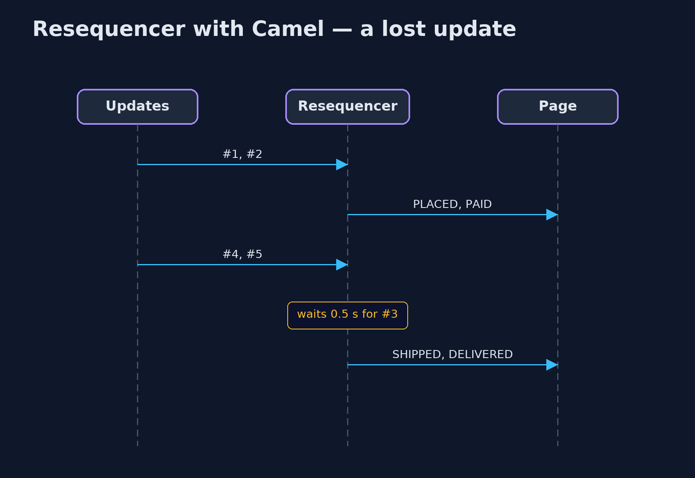

# Resequencer with Apache Camel Pattern

```
src/main/java/com/jk/explore/resequencercamel/
├── CamelResequencerDemo.java  The five acts, with Apache Camel's resequence() step
├── OrderPage.java             The customer's order-tracking page: it shows each status update as it is applied
└── ShopRoutes.java            Four ways into the tracking page: straight through, Camel's stream resequencer, its batch resequencer, and a stream resequencer with a short timeout for lost messages
```

**Build the resequencer with Apache Camel: resequence() puts order-status updates back in order, either as a stream that releases each update as soon as it can, or as batches that are sorted and released together, with a timeout for updates that never arrive.**

This is the framework version of the Resequencer pattern. The plain Java
version, a separate project in this category, writes the holding and
releasing by hand. Here Apache Camel provides it: `resequence()` reads a
sequence number from each message and puts the messages back in order before
they reach the order-tracking page.

Camel offers two modes. Stream mode releases each message as soon as all the
ones before it have been seen, and waits a set time for a missing one before
giving up on it. Batch mode collects a group, sorts it, and releases the group
together. Each mode has a real behaviour the plain version did not show.

## The idea in everyday terms

Think of a postal sorting office receiving the numbered pages of a long
letter out of order. It can hand pages to the reader as soon as the next one
in the run arrives, waiting a while for any missing page. Or it can wait for
the whole bundle, put it in order, and hand it over at once. Either way, a
page that never comes must eventually be given up on.

## The scenario

The online store's order-tracking page shows status updates: placed, paid,
packed, shipped, delivered. They travel by different paths and can arrive out
of order, so a customer saw "shipped" as the final status although the parcel
had been delivered.

## Run

Nothing to install beyond a Java 21 JDK: Camel runs inside the program on its
in-memory `direct:` endpoints.

```bash
./gradlew run
```

The demo tells the story in 5 acts, each printing exact numbers that the tests check:

| Act | What it shows |
| --- | --- |
| 1. Applied as they arrive | Updates arrive #1, #3, #2, #5, #4; the page shows them in that order and ends on SHIPPED, though the parcel was DELIVERED. |
| 2. Stream mode | resequence(header("seq")).stream() shows all five in order, ending DELIVERED; the first update waited one timeout, 0.3 s. |
| 3. Batch mode | Batch mode collects 5: after 4 arrivals the page shows nothing; after the 5th, all five appear in order. |
| 4. Two orders at once | Interleaved updates for ORD-2 and ORD-3, sorted by order then number, are released as each order's own sequence. |
| 5. The bill | #3 is lost: #4 and #5 wait while the page says PAID; after about half a second the gap is given up and the page says DELIVERED. |

## Test

```bash
./gradlew test
```

1 tests in `DemoRunsTest`. Every number the demo prints is asserted, and nothing depends on the clock, so every run gives the same result.

## What the simulation got right, and what it left out

The plain Java version got the idea right: hold early messages, release them
when the gap is filled, keep one sequence per order, and give up on a message
that is lost. What it left out is how a real resequencer behaves. Camel's
stream mode cannot know which message is the first, so the very first update
waits one timeout before it is shown. Its batch mode never releases anything
out of order, but shows nothing until the batch is full. And Camel's stream
mode keeps one sequence for everything, so per-order sequences need batch
mode or another key.

## Technologies and versions

| Technology | Version | Used for |
| --- | --- | --- |
| Java | 21 | the code (toolchain set in `build.gradle`) |
| Gradle | 9.2.1 (wrapper) | build and run, nothing to install |
| JUnit | 5.10.2 | the tests |
| Apache Camel | 4.22.1 | resequence() in stream and batch modes |
| SLF4J simple | 2.0.17 | Camel's logging, switched off |
| videokit | repository tool | the narrated video and animation: Piper `en_US-amy-medium`, speed 0.8, longer pauses (the approved `amy-slow` voice) |

## Learning Material

| Document | What it is for |
| --- | --- |
| [Dependencies](docs/dependencies.md) | what the framework and infrastructure are, and why they are here |
| [Problem statement](docs/problem-statement.md) | the situation and what the project must show |
| [Prerequisites](docs/prerequisites.md) | what you need to know first |
| [Resequencer with Apache Camel, explained](docs/resequencer-with-camel-pattern-explained.md) | the acts in prose |
| [Session guide](docs/session.md) | a one-hour lesson with exercises |
| [Animated walkthrough](docs/animation.html) | the acts step by step, narrated |
| [Spec](docs/spec.md) | what this project must be true of |

### The pattern in one picture

Out of order in, in order out.


### Where each piece sits

Each mode is one route line.


### How the data moves

Soon, or all at once.


### Who calls whom, in order

The gap is given up after the timeout.



### Video

`video/resequencer-with-camel-pattern-explained.mp4` (with `.m4a` audio and `.srt` subtitles) is built by `video/build_video.sh`. Rendered media is not committed.

## What it costs

- **A delay at the start.** Stream mode shows the first update only after one timeout.
- **Batch mode shows nothing until full.** Four of five updates arrived and the page still showed nothing.
- **Lost messages still cost time.** The page stayed on PAID for half a second before the gap was given up.

## When this is too much

If messages travel one path and cannot overtake each other, there is nothing
to resequence. A resequencer pays off when updates travel different paths or
are processed in parallel, and their order matters to someone.

## Where you have already met this

- Camel's `resequence()` and Spring Integration's resequencer.
- TCP, which reorders packets by sequence number before an application sees them.
- Kafka, which keeps order within a partition, so order keys are chosen for that.

## Where this sits

This project is in [messaging-integration-patterns](..). It is the framework
version of the plain Java Resequencer project in the same category, which is
left unchanged.
