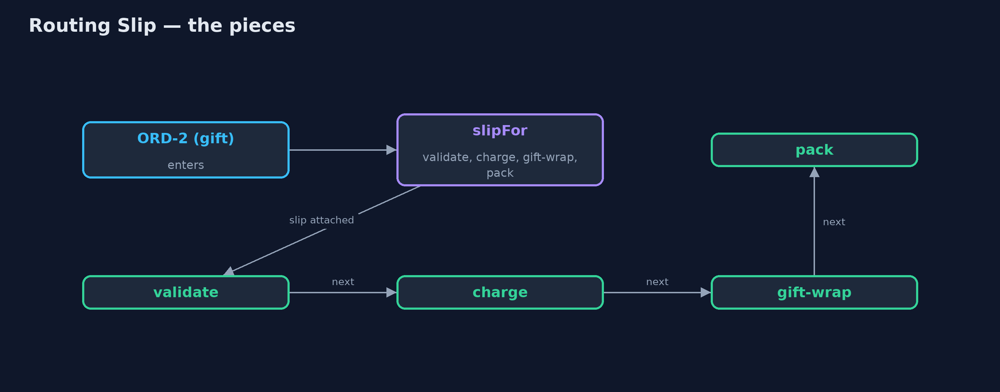
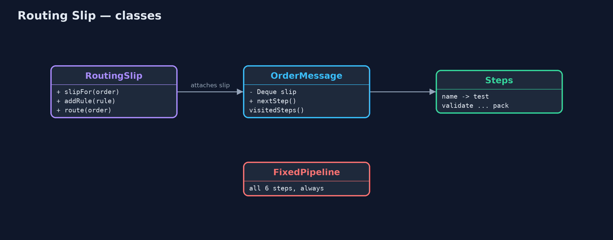
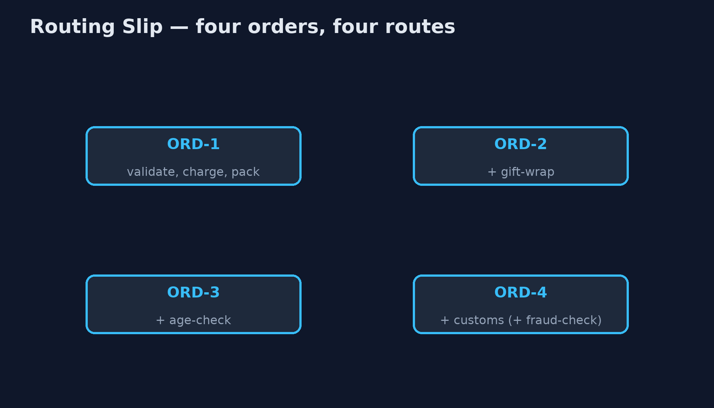
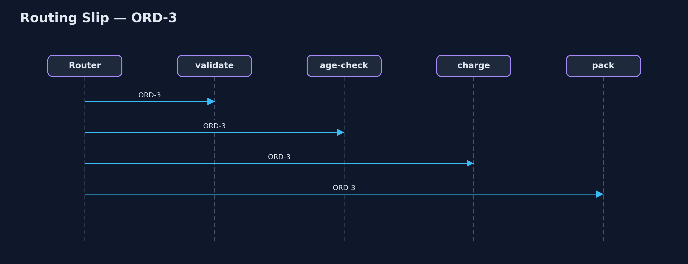

# Routing Slip Pattern

```
src/main/java/com/jk/explore/routingslip/
├── FixedPipeline.java    Without the pattern: every order passes through every step, and each step must check whether it applies
├── OrderMessage.java     An order travelling through the steps, carrying its routing slip: the steps still to visit, in order
├── RoutingSlip.java      The pattern: decide an order's route once, attach it to the message as a slip, and let each step pass the order to the next address on it
├── RoutingSlipDemo.java  The five acts: one fixed pipeline, routing slips, steps that know nothing of each other, a new step, and the bill
└── Steps.java            The processing steps
```

**Decide the steps a message needs once, when it enters, attach them to the message as a slip, and let each step pass it on to the next address on the slip.**

Routing Slip is one of the Enterprise Integration Patterns. When different
messages need different sequences of processing steps, the route is worked
out once, as the message enters, and attached to the message as a list: its
routing slip. Each step does its work, crosses itself off, and passes the
message to whatever the slip says comes next.

Steps stay independent: none knows what comes after it. New steps are added
by changing the rules that write slips, not the steps. The route is fixed
when the message sets off, which is both the simplicity and the limit of the
pattern.

## The idea in everyday terms

Think of the circulation slip clipped to a magazine in an office: "Pass to
Anna, then Ben, then Carl, then return to the library." Each person reads it,
crosses their name off, and passes it to the next name. Nobody needs to know
the whole list; they only look at the next name. But if Ben is away, the slip
cannot decide on its own to skip to Carl.

## The scenario

The online store processes orders through steps: validate, age check for
restricted items, customs for orders abroad, charge, gift wrap for gifts, and
pack. Every order went through one fixed pipeline of all six steps, and each
step began by asking whether it applied to this order at all.

## Run

```bash
./gradlew run
```

The demo tells the story in 5 acts, each printing exact numbers that the tests check:

| Act | What it shows |
| --- | --- |
| 1. One fixed pipeline | 4 orders through all 6 steps: 24 visits, 15 of which did any work; every step asks whether it applies. |
| 2. Routing slips | Each order gets its own slip: ORD-1 [validate, charge, pack], ORD-2 adds gift-wrap, ORD-3 age-check, ORD-4 customs. |
| 3. Steps pass it on | Each step does its job and hands on to the next on the slip: 15 visits in all, every one doing work. |
| 4. A new step | A rule adds fraud-check for orders over £500: ORD-4's slip gains it, ORD-1's is unchanged; no step changed. |
| 5. The bill | ORD-5 fails its age check: the route stops, with charge and pack still on the slip; it cannot choose another route. |

## Test

```bash
./gradlew test
```

7 tests in `DemoRunsTest`, `RoutingSlipTest`. Every number the demo prints is asserted, and nothing depends on the clock, so every run gives the same result.

## Technologies and versions

| Technology | Version | Used for |
| --- | --- | --- |
| Java | 21 | the code (toolchain set in `build.gradle`) |
| Gradle | 9.2.1 (wrapper) | build and run, nothing to install |
| JUnit | 5.10.2 | the tests |
| videokit | repository tool | the narrated video and animation: Piper `en_US-amy-medium`, speed 0.8, longer pauses (the approved `amy-slow` voice) |

## Learning Material

| Document | What it is for |
| --- | --- |
| [Problem statement](docs/problem-statement.md) | the situation and what the project must show |
| [Prerequisites](docs/prerequisites.md) | what you need to know first |
| [Routing Slip, explained](docs/routing-slip-pattern-explained.md) | the acts in prose |
| [Session guide](docs/session.md) | a one-hour lesson with exercises |
| [Animated walkthrough](docs/animation.html) | the acts step by step, narrated |
| [Spec](docs/spec.md) | what this project must be true of |

### The pattern in one picture

The slip is written once; each step reads the next address.



### Where each piece sits

The message carries its slip; the router pops and runs.



### How the data moves

Each order visits only its own steps.



### Who calls whom, in order

Pop, run, pop, run.



### Video

`video/routing-slip-pattern-explained.mp4` (with `.m4a` audio and `.srt` subtitles) is built by `video/build_video.sh`. Rendered media is not committed.

## What it costs

- **Fixed at the start.** A slip can stop when a step fails, but it cannot choose a different route from what happened on the way.
- **The route travels with the message.** Anyone who can change the message can change its route.
- **Rules in one place.** The code that writes slips must know every step and when it applies.

## When this is too much

When every message needs the same steps, a fixed pipeline is simpler. When the
route must change depending on results along the way, use a process manager,
which decides after each step instead of before the first.

## Where you have already met this

- Apache Camel's `routingSlip`.
- Approval workflows where a document carries its list of approvers.
- Circulation slips on office post and magazines.

## Where this sits

This project is in [messaging-integration-patterns](..), next to
[Process Manager](../process-manager-pattern), which decides each next step
from the last reply, and [Recipient List](../recipient-list-pattern), which
sends copies to several places at once rather than one after another.
