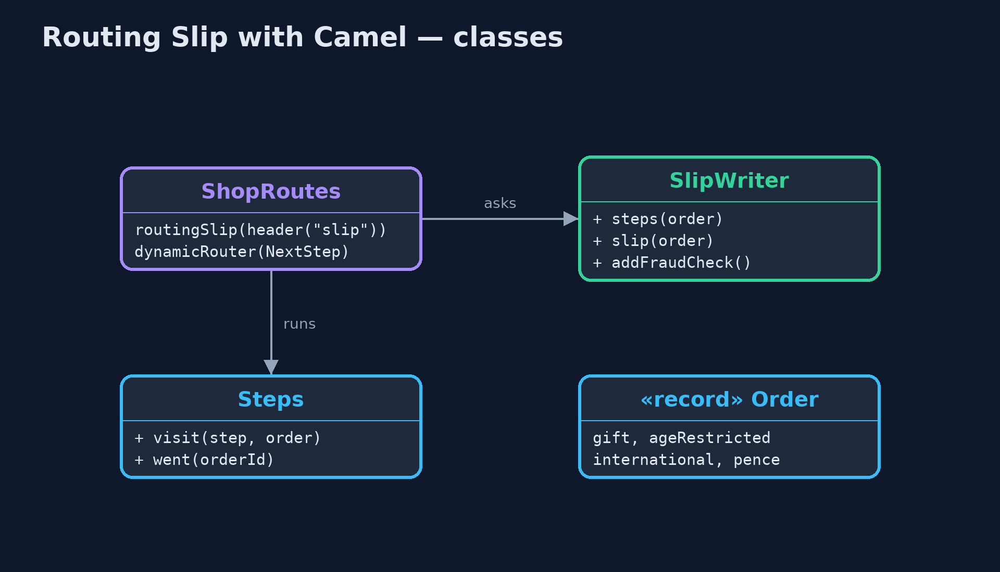
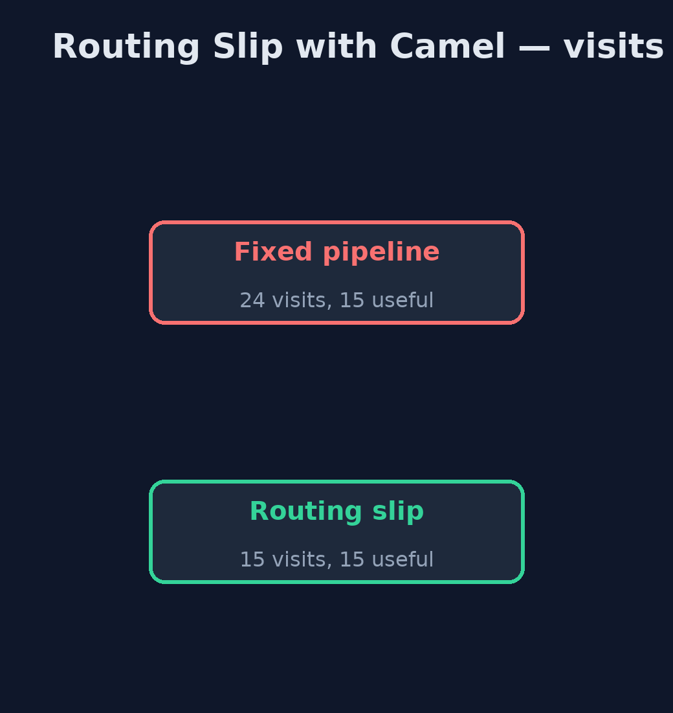
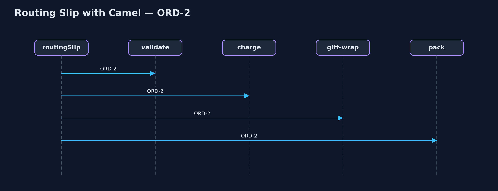

# Routing Slip with Apache Camel Pattern

```
src/main/java/com/jk/explore/routingslipcamel/
├── CamelRoutingSlipDemo.java  The five acts, with Apache Camel's routingSlip() and, at the end, dynamicRouter()
├── Order.java                 An order and the facts that decide which steps it needs
├── ShopRoutes.java            Three ways through the steps: a fixed pipeline, a routing slip, and a dynamic router
├── SlipWriter.java            Writes each order's slip once, when it sets off
└── Steps.java                 The processing steps
```

**Build the routing slip with Apache Camel: each order's list of steps is written once into a header, routingSlip() follows it, and dynamicRouter() shows what to use when the next step must be decided on the way.**

This is the framework version of the Routing Slip pattern. The plain Java
version, a separate project in this category, walks the slip by hand. Here
Apache Camel does it: the list of steps each order needs is written once into
a message header, and `routingSlip(header("slip"))` sends the order through
those steps in turn. No step knows which step comes after it.

Camel also has a close relative, `dynamicRouter()`, which decides each next
step on the way, from what has just happened. The last act shows it doing
what a slip cannot.

## The idea in everyday terms

Think of a hospital patient's treatment card. At reception, the card is
filled in with the departments this patient must visit: X-ray, then blood
test, then the doctor. Each department does its part and sends the patient
on to the next name on the card. No department needs to know the whole plan.

## The scenario

The online store sent every order through the same six steps: validate, age
check, customs, charge, gift wrap and pack. Four orders made twenty-four
visits, and only fifteen did any work; every step began by asking "does this
apply to me?"

## Run

Nothing to install beyond a Java 21 JDK: Camel runs inside the program on its
in-memory `direct:` endpoints.

```bash
./gradlew run
```

The demo tells the story in 5 acts, each printing exact numbers that the tests check:

| Act | What it shows |
| --- | --- |
| 1. One fixed pipeline | Every order visits all 6 steps: 4 orders make 24 visits, of which 15 do any work. |
| 2. The slip | The slip is written once per order: ORD-2 gets gift-wrap, ORD-3 age-check, ORD-4 customs. |
| 3. Camel follows the slip | routingSlip(header("slip")) makes 15 visits, all doing work; ORD-2 went validate, charge, gift-wrap, pack. |
| 4. A new step | A fraud-check rule for orders over £500 is added to the slip writer: ORD-4 now goes through fraud-check; no route or step changed. |
| 5. The bill, and a dynamic router | ORD-5 fails its age check: the slip stops with charge and pack unvisited; Camel's dynamicRouter() instead sends it to notify-customer. |

## Test

```bash
./gradlew test
```

3 tests in `DemoRunsTest`, `SlipWriterTest`. Every number the demo prints is asserted, and nothing depends on the clock, so every run gives the same result.

## What the simulation got right, and what it left out

The plain Java version got the idea right: the route is decided once, carried
with the message, and followed step by step, so steps are independent and a
new step is one rule where slips are written. What it left out is what Camel
provides: the slip as a plain header of endpoint addresses that Camel follows
for you, steps that could be queues or services anywhere, and the sibling
`dynamicRouter()` that decides each next step on the way. The plain version
could only say that a slip cannot change course; this one shows the tool that
can.

## Technologies and versions

| Technology | Version | Used for |
| --- | --- | --- |
| Java | 21 | the code (toolchain set in `build.gradle`) |
| Gradle | 9.2.1 (wrapper) | build and run, nothing to install |
| JUnit | 5.10.2 | the tests |
| Apache Camel | 4.22.1 | routingSlip(), dynamicRouter() and direct: endpoints |
| SLF4J simple | 2.0.17 | Camel's logging, switched off |
| videokit | repository tool | the narrated video and animation: Piper `en_US-amy-medium`, speed 0.8, longer pauses (the approved `amy-slow` voice) |

## Learning Material

| Document | What it is for |
| --- | --- |
| [Dependencies](docs/dependencies.md) | what the framework and infrastructure are, and why they are here |
| [Problem statement](docs/problem-statement.md) | the situation and what the project must show |
| [Prerequisites](docs/prerequisites.md) | what you need to know first |
| [Routing Slip with Apache Camel, explained](docs/routing-slip-with-camel-pattern-explained.md) | the acts in prose |
| [Session guide](docs/session.md) | a one-hour lesson with exercises |
| [Animated walkthrough](docs/animation.html) | the acts step by step, narrated |
| [Spec](docs/spec.md) | what this project must be true of |

### The pattern in one picture

Written once, followed step by step.


### Where each piece sits

The slip writer is the only place that knows the steps.



### How the data moves

Every step for every order, or only what each order needs.



### Who calls whom, in order

Each step passes on to the next on the slip.



### Video

`video/routing-slip-with-camel-pattern-explained.mp4` (with `.m4a` audio and `.srt` subtitles) is built by `video/build_video.sh`. Rendered media is not committed.

## What it costs

- **Fixed at the start.** When ORD-5 failed its age check, the slip could only stop; charge and pack were still on it.
- **Endpoint names in a header.** A typo in a step name is found only when an order reaches it.
- **More to carry.** More than ten library files instead of none.

## When this is too much

If every message needs the same steps, a plain route is simpler. A routing
slip pays off when different messages need different sets of steps, known at
the start.

## Where you have already met this

- Camel's `routingSlip()` and `dynamicRouter()`.
- Treatment cards in hospitals, and job travellers in factories.
- Workflow engines where a document carries its approval chain.

## Where this sits

This project is in [messaging-integration-patterns](..). It is the framework
version of the plain Java Routing Slip project in the same category, which is
left unchanged.
