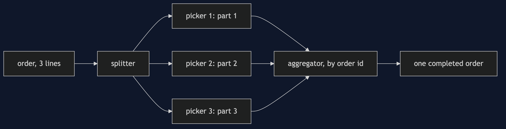
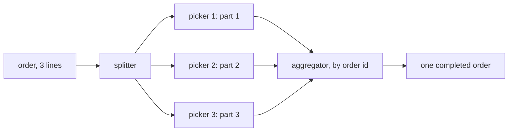

# Splitter and Aggregator Pattern — Architecture Diagram

One order fans out to several pickers and comes back as one.

Mermaid source

```mermaid
flowchart LR
    O["order, 3 lines"] --> S["splitter"]
    S --> P1["picker 1: part 1"]
    S --> P2["picker 2: part 2"]
    S --> P3["picker 3: part 3"]
    P1 --> A["aggregator, by order id"]
    P2 --> A
    P3 --> A
    A --> R["one completed order"]
```

