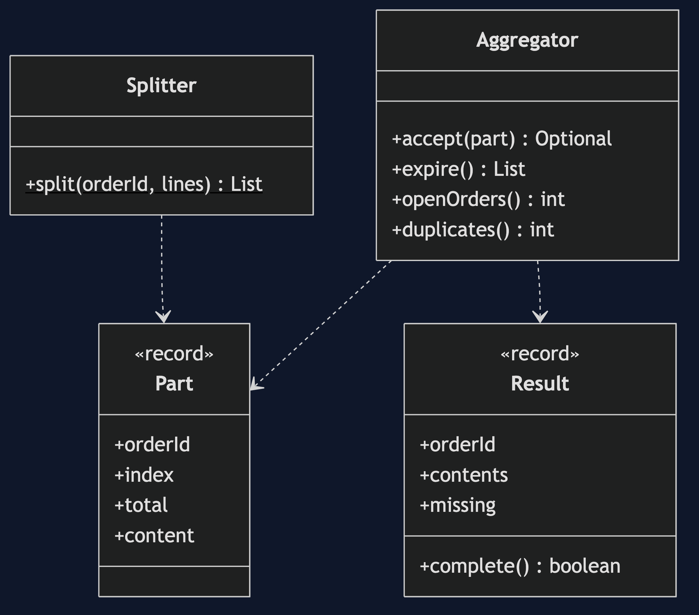
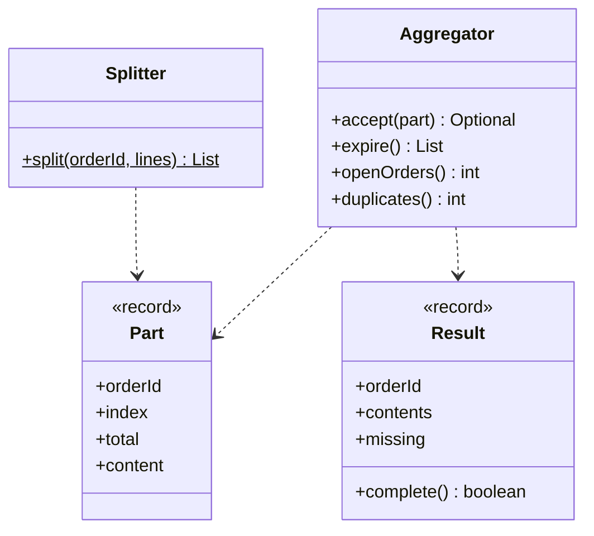

# Splitter and Aggregator Pattern — Class Diagram

A splitter makes numbered parts. An aggregator collects them by order id.

Mermaid source

```mermaid
classDiagram
    class Splitter {
        +split(orderId, lines)$ List
    }
    class Part {
        <<record>>
        +orderId
        +index
        +total
        +content
    }
    class Aggregator {
        +accept(part) Optional
        +expire() List
        +openOrders() int
        +duplicates() int
    }
    class Result {
        <<record>>
        +orderId
        +contents
        +missing
        +complete() boolean
    }
    Splitter ..> Part
    Aggregator ..> Part
    Aggregator ..> Result
```

