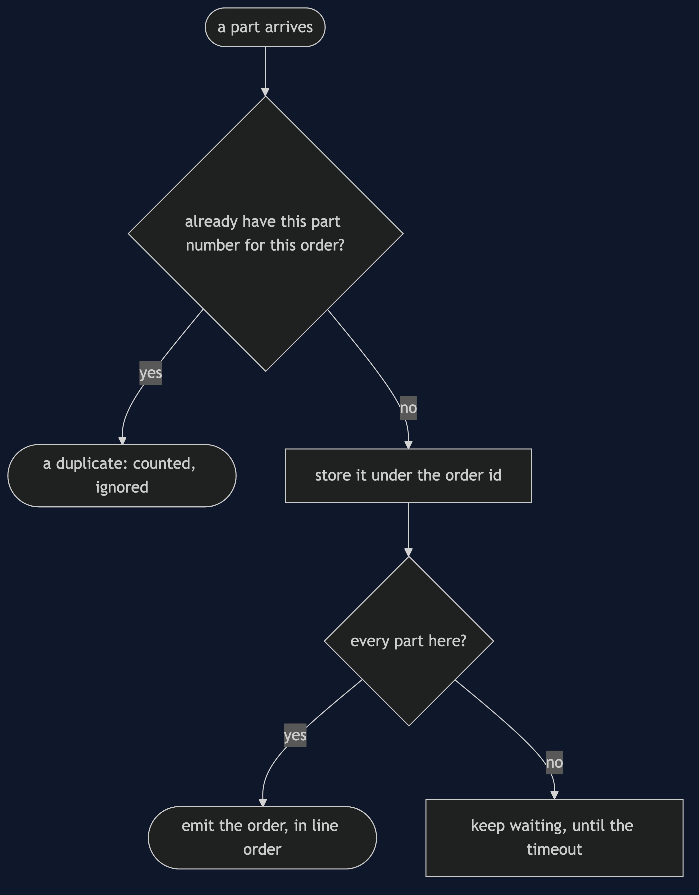
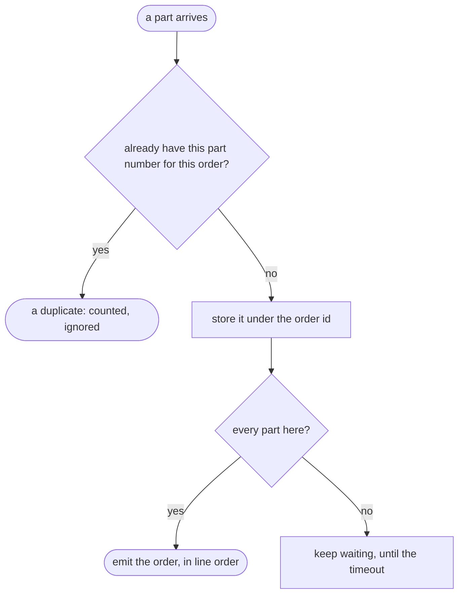

# Splitter and Aggregator Pattern — Data Flow Diagram

What the aggregator does with a part.

Mermaid source

```mermaid
flowchart TD
    Part(["a part arrives"])
    Have{"already have this part number for this order?"}
    Dup(["a duplicate: counted, ignored"])
    Add["store it under the order id"]
    All{"every part here?"}
    Done(["emit the order, in line order"])
    Wait["keep waiting, until the timeout"]
    Part --> Have
    Have -- yes --> Dup
    Have -- no --> Add --> All
    All -- yes --> Done
    All -- no --> Wait
```

