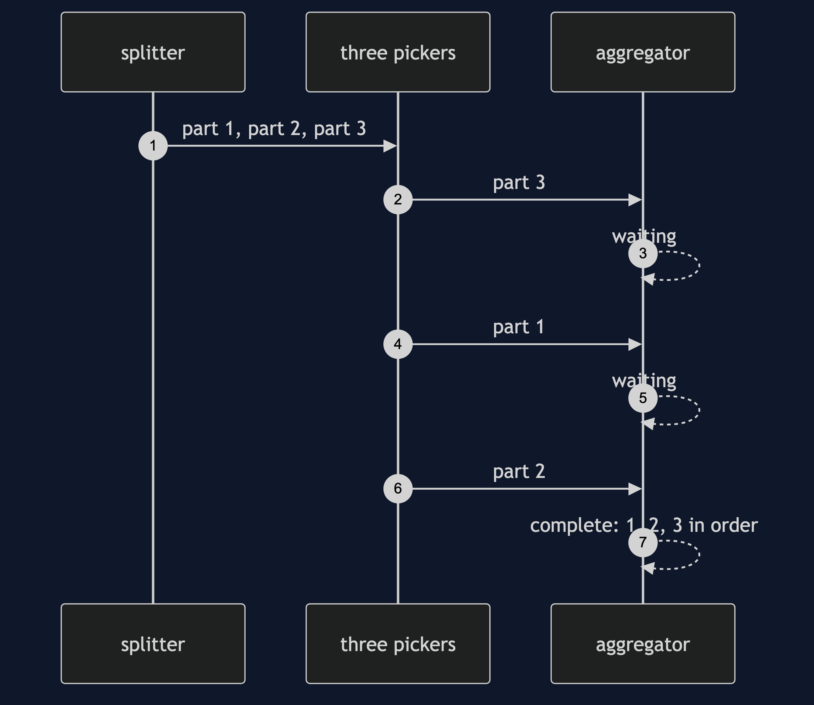
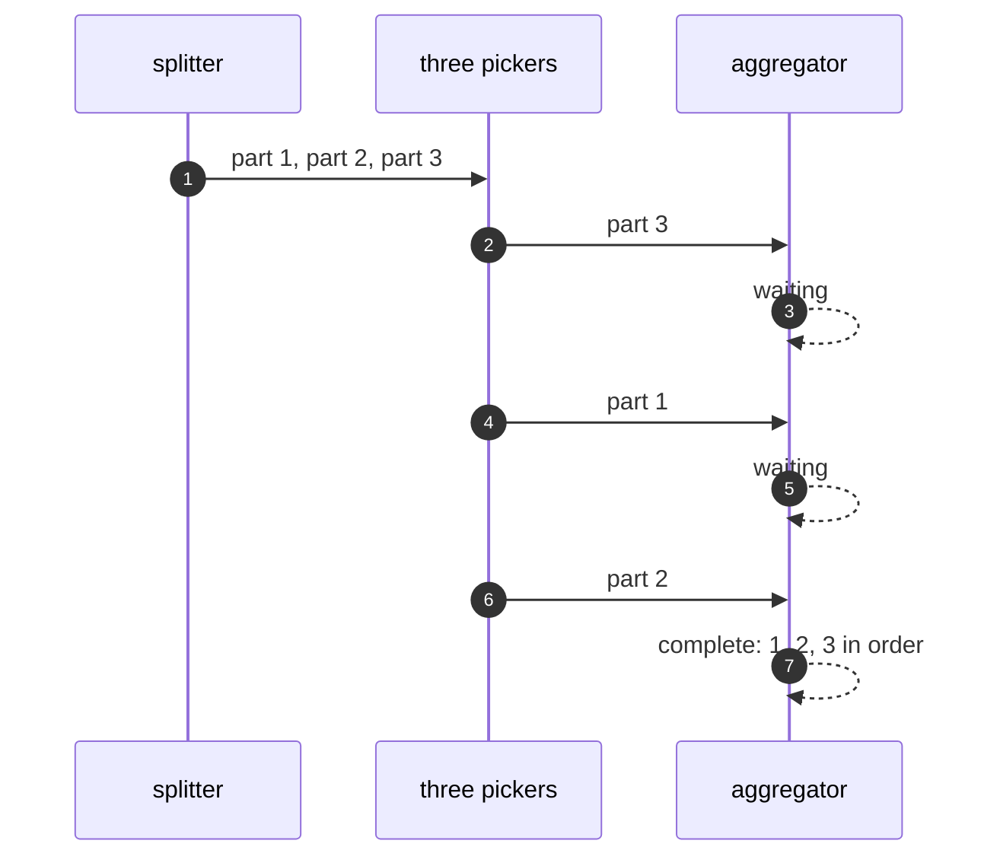

# Splitter and Aggregator Pattern — Sequence Diagram

Written for a listener with the screen off.

Say it in words. The splitter turns the order into three parts and sends them to three pickers. Picker three finishes first, and its part reaches the aggregator, which waits. Picker one finishes, and the aggregator waits again. Picker two finishes. Now the aggregator has all three, puts them in line order using the numbers they carry, and emits the completed order.

Mermaid source

The load-bearing sentence: **the numbers on the parts are what put the order back.**
