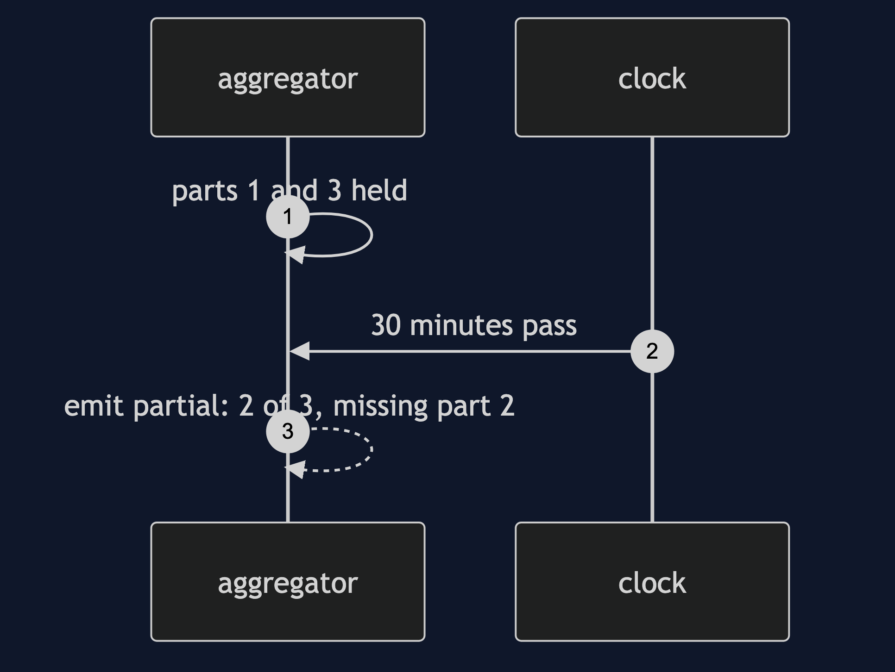
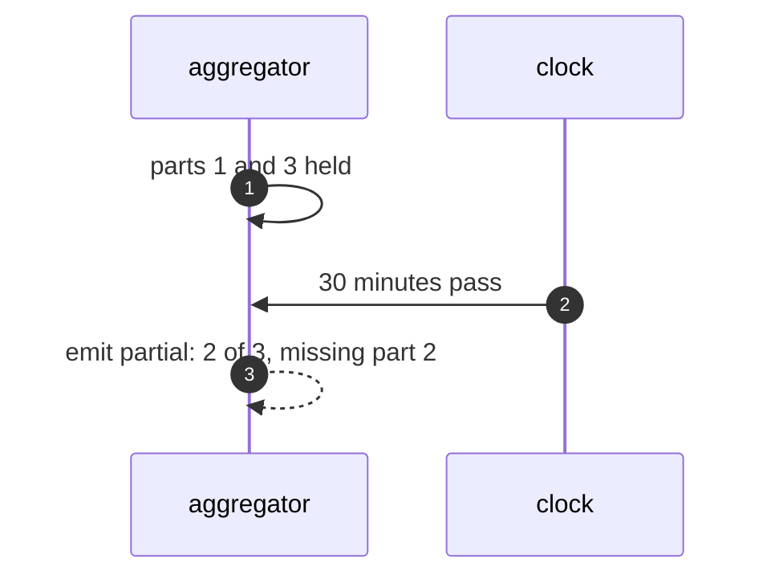

# Splitter and Aggregator Pattern — UML Sequence Diagrams

Four sequences.

## 1. A Timeout

Mermaid source

```mermaid
sequenceDiagram
    autonumber
    participant A as aggregator
    participant C as clock
    A->>A: parts 1 and 3 held
    C->>A: 30 minutes pass
    A-->>A: emit partial: 2 of 3, missing part 2
```

