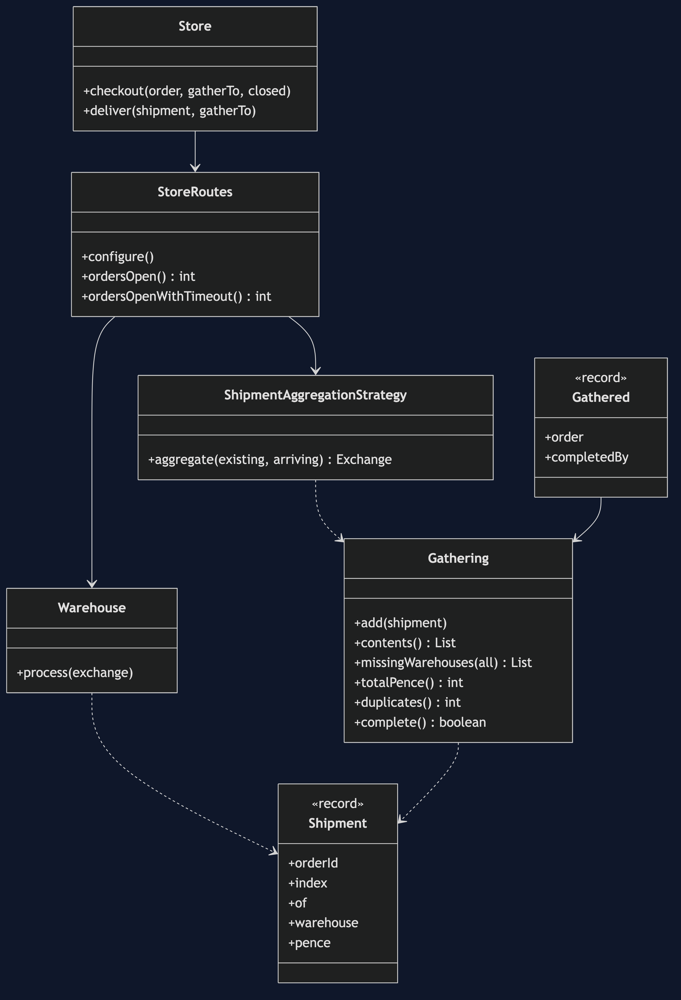
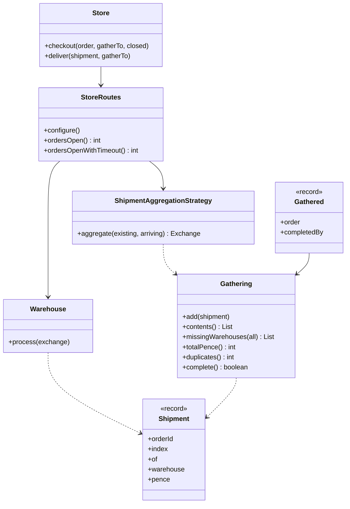

# Splitter and Aggregator with Camel Pattern — Class Diagram

Camel owns the split and the aggregate. What the project writes is the fold, the picking step, and the answer.

Mermaid source

```mermaid
classDiagram
    class StoreRoutes {
        +configure()
        +ordersOpen() int
        +ordersOpenWithTimeout() int
    }
    class ShipmentAggregationStrategy {
        +aggregate(existing, arriving) Exchange
    }
    class Gathering {
        +add(shipment)
        +contents() List
        +missingWarehouses(all) List
        +totalPence() int
        +duplicates() int
        +complete() boolean
    }
    class Gathered {
        <<record>>
        +order
        +completedBy
    }
    class Shipment {
        <<record>>
        +orderId
        +index
        +of
        +warehouse
        +pence
    }
    class Warehouse {
        +process(exchange)
    }
    class Store {
        +checkout(order, gatherTo, closed)
        +deliver(shipment, gatherTo)
    }
    Store --> StoreRoutes
    StoreRoutes --> ShipmentAggregationStrategy
    StoreRoutes --> Warehouse
    Warehouse ..> Shipment
    ShipmentAggregationStrategy ..> Gathering
    Gathering ..> Shipment
    Gathered --> Gathering
```

