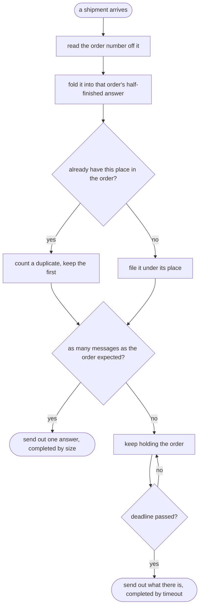

# Splitter and Aggregator with Camel Pattern — Data Flow Diagram

What happens to one shipment when it reaches the aggregator, and what the clock does when no shipment reaches it at all.

Mermaid source

