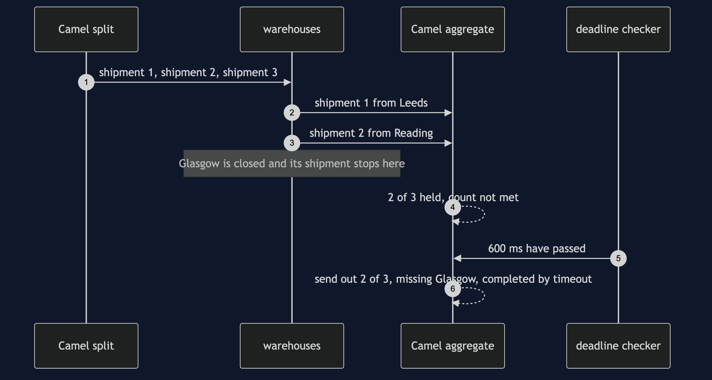

# Splitter and Aggregator with Camel Pattern — Sequence Diagram

Written for a listener with the screen off.

Say it in words. One order for three products arrives at the store. Camel's split step sends out three shipments, one for each line, and stamps each with the order number and its place in the order. Leeds picks its line and sends it back. Reading picks its line and sends it back. Glasgow is closed, so its shipment reaches the warehouse and stops there; nobody downstream is told anything. The aggregator now holds two shipments for an order that expects three, and it waits, because its count is not met. Then its deadline passes. A background checker, watching the clock the whole time, tells the aggregator to stop waiting. The aggregator sends out one answer carrying the two shipments it has, names Glasgow as the one that never came, and says the reason it finished was the timeout and not the count.

The load-bearing sentence: **an aggregator with only a count will wait for ever, so the deadline is not a nicety, it is the other half of the pattern.**

For the rejected designs and the rest of the failure modes, see [`uml-diagram.md`](uml-diagram.md).
