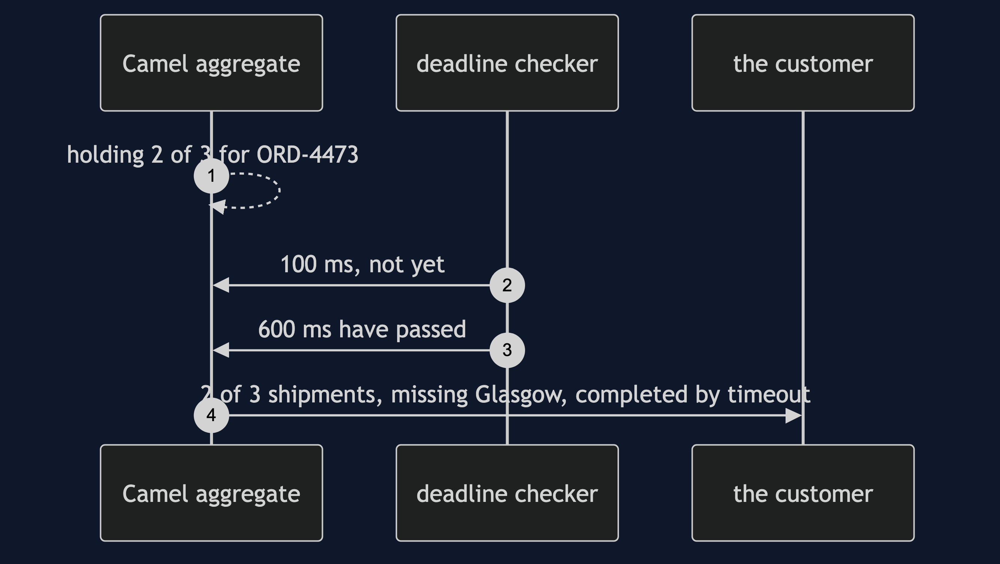
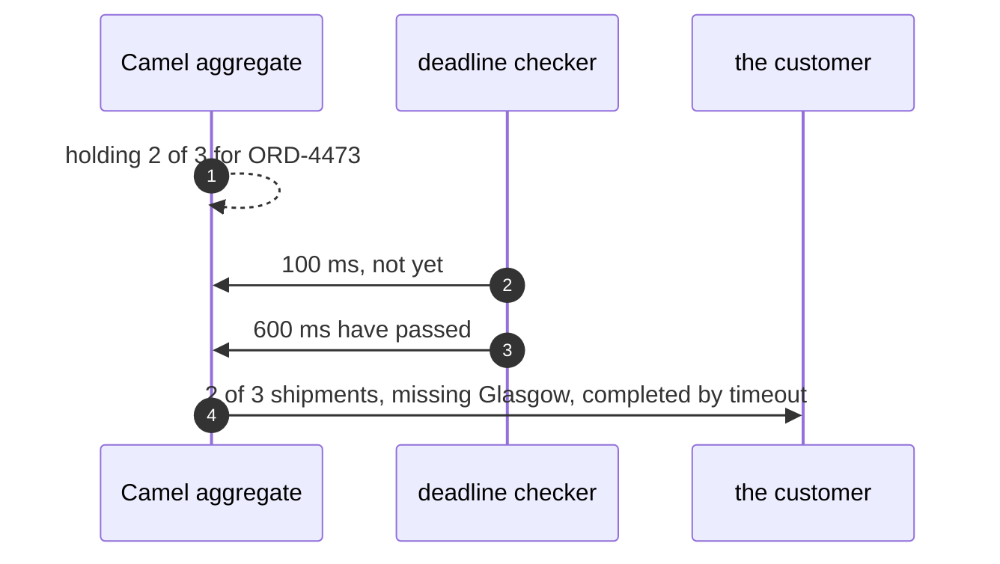
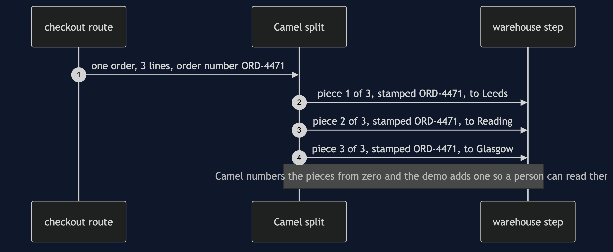
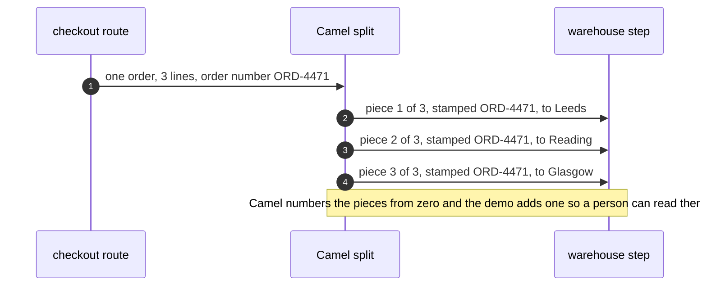
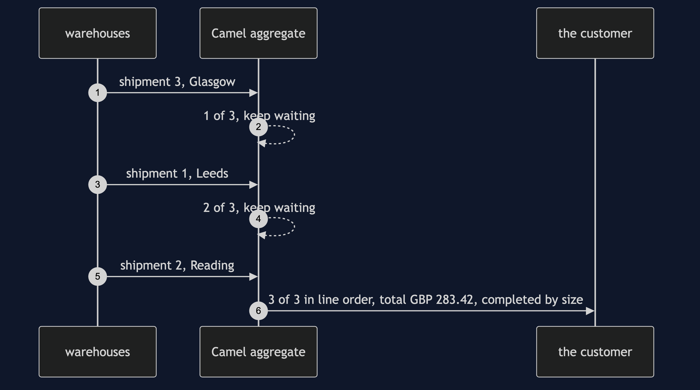
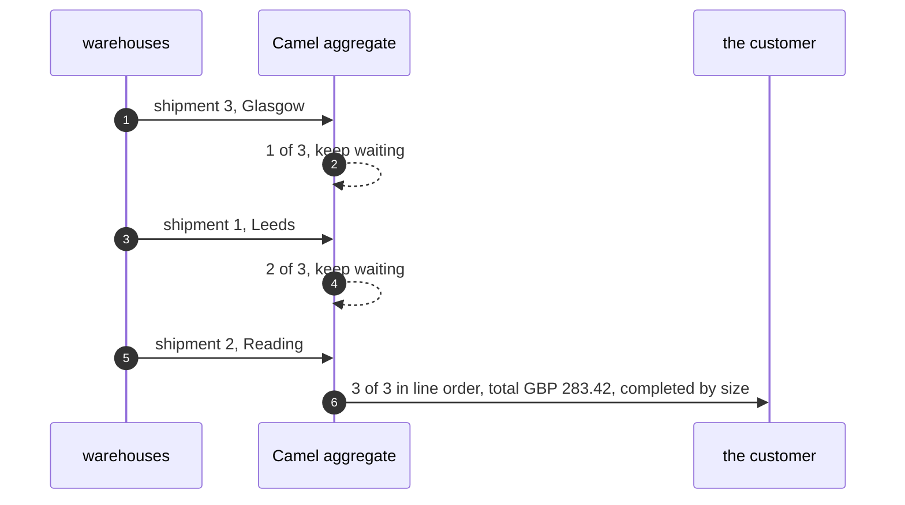
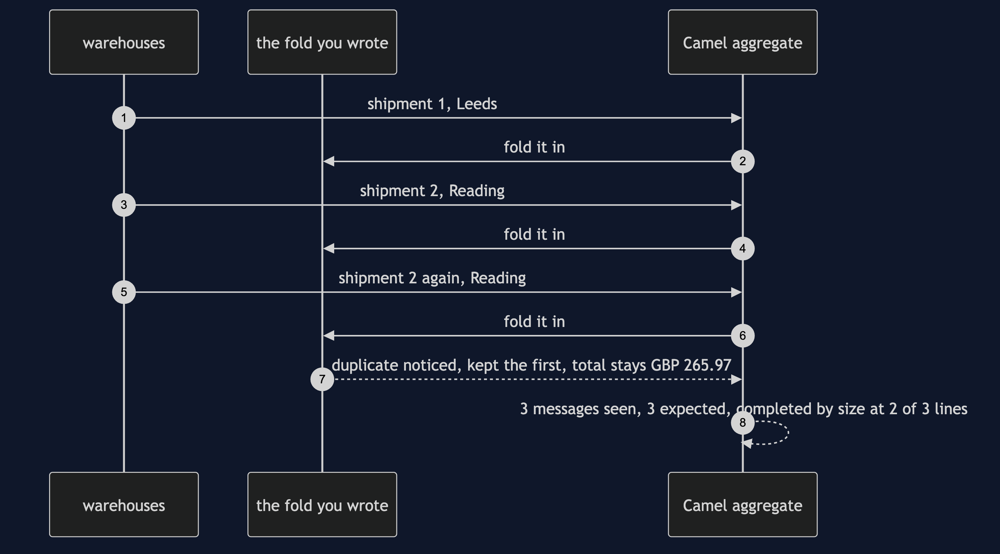
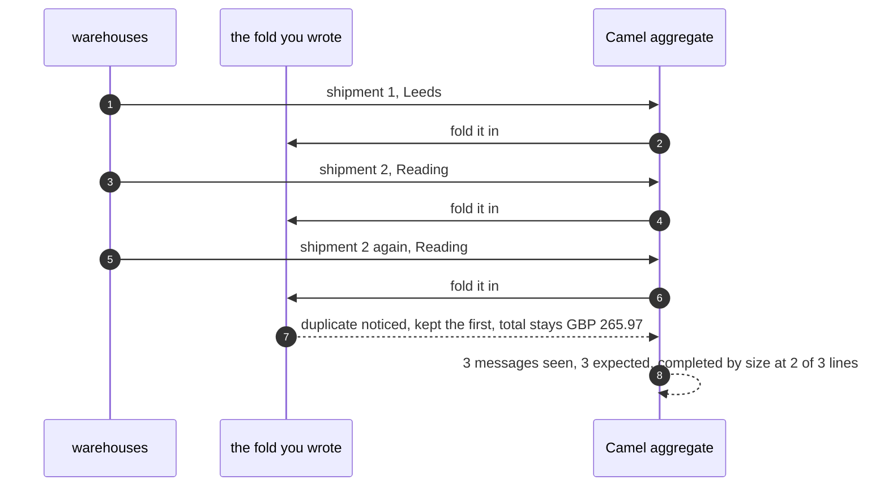

# Splitter and Aggregator with Camel Pattern — UML Sequence Diagrams

Four sequences. The deadline comes first, because it is the one thing this project exists to show.

## 1. The Deadline Fires

The aggregator holds two of three shipments. Nothing else will ever arrive. The background checker, which has been looking at the clock every hundred milliseconds, finds that six hundred have passed and ends the wait.

Mermaid source

## 2. The Split Stamps Every Piece

One order in, three messages out. Camel numbers them itself and copies the order's headers onto each one, so the order number travels without anybody arranging it.

Mermaid source

## 3. Jumbled Arrivals, Ordered Answer

The warehouses answer third, first, second. The aggregator files each under the place it says it is, so the answer comes out in the customer's line order and completes by size.

Mermaid source

## 4. A Repeated Message Counts As Progress

Camel's completion by size counts messages, not distinct pieces. Two copies of the Reading shipment plus one from Leeds makes three messages, so the order is declared finished with one of its lines never picked.

Mermaid source

