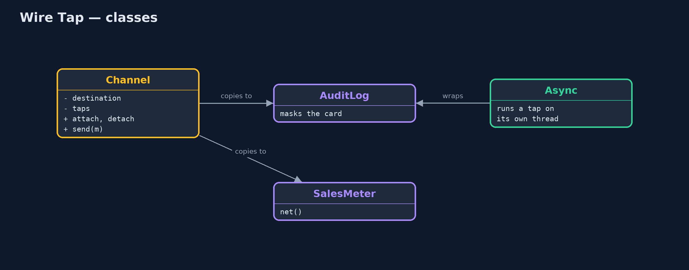
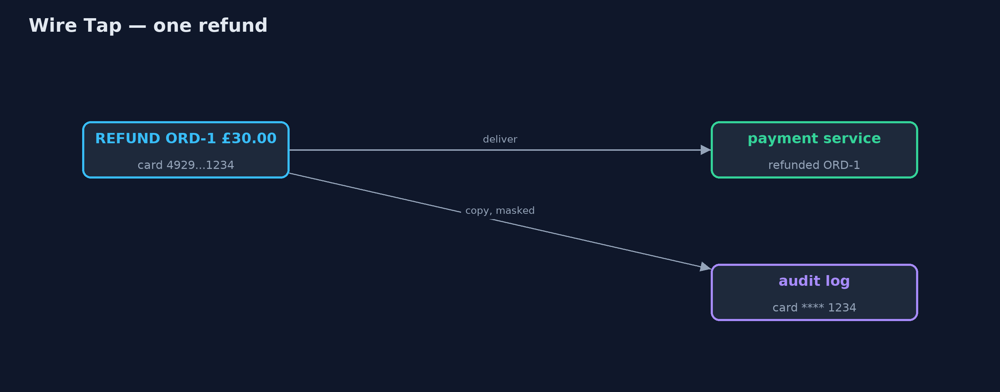

# Wire Tap Pattern

```
src/main/java/com/jk/explore/wiretap/
├── Channel.java         A point-to-point channel from checkout to payment, with a place to attach wire taps
├── PaymentMessage.java  A message from checkout to the payment service: charge or refund an amount on a card
├── PaymentService.java  The payment service at the end of the channel
├── WireTapDemo.java     The five acts: logging typed into the services, a wire tap, taps on and off, a second tap, and the bill
└── WireTaps.java        The pattern's taps: copies of the traffic for someone else to look at, while the real message carries on untouched
```

**Attach a tap to a channel that sends a copy of every message to a second listener, such as an audit log, while the real message carries on untouched.**

Wire Tap is one of the Enterprise Integration Patterns. To see what is
flowing through a channel (for auditing, debugging or a dashboard) you attach
a tap to the channel itself. Every message is still delivered to its real
destination, and a copy goes to the tap's listener. Neither the sender nor the
receiver is changed, and taps can be attached and detached while the system
runs.

The copies must be treated with care: a tap sees everything, including
sensitive data, and a slow tap must not slow down the real traffic.

## The idea in everyday terms

Think of "calls may be recorded for training purposes". The customer and the
agent talk exactly as they would anyway; a recorder quietly keeps a copy.
Recording can be switched on and off without changing how anyone speaks. And
when the customer reads out their card number, the recording is paused,
because the copy must not keep what it has no business keeping.

## The scenario

The online store's checkout sends payment messages (charges and refunds) to
the payment service. To investigate a disputed refund, someone typed logging
into the payment service's charge code. The refund path never got any, and the
log that did exist was full of complete card numbers.

## Run

```bash
./gradlew run
```

The demo tells the story in 5 acts, each printing exact numbers that the tests check:

| Act | What it shows |
| --- | --- |
| 1. Logging typed in by hand | Logging was added to the payment service's charge path only: 4 messages sent, 3 logged, with full card numbers. |
| 2. A wire tap | An audit tap on the channel copies all 4 messages with masked cards; payment handles all 4; neither service changed. |
| 3. Attach and detach | The tap is detached after the investigation; ORD-4 flows as normal and the audit keeps its 4 lines. |
| 4. A second tap | A sales meter tapped onto the channel shows net takings of £58.42. |
| 5. The bill | A 100 ms tap makes 4 payments take over 0.4 s; on its own thread, under 0.05 s. Mask everything a tap copies. |

## Test

```bash
./gradlew test
```

7 tests in `DemoRunsTest`, `WireTapTest`. Every number the demo prints is asserted, and nothing depends on the clock, so every run gives the same result.

## Technologies and versions

| Technology | Version | Used for |
| --- | --- | --- |
| Java | 21 | the code (toolchain set in `build.gradle`) |
| Gradle | 9.2.1 (wrapper) | build and run, nothing to install |
| JUnit | 5.10.2 | the tests |
| videokit | repository tool | the narrated video and animation: Piper `en_US-amy-medium`, speed 0.8, longer pauses (the approved `amy-slow` voice) |

## Learning Material

| Document | What it is for |
| --- | --- |
| [Problem statement](docs/problem-statement.md) | the situation and what the project must show |
| [Prerequisites](docs/prerequisites.md) | what you need to know first |
| [Wire Tap, explained](docs/wire-tap-pattern-explained.md) | the acts in prose |
| [Session guide](docs/session.md) | a one-hour lesson with exercises |
| [Animated walkthrough](docs/animation.html) | the acts step by step, narrated |
| [Spec](docs/spec.md) | what this project must be true of |

### The pattern in one picture

The real message goes on; copies go to the taps.


### Where each piece sits

Taps are consumers attached to the channel.



### How the data moves

Delivered as sent; copied with the card masked.



### Who calls whom, in order

Copy first, then deliver.


### Video

`video/wire-tap-pattern-explained.mp4` (with `.m4a` audio and `.srt` subtitles) is built by `video/build_video.sh`. Rendered media is not committed.

## What it costs

- **A tap sees everything.** Card numbers must be masked before anything is copied.
- **A slow tap slows the real traffic.** A 100 ms tap made four payments take over 0.4 seconds, until it ran on its own thread.
- **More copies to store.** Audit logs grow, and must be kept safe and eventually deleted.

## When this is too much

When you only need a count or a timing, a metric in the channel itself is
lighter than copying whole messages. And for occasional debugging on a
developer's laptop, a breakpoint is simpler than a tap.

## Where you have already met this

- Apache Camel's `wireTap` and Spring Integration's `wire-tap` interceptor.
- Kafka consumers in a separate group that read a topic for auditing.
- Network port mirroring for monitoring tools.
- Call recording in customer service centres.

## Where this sits

This project is in [messaging-integration-patterns](..), next to
[Message Channel](../message-channel-pattern), the channel a tap is attached
to, and [Message Filter](../message-filter-pattern).
