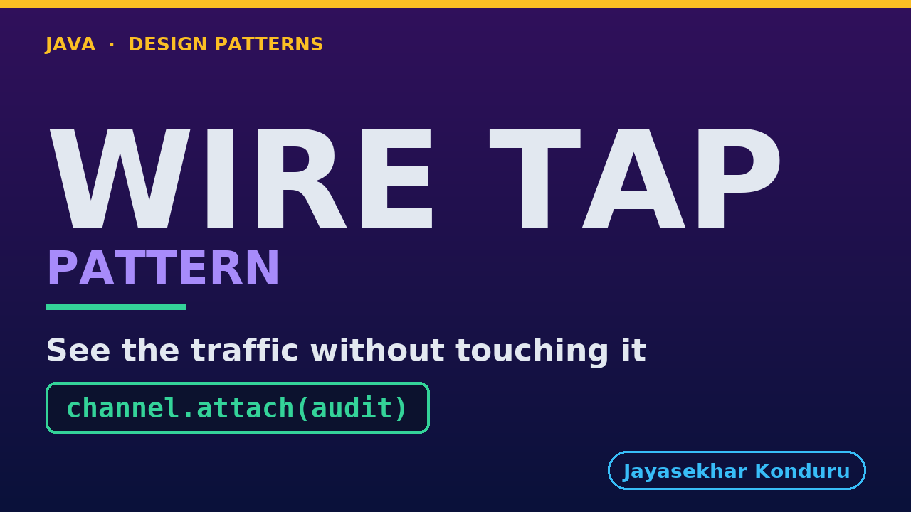

# YouTube — Wire Tap Pattern

Everything needed to publish `video/wire-tap-pattern-explained.mp4`. Copy the fields straight out of this file.

Chapter timings are generated from the video's `.srt`. Re-run `python3 docs/make_youtube_docs.py wire-tap` after any change to the narration, or they will be wrong.

## Title

```
Wire Tap
```

8 characters — under the 60 YouTube shows before truncating in search results.

## Description

The first two lines are what a viewer sees above the fold, so they carry the hook rather than the boilerplate.

```
Attach a tap to a channel that sends a copy of every message to a second listener, such as an audit log, while the real message carries on untouched. A wire tap copies every message on a channel to a second listener, while the original is delivered unchanged, so traffic can be observed without touching senders or receivers.

CHAPTERS
00:00 Introduction
01:13 The Scenario
01:31 Act One — Logging typed in by hand
01:55 Act Two — A wire tap
02:23 Act Three — Attach and detach
02:43 Act Four — A second tap
03:00 Act Five — The bill
03:27 The Pattern
03:49 Who Does What
04:15 Where You Have Seen It
04:39 When To Use It
04:57 Thanks for Watching

SOURCE CODE, WRITTEN NOTES AND AN INTERACTIVE ANIMATION
https://github.com/jk-boot-up/java-design-patterns/tree/main/gradle-java/messaging-integration-patterns/wire-tap-pattern

WHAT YOU NEED FIRST
Java 21 and a working knowledge of classes and interfaces. No prior design-pattern knowledge is assumed. The full prerequisites are in docs/prerequisites.md in the repository.
```

## Chapters

YouTube renders these as chapters only if there are at least three and the first is at `00:00`.

```
00:00 Introduction
01:13 The Scenario
01:31 Act One — Logging typed in by hand
01:55 Act Two — A wire tap
02:23 Act Three — Attach and detach
02:43 Act Four — A second tap
03:00 Act Five — The bill
03:27 The Pattern
03:49 Who Does What
04:15 Where You Have Seen It
04:39 When To Use It
04:57 Thanks for Watching
```

## Tags

```
wire tap, enterprise integration patterns, auditing, monitoring, messaging, java, design patterns, java design patterns, gang of four, java 21, software design, clean code, object oriented design, java tutorial, ecommerce, programming tutorial
```

243 characters, under YouTube's 500 limit.

## Thumbnail



**Upload `docs/thumbnail.png`** — 1280×720, the size YouTube recommends, generated by `docs/make_thumbnails.py`. It is deliberately not the same image as the video's opening frame: a thumbnail is judged at about 360 pixels wide in a search result, so this one carries only the pattern name, one line of promise and one short piece of code, each set large enough to survive the shrink.

`video/poster.png` is the 1920×1080 opening frame, produced by the video build. It stays in the repository as the title card; it is not what gets uploaded.

YouTube will not pick the thumbnail up on its own — upload it under **Details → Thumbnail → Upload file**. A custom thumbnail requires a verified channel.

## Upload checklist

- [ ] Upload `video/wire-tap-pattern-explained.mp4` (1080p, H.264, 30 fps, AAC 48 kHz — already YouTube's recommended settings, no re-encode needed)
- [ ] Set the video language to **English** first, or the subtitle option may not appear
- [ ] Add subtitles: *Video elements → Add subtitles → Upload file → With timing* → `video/wire-tap-pattern-explained.srt`
- [ ] Upload `docs/thumbnail.png` as the thumbnail — do not let YouTube auto-pick a frame
- [ ] Paste the title, description and tags from above
- [ ] Add to the **Java Design Patterns** playlist, in learning order
- [ ] Wait for 1080p processing before sharing the link — code slides are unreadable at 360p

## Cards and end screen

End screen links to whichever pattern video goes up next — set it at upload time rather than assuming an order.

Add a card partway through pointing at the playlist, so a viewer who arrives at this pattern from search can find the rest of the series.

## Runtime

Approximately 05:43, narrated at 145 words per minute.
