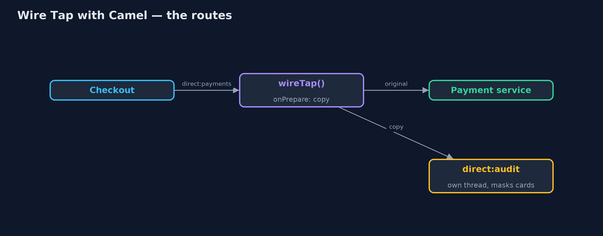

# Wire Tap with Apache Camel Pattern

```
src/main/java/com/jk/explore/wiretapcamel/
├── Audit.java             The audit log fed by the wire tap
├── CamelWireTapDemo.java  The five acts, with Apache Camel's wireTap()
├── PaymentMessage.java    A payment instruction
├── PaymentService.java    The real work: charging and refunding
└── ShopRoutes.java        Checkout sends to direct:payments
```

**Build the wire tap with Apache Camel: wireTap() sends a copy of every payment to an audit route on its own thread, and onPrepare() makes sure the copy is truly a copy.**

This is the framework version of the Wire Tap pattern. The plain Java
version, a separate project in this category, builds the tap by hand. Here
Apache Camel provides it: one `wireTap("direct:audit")` step in the payments
route sends a copy of every message to an audit route, while the payment
service carries on as if nothing were listening.

Camel's tap runs on its own thread, so a slow audit does not slow payments.
It also has a trap the plain version did not: by default the tap is handed the
same message object, so a tap that changes it changes the real message.
`onPrepare()` fixes that by giving the tap its own copy.

## The idea in everyday terms

Think of a shop's CCTV camera over the till. It watches every sale without
the cashier doing anything differently, and the recording goes to a separate
room. But if the camera room could reach through and change the receipt in
the customer's hand, that would be a problem; the camera must only ever see
a copy.

## The scenario

The online store's payment service handled charges and refunds. Logging had
been typed into it by hand, it missed the refund path, and it wrote full card
numbers. Auditors want a masked copy of every payment message, without
changing checkout or the payment service.

## Run

Nothing to install beyond a Java 21 JDK: Camel runs inside the program on its
in-memory `direct:` endpoints.

```bash
./gradlew run
```

The demo tells the story in 5 acts, each printing exact numbers that the tests check:

| Act | What it shows |
| --- | --- |
| 1. A tap on the route | wireTap("direct:audit") copies all 4 payments, the refund included, with cards masked; payment handles all 4, unchanged. |
| 2. Not a copy after all | The tap was handed the same object: checkout's own ORD-1 message now reads card **** 1234. |
| 3. onPrepare: a real copy | With onPrepare(copy), the audit still gets 4 lines and checkout's ORD-1 keeps its full card number. |
| 4. The audit stops | With the audit route stopped, ORD-4 is still charged; the failed copy never reaches checkout or payment. |
| 5. The bill | An audit taking 100 ms per copy: 4 payments take under 0.3 s, but the audit lags behind and catches up later; waiting copies live only in memory. |

## Test

```bash
./gradlew test
```

1 tests in `DemoRunsTest`. Every number the demo prints is asserted, and nothing depends on the clock, so every run gives the same result.

## What the simulation got right, and what it left out

The plain Java version got the idea right: a copy of every message goes to a
side channel, the sender and receiver are unchanged, taps can be attached and
detached, and a slow tap on the same thread slows everything. What it left out
is what Camel does differently: its tap runs on a thread pool, so a slow audit
no longer slows payments but lags behind instead, with copies waiting in
memory; it hands the tap the same object unless you ask for a copy; and a
failing tap never breaks the main route. The plain version could not show
the shared-object trap, because it copied by design.

## Technologies and versions

| Technology | Version | Used for |
| --- | --- | --- |
| Java | 21 | the code (toolchain set in `build.gradle`) |
| Gradle | 9.2.1 (wrapper) | build and run, nothing to install |
| JUnit | 5.10.2 | the tests |
| Apache Camel | 4.22.1 | wireTap(), onPrepare() and route control |
| SLF4J simple | 2.0.17 | Camel's logging, switched off |
| videokit | repository tool | the narrated video and animation: Piper `en_US-amy-medium`, speed 0.8, longer pauses (the approved `amy-slow` voice) |

## Learning Material

| Document | What it is for |
| --- | --- |
| [Dependencies](docs/dependencies.md) | what the framework and infrastructure are, and why they are here |
| [Problem statement](docs/problem-statement.md) | the situation and what the project must show |
| [Prerequisites](docs/prerequisites.md) | what you need to know first |
| [Wire Tap with Apache Camel, explained](docs/wire-tap-with-camel-pattern-explained.md) | the acts in prose |
| [Session guide](docs/session.md) | a one-hour lesson with exercises |
| [Animated walkthrough](docs/animation.html) | the acts step by step, narrated |
| [Spec](docs/spec.md) | what this project must be true of |

### The pattern in one picture

The main route carries on; the copy goes to the side.



### Where each piece sits

The tap is one route step.


### How the data moves

Without onPrepare, the audit's change reaches the real message.


### Who calls whom, in order

The payment goes on at once; the copy follows.


### Video

`video/wire-tap-with-camel-pattern-explained.mp4` (with `.m4a` audio and `.srt` subtitles) is built by `video/build_video.sh`. Rendered media is not committed.

## What it costs

- **Shared object by default.** Without `onPrepare()`, the audit's masking changed the real payment instruction.
- **Copies in memory.** A slow tap lags behind; copies still waiting are lost if the program stops. A real audit should tap to a durable queue.
- **Silent failures.** A failing tap never reaches the sender, so its errors must be watched separately.

## When this is too much

If one service needs a log line, logging inside it is simpler. The wire tap
pays off when a copy of traffic is needed on the side, by auditors or a
dashboard, without touching sender or receiver.

## Where you have already met this

- Camel's `wireTap()` and Spring Integration's `wire-tap` interceptor.
- Port mirroring on network switches.
- Kafka consumers that read a topic purely for auditing or analytics.

## Where this sits

This project is in [messaging-integration-patterns](..). It is the framework
version of the plain Java Wire Tap project in the same category, which is left
unchanged.
