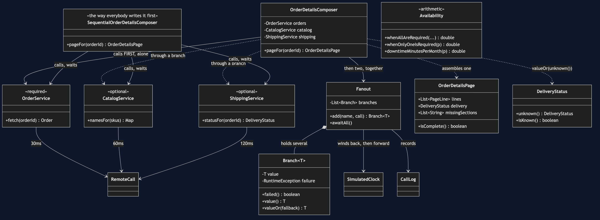
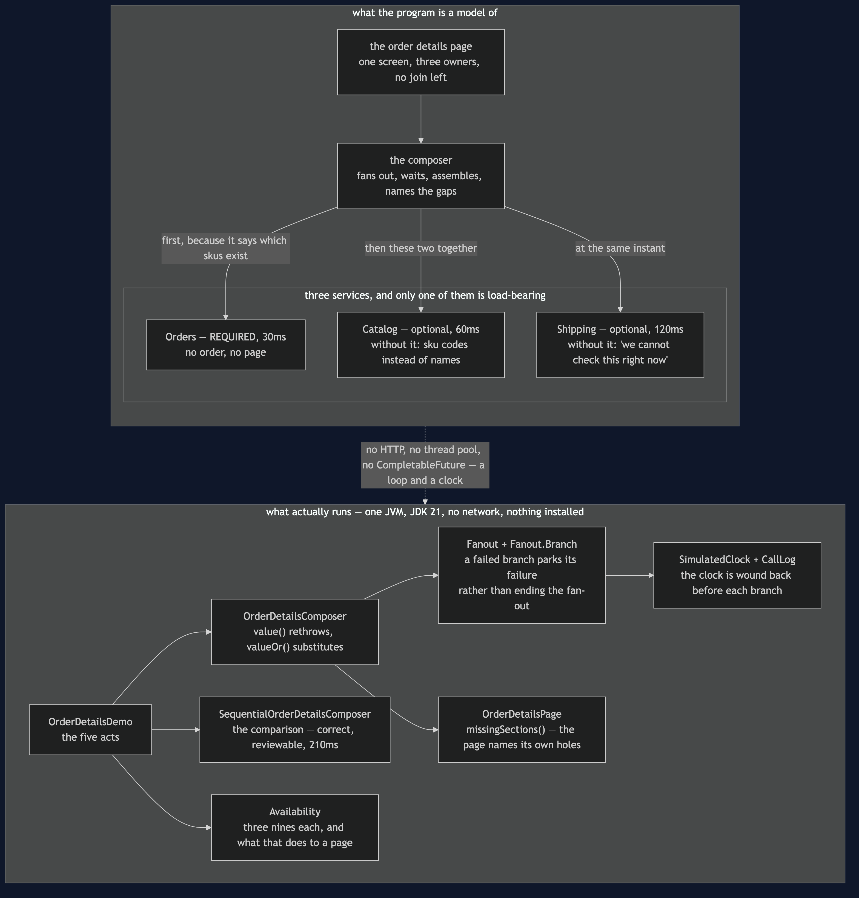
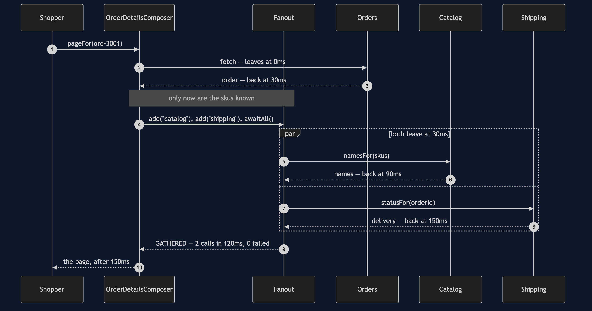
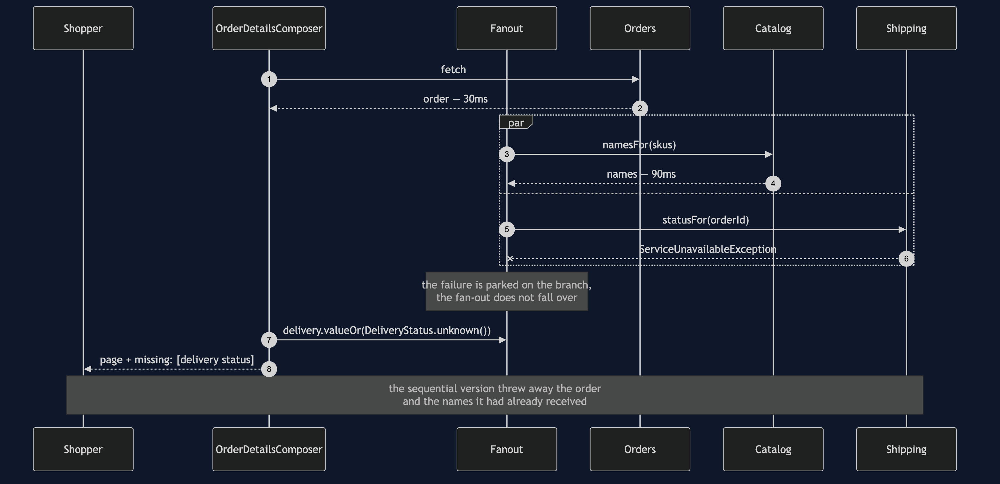
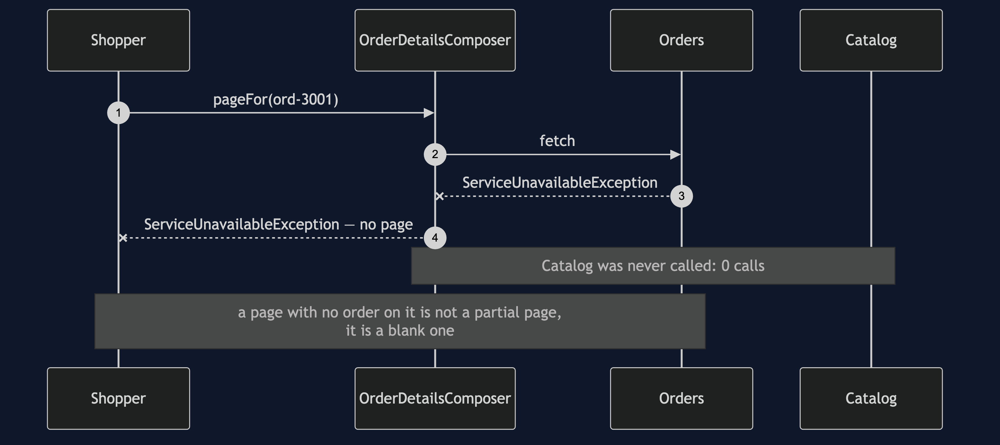
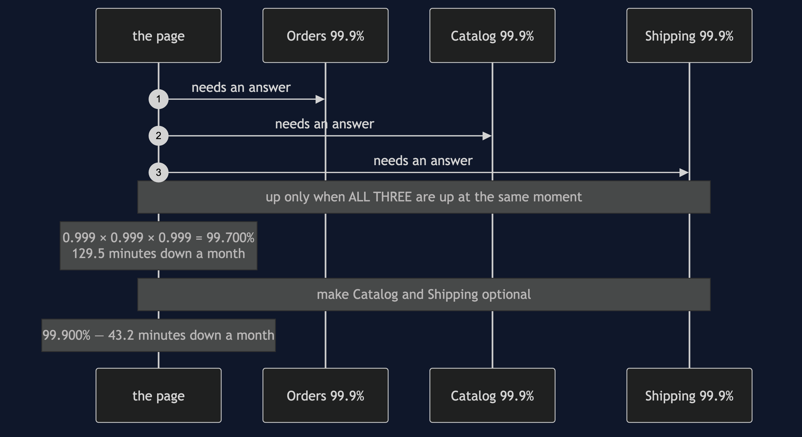

# API Composition

**In plain words:** to build one page out of data owned by three services, ask all three
at once, wait for the answers, and put them together yourself.

**Everyday analogy:** making a sandwich from three different shops. There is no one shop
that sells the finished sandwich, so somebody walks to the baker, the grocer and the
deli, and assembles it at home. Two things follow immediately, and they are the whole
lesson. Go to the three shops one after another and lunch takes three times as long, so
go at the same time. And if any one shop is closed, you must have decided in advance
whether that means no lunch or a sandwich without the pickle.

In the shop, the order details page needs the order from `Orders`, the product names
from `Catalog` and the delivery status from `Shipping`. There is no join any more — the
previous project took it away — so somebody has to fetch three things and stitch them
together.

## Three calls in a queue

```
      0ms ->    30ms  Orders           OK
     30ms ->    90ms  Catalog          OK
     90ms ->   210ms  Shipping         OK
  the shopper waited 210ms: 30 + 60 + 120, added up
```

That is `SequentialOrderDetailsComposer`, and it is three lines of ordinary Java. There
is no bug in it. Every test in `SequentialOrderDetailsComposerTest` passes, including
`itBuildsTheRightPage`. A code review would wave it through, because the cost is not
visible in the code — it is visible in the timeline.

Look at the second and third lines. Shipping waited sixty milliseconds for Catalog's
answer, and then did not use it.

## The same three calls, sent together

```
      0ms ->    30ms  Orders           OK
     30ms ->    90ms  Catalog          OK
     30ms ->   150ms  Shipping         OK
    150ms ->   150ms  Composer         GATHERED  2 call(s) in 120ms, 0 failed
  the shopper waited 150ms: 30, then the slower of 60 and 120
```

Sequential calls cost the sum of their latencies; parallel calls cost the maximum.

Notice that this is **not** one flat fan-out of three. Catalog has to be told which skus
to name, and only Orders knows that, so the shape is one call and then two together. The
honest work in composing a page is deciding which calls genuinely depend on which, and
that is where "just parallelise it" comes unstuck.

## Required and optional, decided in advance

```
Act 3 - Shipping is down
  sequential: Shipping did not answer -- no page at all
             the order and the product names had already arrived. Both thrown away.
  composed:
    SKU-KETTLE   Stainless Steel Kettle   x1  £34.99
    SKU-MUG      Blue Stoneware Mug       x4  £35.96
    delivery: unknown, we cannot check this right now
  missing: [delivery status]
```

The second decision inside `OrderDetailsComposer` matters more than the parallelism.
Every dependency has been classified beforehand:

- **Orders is required.** A page with no order on it is not a partial page, it is a blank
  one. If Orders is down the shopper gets an error, and act 4 shows the composer refusing
  to build anything — correctly.
- **Catalog is optional.** Without it the page shows sku codes instead of names. The
  quantities and the money are still right, because they were never Catalog's to know.
- **Shipping is optional.** Without it the page says it cannot check the delivery status.

That classification is a product decision, not a technical one, and it has to be made
before the outage. The middle of an outage is the worst possible time to be deciding
what a page means.

`Fanout.Branch` is what makes the choice expressible: a branch that throws does not
bring down the fan-out, it parks its failure, and the composer then asks each branch in
turn whether that absence is fatal. `value()` rethrows, for data the page needs;
`valueOr(fallback)` substitutes, for data it can do without.

## The page must not lie about what it does not know

`DeliveryStatus.unknown()` says *"we cannot check this right now"*. It would have been
easy to write "in transit", which is nearly always true — and wrong to do so, because a
shopper told the parcel is in transit will not ring up about the one that never left.
`OrderDetailsPage.missingSections()` exists for the same reason: a page that quietly
drops the delivery section looks exactly like a page for an order that has not shipped
yet, and the shopper cannot tell the difference. Naming the gap is what makes a partial
answer honest rather than merely convenient.

## The arithmetic nobody does until it is too late

```
  each service up 99.900% of the time -> 43.2 min down a month
  a page needing all three: 99.700% -> 129.5 min down a month
  with only Orders required: 99.900% -> 43.2 min down a month
```

Availabilities **multiply**. Three excellent services make a page worse than any of
them individually, because the page is up only when all three are up at once. Each
service is allowed about forty-three minutes of downtime a month; the page gets over two
hours of it, since the outages mostly do not overlap. `Availability` computes this and
`AvailabilityTest` pins the numbers so the explainer cannot drift from the code.

The way out is not better services. It is needing fewer of them — which is exactly what
the required-and-optional classification buys. Once only Orders is required, the page
renders whenever Orders is up.

## The two costs, stated plainly

**The page is as slow as its slowest dependency.** Parallelism removes the addition, not
the maximum. `theSlowestDependencySetsThePace` puts Shipping at 400ms and the page goes
to 430ms; no amount of restructuring will beat that while Shipping is on the critical
path.

**The page is as available as the product of its required dependencies.** Optional
dependencies are the only lever, and there is a limit to how much of a page can honestly
be optional.

When neither number can be lived with, composition has run out of road, and the answer
is to stop assembling on demand and keep a copy that is already assembled. That is
CQRS.

## One JVM, no infrastructure

No HTTP, no thread pool, no `CompletableFuture`. `RemoteCall` advances a
`SimulatedClock` instead of using a network, and `Fanout` runs its branches in a loop,
winding the clock back to the moment of departure before each one and forward to the
slowest arrival at the end. The timeline that comes out is the timeline three genuinely
parallel calls would have produced, and a test checks that both parallel branches share
a start time. Nothing in this project sleeps, so a 400ms page costs a test nothing.

In a real service the fan-out would be a virtual thread per branch, or
`CompletableFuture.allOf`, with a timeout on each. The reasoning above would be
unchanged.

## Technologies and versions

Nothing here is a range and nothing is `latest`: a course that worked last year and does
not work today is worse than one that never took the dependency.

| What | Version | Why it is here |
| --- | --- | --- |
| Java | 21 | The repository standard, requested through the Gradle toolchain block |
| Gradle | 9.2.1 | The wrapper in this directory; no separate install needed |
| JUnit 5 | 5.10.2 | The 22 tests, through `junit-bom` so the Jupiter artefacts cannot disagree |

That is the entire list, and the short version of it is the point. **This project has no
runtime dependency at all** — the `dependencies` block in `build.gradle` names nothing but
JUnit, and JUnit is `testImplementation`. There is no HTTP client, no thread pool, no
`CompletableFuture` and no container; the fan-out is a loop over branches and the clock is
wound back before each one, which is what makes a 400ms page cost a test nothing. Every one
of the twelve projects in this category is built the same way, so a reader who can run one
can run all of them, offline, with a JDK and nothing else.

## Learning Material

| Document | What it covers |
| --- | --- |
| [`docs/problem-statement.md`](docs/problem-statement.md) | One page, three services, and the three-line version that costs 210ms and throws away work already done |
| [`docs/api-composition-pattern-explained.md`](docs/api-composition-pattern-explained.md) | The sandwich from three shops, sum versus maximum, and the half that is harder than the parallelism |
| [`docs/class-diagram.md`](docs/class-diagram.md) | The structure, and the stereotype that matters most — required or optional — appearing nowhere in the type system |
| [`docs/architecture-diagram.md`](docs/architecture-diagram.md) | What the page depends on, which dependencies it can survive without, and why the fan-out is not a flat three |
| [`docs/data-flow-diagram.md`](docs/data-flow-diagram.md) | One page followed end to end: what each service contributes, and the substitute that stands in when it cannot |
| [`docs/sequence-diagram.md`](docs/sequence-diagram.md) | The two composers side by side in call order — 210ms queued against 150ms sent together |
| [`docs/uml-diagram.md`](docs/uml-diagram.md) | All five acts as sequences, including which call leaves when |
| [`docs/animation.html`](docs/animation.html) | The calls leaving, the branch that fails, and the page with a named hole in it, one step at a time in a browser |
| [`docs/prerequisites.md`](docs/prerequisites.md) | What you need to know, what you explicitly do not, and 60-second primers on required-versus-optional and on multiplying availabilities |
| [`docs/session.md`](docs/session.md) | A one-hour taught session with exercises |
| [`docs/spec.md`](docs/spec.md) | The generated specification, with measured test counts and timings |
| [`docs/youtube.md`](docs/youtube.md) | Title, description and chapters for the video |
| [`video/README.md`](video/README.md) | The video pipeline, the scene list, and how to rebuild it |

### The pattern in one picture

The class diagram, and the thing to look for is what the type system does not say: nothing
in these classes marks a dependency required or optional. That distinction lives in one
call — `value()` or `valueOr()` — and it is the most important decision in the project.



### What runs where

The lower half is the literal truth: one JVM, a loop and a clock. The upper half is the
page and its three owners, each labelled with the only thing that matters about it —
whether the page can be drawn without it.



### How the data moves

One page from the request to the rendered rows. One branch ends the page and two do not,
and both optional branches land in the same place whether they succeeded or not.


### Who calls whom, in order

The same three calls queued and then composed. The difference is not work, it is waiting:
in the upper half Shipping sits for sixty milliseconds behind an answer it never needed.


### All five acts

The full set from [`docs/uml-diagram.md`](docs/uml-diagram.md), in the order that document
argues them.

**One. Three calls in a queue.** Three lines of ordinary Java with no bug in it, and 210ms
of a shopper's time.


**Two. The same calls, sent together.** 30, then the slower of 60 and 120 — because sums
become maxima.



**Three. Shipping is down.** One version keeps what it already has and names the hole; the
other throws the same data away.



**Four. Orders is down.** The composer refuses to build anything, and that is the correct
answer. Required means required.



**Five. What three dependencies do to availability.** Three services at 99.9% make a page
at 99.7%, and the only lever is needing fewer of them.



### Video

The narrated walkthrough is built from [`video/scenes.py`](video/scenes.py) by
[`video/build_video.sh`](video/build_video.sh). It runs about eighteen minutes
across sixteen scenes, and the rendered file is not committed — see the
repository README for why — so producing it takes about ten minutes on macOS.
