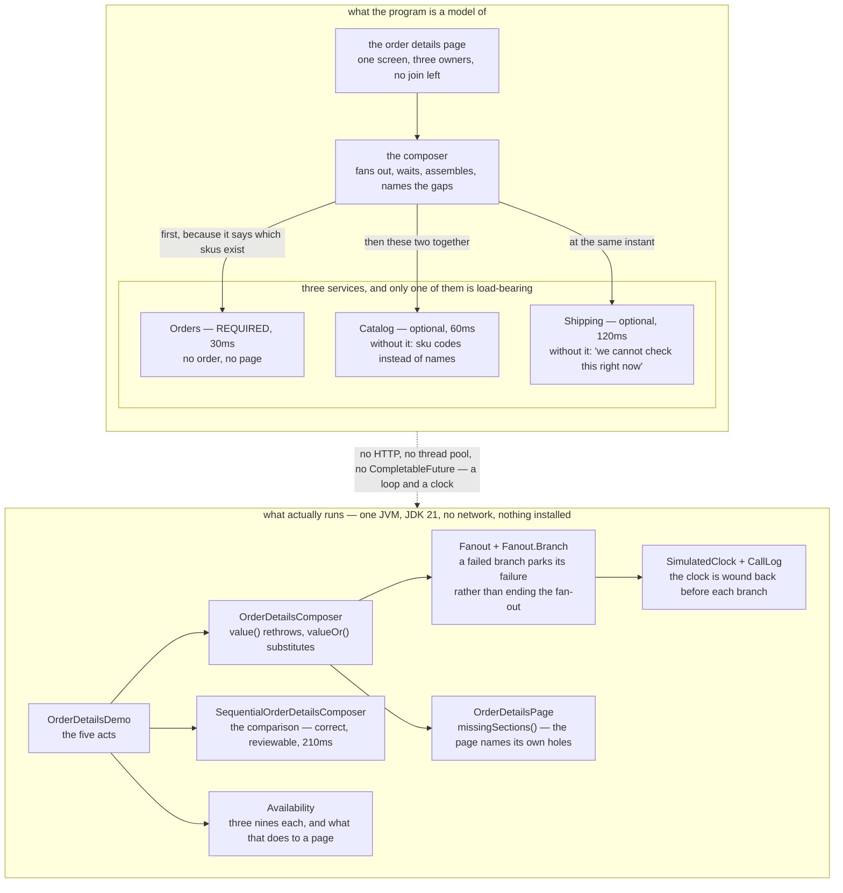

# API Composition — Architecture Diagram

Where each piece of this project sits, and — because this project starts nothing — what
each piece *stands for*. The class diagram shows the types and the sequences show when
each call leaves; this one answers the question those two cannot, which is **what the page
depends on, and which of those dependencies it can survive without**.

Read the picture as two halves stacked. The upper half is what the program is a model of:
one page, three services that own three different pieces of it, and no database in common —
the previous project took the join away, and this project is what you do next. The lower
half is the literal truth: one Java program, a fan-out that runs in a loop, and a clock
that only moves when something moves it.

There are two labels on the upper half and they carry the entire design.

The first is **required or optional**, written on each dependency. Orders is required,
because a page with no order on it is not a partial page, it is a blank one. Catalog and
Shipping are optional, because a page showing sku codes instead of names, or admitting it
cannot check the delivery status, is still a page worth looking at. That classification is
a product decision rather than a technical one, and it has to be made *before* the outage.

The second is the **shape of the fan-out**, and it is not a flat three. Orders goes first
and the other two go together, because Catalog has to be told which skus to name and only
Orders knows that. Working out which calls genuinely depend on which is where "just
parallelise it" comes unstuck.

Mermaid source

## What the diagram is telling you to count

**Three dependencies, one of them required, and that ratio is the availability story.**
Availabilities multiply. Three services at 99.9% each — about forty-three minutes of
downtime a month — make a page that needs all three available only 99.7% of the time, which
is over two hours a month, because the outages mostly do not overlap. Once only Orders is
required the page is back to 99.9%. `Availability` computes this and a test pins the
numbers so the prose cannot drift from the code.

**The way out is not better services.** It is needing fewer of them, and the
required/optional labels are the only lever the pattern offers. There is a limit to how
much of a page can honestly be optional, and when that limit binds, composition has run out
of road.

**The fan-out is one call then two, not three at once.** Catalog cannot start until Orders
has said which skus are on the order. The demo's timeline shows it: Orders from 0 to 30ms,
then Catalog 30 to 90 and Shipping 30 to 150, both leaving at the same instant.

**`Fanout.Branch` is in the lower half because the failure handling is the pattern.** A
branch that throws does not bring down the fan-out; it parks its failure, and the composer
asks each branch afterwards whether that absence is fatal. `value()` rethrows for data the
page needs, `valueOr(fallback)` substitutes for data it can do without.

**`missingSections()` is a box of its own on purpose.** A page that quietly drops the
delivery section looks exactly like a page for an order that has not shipped yet, and the
shopper cannot tell the difference. Naming the gap is what makes a partial answer honest
rather than merely convenient.

## What it deliberately leaves out

**There are no timeouts on the branches**, and a real fan-out needs them. Here a service
either answers or fails immediately; in production the interesting case is the one that
does neither, and that is where [Circuit Breaker](../circuit-breaker-pattern) and
[Bulkhead](../bulkhead-pattern) rejoin the story.

There is no cache and no read model. When "as slow as the slowest dependency" and "as
available as the product of the required ones" are both unacceptable, the answer is to stop
assembling on demand and keep a copy that is already assembled. That is
[CQRS](../cqrs-pattern), the next project.

And the parallelism is modelled rather than real. `Fanout` runs its branches in a loop,
winding the clock back to the moment of departure before each and forward to the slowest
arrival at the end, and a test checks both parallel branches share a start time. In a real
service this would be a virtual thread per branch, or `CompletableFuture.allOf`. Every
argument above would be unchanged.
